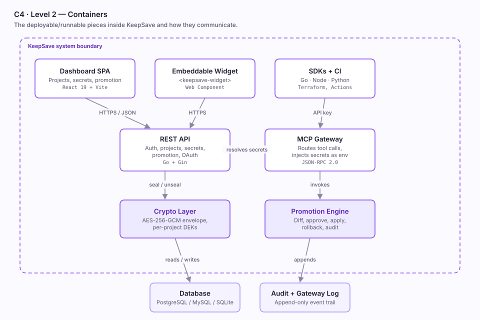
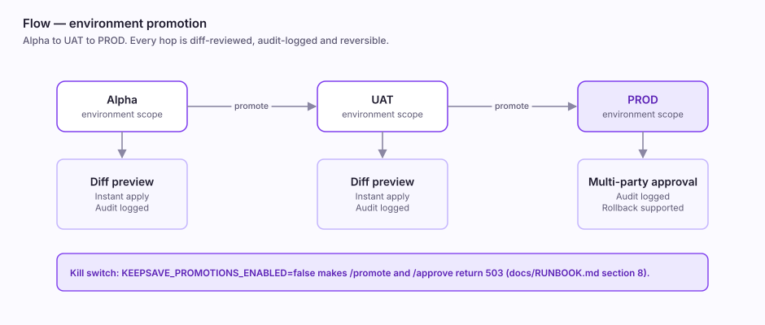

# KeepSave

[](https://github.com/santapong/KeepSave/releases)
[](https://github.com/santapong/KeepSave/actions)
[](https://go.dev)
[](https://react.dev)
[](#license)

**Your agents need secrets. Your repo doesn't.**

KeepSave is an encrypted vault, an OAuth 2.0 identity provider, and an MCP
server hub in one service. It seals every value with AES-256-GCM under a
per-project key, then releases it to your agents, pipelines and MCP servers on
demand — so it never lands in a `.env`, a prompt, or a chat log.

---

## The problem

AI agents and CI pipelines need API keys, database URLs and feature flags. The
usual answers all leak:

- `.env` files get committed, copied into Slack, and pasted into prompts.
- Promoting config from Alpha to UAT to PROD is manual, so it drifts — and the
  one time it doesn't drift, nobody can prove it.
- MCP servers each need their own tokens, so every new tool multiplies the
  number of places a credential lives.

The failure mode is never the encryption. It's the copy someone made.

## What KeepSave does

| | |
|---|---|
| **Encrypted vault** | AES-256-GCM envelope encryption, per-project data keys, master key held in a KMS and never written to the database |
| **Environment promotion** | Alpha → UAT → PROD with diff review, audit trail, rollback, and optional multi-party approval on PROD |
| **Scoped agent access** | Read-only API keys bound to one project and one environment, so a leaked runtime key cannot reach production |
| **OAuth 2.0 provider** | A full identity provider — authorization code, client credentials, PKCE, refresh token, OIDC discovery |
| **MCP server hub** | Register servers from GitHub, browse a marketplace, and route tool calls through one gateway that injects secrets as env vars at call time |
| **Embeddable widget** | A `<keepsave-widget>` Web Component that drops into any site with one `<script>` tag |

The load-bearing property across all of it: **the agent never receives the
credential.** The gateway resolves it, hands it to the server as an environment
variable, writes an audit event, and returns only the tool result.

## Architecture



The crypto layer is only ever reached through the service layer, and the MCP
gateway resolves secrets through that same path rather than reading storage
directly. Nothing bypasses it.

For the full picture — C4 levels 1–3 and the 4+1 views (logical, process,
development, physical, and a scenario walkthrough of an agent tool call) — see
[`docs/ARCHITECTURE_VIEWS.md`](docs/ARCHITECTURE_VIEWS.md).

### Environment promotion



Every hop previews its diff before applying, writes an audit row when it does,
and can be rolled back. The whole pipeline has a kill switch:
`KEEPSAVE_PROMOTIONS_ENABLED=false` makes `/promote` and `/approve` return 503.

---

## Quick start

**Prerequisites:** Docker and Docker Compose. For local development, Go 1.24+
and Node.js 20+.

```bash
git clone https://github.com/santapong/KeepSave.git
cd KeepSave

# The master key never lives in the database — generate it and keep it out.
export MASTER_KEY=$(openssl rand -base64 32)

docker-compose up --build
```

API on `http://localhost:8080`, dashboard on `http://localhost:3000`.

<details>
<summary>Running the services directly</summary>

```bash
# Backend
cd backend
cp .env.example .env        # configure database and keys
go run ./cmd/server

# Frontend
cd frontend
npm install
npm run dev
```

</details>

### First secret, end to end

```bash
# 1. Register, and create a project — the unit of isolation
curl -X POST localhost:8080/api/v1/auth/register \
  -H 'Content-Type: application/json' \
  -d '{"email":"you@example.com","password":"a-strong-password"}'

# 2. Store a secret in the alpha environment
curl -X POST localhost:8080/api/v1/projects/$PROJECT/secrets \
  -H "Authorization: Bearer $JWT" \
  -d '{"key":"DATABASE_URL","value":"postgres://…","environment":"alpha"}'

# 3. Issue a read-only key for an agent, scoped to alpha only
curl -X POST localhost:8080/api/v1/api-keys \
  -H "Authorization: Bearer $JWT" \
  -d '{"name":"my-agent","project_id":"'$PROJECT'","scopes":["read"],"environment":"alpha"}'

# 4. The agent fetches what it needs, and nothing else
curl "localhost:8080/api/v1/projects/$PROJECT/secrets?environment=alpha" \
  -H "X-API-Key: ks_live_…"
```

## API

| Area | Base path | What lives there |
|---|---|---|
| Auth | `/api/v1/auth` | Register, login, JWT issue and refresh |
| API keys | `/api/v1/api-keys` | Scoped machine credentials for agents and CI |
| Projects & secrets | `/api/v1/projects` | Projects, environments, sealed values |
| Promotion | `/api/v1/projects/:id/promote` | Diff preview, apply, approve, rollback |
| OAuth 2.0 | `/api/v1/oauth`, `/.well-known/openid-configuration` | Clients, authorize, token, OIDC discovery |
| MCP hub | `/api/v1/mcp` | Server registry, marketplace, installations, gateway |
| Health & metrics | `/healthz`, `/metrics` | Liveness and Prometheus |

Full request and response shapes, including every error code, are in
[`docs/system/03-api-reference.md`](docs/system/03-api-reference.md). An OpenAPI
specification ships with the backend.

## Security

KeepSave holds other people's secrets, so the guarantees are the product:

- **Sealed before storage.** AES-256-GCM envelope encryption with per-project
  data keys. No secret value is written to disk unsealed.
- **The master key is never in the database.** It comes from a KMS or an
  env-provided root key, and unwraps data keys in memory.
- **Least privilege by construction.** API keys are scoped per-project and
  per-environment; PROD promotion can require multi-party approval.
- **Nothing leaks through errors.** Handlers never return raw error strings —
  see [`docs/ERROR_HANDLING_STANDARD.md`](docs/ERROR_HANDLING_STANDARD.md).
- **Every mutation is audited.** State-mutating handlers must emit an event from
  the canonical taxonomy, and the test must assert the row was written.
- **Hardened by default.** Rate limiting keyed on a derived client IP
  (`TRUSTED_PROXIES` defaults to trusting no proxy, so `X-Forwarded-For` cannot
  spoof it), CSRF protection, security headers, and CORS restricted for the
  embeddable widget.

The STRIDE pass with `file:line` references is in
[`docs/THREAT_MODEL.md`](docs/THREAT_MODEL.md); release posture is in
[`SECURITY_AUDIT.md`](SECURITY_AUDIT.md).

## Tech stack

| Layer | Technology |
|---|---|
| Backend | Go 1.24 with Gin |
| Database | PostgreSQL 16, MySQL, SQLite |
| Encryption | AES-256-GCM, envelope encryption |
| Auth | JWT, scoped API keys, OAuth 2.0 provider |
| Frontend | React 19, TypeScript, Vite, Tailwind v4 |
| Embed SDK | Web Components with Shadow DOM |
| MCP hub | GitHub integration and process runner |
| Deploy | Docker Compose, Helm |
| Observability | Prometheus metrics, OpenTelemetry |

## Repository layout

```
keepsave/
├── backend/              # Go (Gin) REST API
│   ├── cmd/server/       # entry point
│   ├── internal/
│   │   ├── api/          # handlers, middleware
│   │   ├── auth/         # JWT + API keys
│   │   ├── crypto/       # AES-256-GCM         ← Security Engineer veto
│   │   ├── service/      # business logic
│   │   ├── promotion/    # promotion engine    ← Security Engineer veto
│   │   └── repository/   # SQL, driver-agnostic
│   └── migrations/       # embedded in the binary
├── frontend/             # React 19 + Vite dashboard, and the embed widget
├── sdks/                 # Go · Node.js · Python
├── integrations/         # GitHub Action · GitLab CI · Terraform
├── helm/                 # Kubernetes chart
└── docs/                 # architecture, ADRs, threat model, runbook
```

## Integrations

SDKs for Go, Node.js and Python; GitHub Actions, GitLab CI and a Terraform
provider; the embeddable widget; and any MCP-speaking client.

**→ [`docs/INTEGRATIONS.md`](docs/INTEGRATIONS.md)** covers all of them, plus the
partner products that use KeepSave as their vault.

---

## Documentation

KeepSave handles other people's secrets, so the project runs on explicit
decision records, role mandates and operating rituals rather than convention.

**Start here**

| Document | What it answers |
|---|---|
| [`CLAUDE.md`](CLAUDE.md) | Conventions, branch model, decision classes |
| [`docs/ARCHITECTURE_VIEWS.md`](docs/ARCHITECTURE_VIEWS.md) | C4 levels 1–3 and the 4+1 views, as SVG |
| [`docs/ARCHITECTURE.md`](docs/ARCHITECTURE.md) | Package dependency map and trust boundaries |
| [`docs/system/`](docs/system/) | Per-subsystem reference, including the API |
| [`docs/INTEGRATIONS.md`](docs/INTEGRATIONS.md) | Everything that plugs in |

<details>
<summary><strong>Decisions and architecture</strong></summary>

- [`docs/adr/`](docs/adr/) — Architecture Decision Records; start with
  [the README](docs/adr/README.md) for the lifecycle and index.
  - [`0001`](docs/adr/0001-envelope-encryption.md) Envelope encryption with AES-256-GCM
  - [`0002`](docs/adr/0002-auth-model.md) JWT for humans, API keys for agents
  - [`0003`](docs/adr/0003-promotion-engine.md) Promotion engine: decrypt-and-rewrap
  - [`0004`](docs/adr/0004-key-hierarchy.md) Two-level key hierarchy
- [`docs/THREAT_MODEL.md`](docs/THREAT_MODEL.md) — STRIDE pass with `file:line` refs.

</details>

<details>
<summary><strong>Roles and execution</strong></summary>

- [`docs/ROLES.md`](docs/ROLES.md) — 9-role operating model; the Security
  Engineer holds veto over `internal/crypto`, `internal/auth` and the promotion
  engine.
- [`docs/ROLES_30_60_90.md`](docs/ROLES_30_60_90.md) — per-role 30/60/90 plan.
- [`docs/FOLLOWUPS.md`](docs/FOLLOWUPS.md) — tracked debt with owner and due date.
- [`docs/ROADMAP_NOT.md`](docs/ROADMAP_NOT.md) — explicit non-goals.
- [`docs/ADLC.md`](docs/ADLC.md) — how AI-assisted work is sequenced and gated.

</details>

<details>
<summary><strong>Operations and security</strong></summary>

- [`docs/RUNBOOK.md`](docs/RUNBOOK.md) — lost master key, compromised API key,
  DB failover, rotation drill, deploy rollback, break-glass secret read.
- [`docs/SECRET_SOURCES.md`](docs/SECRET_SOURCES.md) — where KeepSave's own
  secrets live per environment.
- [`docs/PENTEST_CHECKLIST.md`](docs/PENTEST_CHECKLIST.md) — pre-release checklist.
- [`docs/CI_PERMISSIONS.md`](docs/CI_PERMISSIONS.md) — least-privilege CI.
- [`SECURITY_AUDIT.md`](SECURITY_AUDIT.md) — audit posture per release.

</details>

<details>
<summary><strong>Engineering specs and tests</strong></summary>

- [`docs/AUDIT_LOG_COVERAGE.md`](docs/AUDIT_LOG_COVERAGE.md) — event taxonomy and test obligations.
- [`docs/ERROR_HANDLING_STANDARD.md`](docs/ERROR_HANDLING_STANDARD.md) — `httperror` and sanitisation.
- [`docs/EMBED_STATE.md`](docs/EMBED_STATE.md) · [`docs/EMBED_ORIGIN_POLICY.md`](docs/EMBED_ORIGIN_POLICY.md) — widget state machine and cross-origin policy.
- [`docs/UX_STATE_INVENTORY.md`](docs/UX_STATE_INVENTORY.md) — per-screen UX states.
- [`tests/PYRAMID.md`](tests/PYRAMID.md) · [`tests/NEGATIVE_AUTH_PLAN.md`](tests/NEGATIVE_AUTH_PLAN.md) · [`tests/FLAKY.md`](tests/FLAKY.md)

</details>

<details>
<summary><strong>Roadmap and changelogs</strong></summary>

- [`Roadmap.md`](Roadmap.md) — vision, phases, completed milestones.
- [`CHANGELOG.md`](CHANGELOG.md) — release-by-release notes.
- [`PHASE15_CHANGELOG.md`](PHASE15_CHANGELOG.md) · [`PHASE16_CHANGELOG.md`](PHASE16_CHANGELOG.md) — phase summaries.

</details>

## Status

Phases 1–13 are complete: core vault and promotion, organisations and templates,
observability, OpenAPI, enterprise SSO and compliance, security hardening, agent
leases and analytics, the platform event/plugin system, and the OAuth 2.0
provider with the MCP server hub. See [`Roadmap.md`](Roadmap.md) for the detail
and what comes next.

## Contributing

`main` and `develop` are the only permanent branches. Work happens on short-lived
`feat/`, `test/` or `experiment/` branches off `develop`, and PRs are required to
reach `main`. Changes to `internal/crypto`, `internal/auth` or the promotion
engine are Type-1 decisions: they need an ADR and Security Engineer sign-off
before implementation. See [`CLAUDE.md`](CLAUDE.md).

## License

MIT
