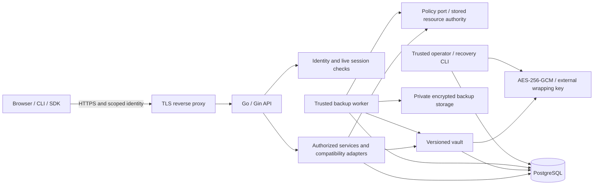

# KeepSave architecture and dependency map

> Historical/core baseline view. The 2026-10-02 harness-neutral working-tree [implementation checkpoint](design/2026-10-02-harness-neutral-platform/README.md) supersedes single-harness and unimplemented-platform descriptions below. This file is retained as context, not current release evidence.

Reconciled 2026-10-02 (Asia/Bangkok), unreleased core candidate. Source presence,
local verification, independent review and production acceptance are separate
states. The [acceptance ledger](validation/2026-10-01-core-release/ACCEPTANCE.md)
is the current evidence index; older SVG architecture views describe legacy
components and are not proof of isolation or supported integrations.

## Current application and trust boundaries



The API and trusted worker can decrypt vault values and belong to the control
host's trust domain. A compromised control host or wrapping-key provider is not
contained by database encryption. Metadata, identities and permissions are not
all encrypted; sensitive vault values and wrapped key material are. API reads
and exports return authorized plaintext to the caller. The later broker has a
different custody contract and must not be inferred from those vault APIs.

Human authentication verifies a stored active session on admission. Credential
services additionally resolve the stored resource and current authority before
access. Personal projects derive administrator authority from their stored
owner; organization-bound projects derive it from current membership, including
for the original owner and their API keys. Demotion, removal, expiry and
revocation deny subsequent admissions. Already-admitted or dispatched work can
complete and returned data cannot be recalled.

Marketing remains a separate static site at `keepsave.draveniq.dev`. The intended
application is same-origin at `app.keepsave.draveniq.dev`. The
[reference control-host bundle](../deploy/self-hosted/README.md) is not deployed
and does not establish the future runner topology, two-replica correctness or
availability.

## Package ownership and migration pattern

```text
cmd/server                  typed composition; API lifecycle and startup checks
cmd/keepsave-worker          trusted durable vault maintenance; no connector execution
cmd/keepsave-operator        explicit operator identity grants; no HTTP surface
cmd/keepsave-vault           baseline, verification and isolated recovery
cmd/keepsave                 existing API client / compatibility adapter
internal/api                transport handlers, authentication and early rejection
internal/service            existing authorized services and migration adapters
internal/repository         existing identity/resource stores, transactions and audit
internal/policy             transport-independent actions, principals and policy port
internal/vault              journal, key continuity, backup and recovery use cases
internal/jobs               leases, fences, retry and uncertain-effect state
internal/crypto              AES-GCM and wrapping-key providers
```

The target is a modular monolith, not a rewrite or a service per feature. Identity,
policy, vault, promotion, broker, MCP, automation, audit and jobs own their
invariants. REST, MCP, CLI and jobs use the same authorized application services.
Consumer-owned ports cross module boundaries; one module must not use another
module's repositories. Local changes join mutation, immutable revision, required
audit and outbox in one database transaction. External effects are represented by
durable attempts; an unknown outcome cannot be treated as a safe retry.

`api.Dependencies` is the current composition contract; the positional router
constructor remains a compatibility adapter. Existing service/repository code is
migrated a use case at a time. The source still contains legacy decryption and
process-execution adapters. The core composition refuses unfinished AI, policy
metadata, enterprise SSO, webhooks, legacy OAuth issuance, connector builds and
MCP execution rather than claiming those adapters meet the new boundary.

`internal/architecture/boundaries_test.go` checks policy isolation, vault/jobs
ports, decryption custody and process imports. Its explicit legacy exceptions
are an inventory to reduce, not approval for new bypasses. Module boundaries do
not by themselves prove runtime authority, container isolation or live-client
interoperability; actual-router PostgreSQL tests cover the core permission and
transaction matrix.

Template metadata uses current workspace membership for reads/application and
current admin for mutations; personal templates use their creator. Removed
workspace creators have no ownership bypass. A tracked session, metadata change,
required audit and local template event share a transaction. Core global
publication is refused while builtins remain available. Template default values
are ordinary configuration, not encrypted vault storage; use placeholders. Vault
application encrypts the permitted values through the shared journal.

Lease and agent-token create/revoke also require current principal/parent/
membership checks and join their persisted mutation, required audit and local
identity event. They delegate vault read authority; they are not broker runs.

## Consistency, deletion and recovery

PostgreSQL credential mutation adapters cover CRUD, imports, template application,
promotion, rollback, key rotation and version restoration. Current values,
immutable revisions and snapshots reference retained wrapped key versions.
Baseline enrollment labels existing ciphertext without inventing earlier history.
A coordinated cutover drains old writers; startup refuses unenrolled active
projects. Applied migrations are additive and may not be edited.

Secret deletion retains a journal tombstone. Project DELETE retains a project
tombstone and closes active authority. Current access excludes deleted projects;
immutable audited IDs survive deletion without rewriting hashed event fields.
No automatic history or key purge is implemented. Restore appends a new revision,
requires the current expected revision and does not undelete a record.

Encrypted backups include recoverable vault records and required key references.
Verification and isolated recovery use external recovery material. Selected live
restore starts from a metadata diff and does not restore accounts, sessions,
grants, approvals or deleted records. Scheduling defaults off until a fresh
operator-confirmed recovery drill; the trusted worker then creates daily 02:00
UTC bundles, keeps thirty verified scheduled bundles and at least two verified
copies, and leaves manual/pre-upgrade artifacts untouched. Retention records an
audited delete-pending state before unlinking; failures remain visible.

SQLite is a local/legacy option. MySQL 8.4 has bounded shipped-migration,
identity/session/scoped CRUD/batch and workspace-role acceptance; it does not
establish journal parity. Versioned vault and durable jobs are PostgreSQL-only;
core history/recovery routes refuse unsupported dialects with 503. An authorized
corrupt current secret returns a safe 500, not a misleading missing-record 404.

## Ordered feature delivery

1. **Finish the current identity/vault release gate:** consolidated checks,
   independent Security/Tech Lead review, Google/GitHub applications and real
   sign-in UAT, external backup/isolated recovery and operational acceptance.
2. **M2 — MCP and resource-bound OAuth:** exact official SDK pin, discovery,
   pre-registered Codex public client with S256 PKCE, browser consent, atomic code
   redemption, refresh replay detection, installation-qualified tool identities,
   schema digests, bounded calls and real supported-Codex contract tests. Start
   with a synthetic tool. Social login is not this OAuth server.
3. **M3 — broker and isolated GitHub pilot:** explicit provider bindings, one
   approved repository/commit per ten-minute run, current policy at admission and
   broker use, signed enrolled workload identity and a vetted digest-pinned
   connector. The broker makes authenticated GitHub requests; the connector and
   model never receive the GitHub token. A separate rootless Linux runner has no
   host home, database/vault keys, container socket or direct GitHub network path.
4. **M4 — private skills and managed Codex:** immutable instruction-only skill
   versions and manifests, exact approvals, pinned harness profiles, compatibility
   refusal, configuration export and verified administrator requirements. A
   prompt or client-reported harness name cannot grant authority. Native skill
   installation is the pilot; Skills over MCP requires negotiated client support.
5. **M5 — measured self-hosted team operation:** separate runner host, coordinated
   migrations, database-backed admission limits, durable webhooks, restart/outage/
   restore/upgrade/two-replica tests, runbooks and measured capacity/recovery.

M0 → M1/M2 → M3 → M4 → M5 remains the dependency order. Recovery acceptance is
required before production; M2 synthetic protocol work can proceed after the
shared authorization contract while remaining recovery work is completed.
Incremental additions after the first team pilot can include repository-review
profiles, connection diagnostics and receipt export before more providers or
harnesses. Model-key relaying, arbitrary builds, marketplaces, device attestation,
agent hosting, cloud-KMS expansion and multi-region operation remain deferred.

See [approved program](design/2026-09-28-backend-platform/README.md),
[core ADR](adr/0028-core-identity-and-vault-release.md),
[credential entry points](design/2026-09-28-backend-platform/CREDENTIAL_ENTRYPOINTS.md)
and [current threat model](THREAT_MODEL.md).
