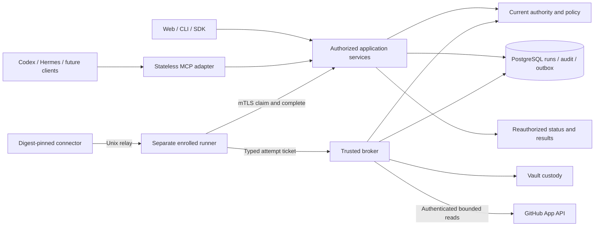

# KeepSave architecture

KeepSave is a **Go/Gin modular monolith with PostgreSQL and a trusted worker**.
It provides an encrypted vault and a harness-neutral access core. This describes
the integrated **source candidate**, reconciled 4 October 2026 against
`6684aca`; it is not a production qualification. See [status](STATUS.md),
[visual architecture](ARCHITECTURE_VIEWS.md) and the
[implementation/evidence checkpoint](design/2026-10-02-harness-neutral-platform/README.md).

## Two credential contracts

Ordinary vault APIs deliberately return authorized plaintext to Web, CLI, SDK,
widget and CI callers. The GitHub tool broker instead authenticates structured
provider operations itself. The connector and model receive permitted results,
**never the GitHub token**. Sign-in OAuth, browser sessions, delegated MCP tokens,
agent leases, provider credentials and runner identity remain separate.

The diagram shows contracts, not a complete network graph. All decrypt-capable
API/worker/broker components belong to the trusted control host. Database
ciphertext cannot contain a compromised control host or wrapping-key source.
Permitted repository content reaches the client's configured model. Local
packages and administrator settings do not attest an unrestricted device.

## Current ownership and extension ports

| Ownership | Current packages | Responsibility |
|---|---|---|
| Identity/current authority | `identity`, `auth`, `authority`, legacy `service`/`repository` adapters | Stable provider identities, tracked human sessions, contacts/proofs, membership epochs and ordered barriers |
| Shared policy | `policy` | Transport-independent principal, resource, decision and permission vocabulary |
| Vault/promotion | `vault`, `crypto`, promotion adapters in `service` | AES-GCM custody, immutable revisions, retained keys, recovery and protected environment mutation |
| Runs | `runs` | Client-bound admission, limits, idempotency, attempts, cancellation and receipts |
| Broker | `broker` | Stored bindings, GitHub App custody, typed bounded provider requests and ticket redemption |
| Automation/native adapters | `automation`, `harness` | Immutable skill/profile/package versions and native export/check |
| MCP/OAuth adapters | `mcpgateway`, `mcpauth` | Stateless protocol translation, discovery, consent and delegated token families |
| Audit/jobs | `auditview`, `events`, `jobs`, transactional repository append | Safe read models, consistent exports, outbox, fencing and external-effect state |
| Runner/operator | `runner`, `diagnostics`, `cmd/*` | Enrolled supervisor, read-only doctor, explicit recovery and operator controls |

`api.Dependencies` wires typed services. Handlers translate requests; application
services resolve stored ownership, apply common authority and commit changes.
Modules communicate through narrow consumer-owned ports. Existing adapters are
migrated one capability at a time. Explicit legacy exceptions in
[boundary tests](../backend/internal/architecture/boundaries_test.go) may not grow.
Native harness adapters contain no SQL, provider decryption or policy decisions.
Provider adapters accept stored targets and typed operations, not arbitrary URLs
or caller-selected headers.

Profiles are portable; **runs belong to one actor and registered client**. Codex
and Hermes are qualification candidates using separate delegations/packages/runs.
Future harnesses implement the same ports and need exact-version evidence; no
universal support is claimed. The pilot registry accepts one instruction-only
`SKILL.md` per source artifact; richer reference trees and Skills over MCP remain
deferred.

## Admission and concurrency

Every protected operation reconstructs stored resource, identity, membership,
parent delegation, policy, binding, approved versions, expiry and revocation.
Deny overrides allow. Missing authoritative state refuses access. A run ID,
client name, prompt, skill or annotation cannot create permission.

The ordered barrier is: sorted represented humans; organizations/projects;
member authority; sessions/families/parent grants; connections/bindings/workloads;
runs/budgets/attempts; approvals/vault records; audit head last. Discovery is
revalidated under locks. Changed ownership fails closed; automatic bounded
rediscovery retries are not implemented. Network calls occur outside the locked
transactions. Organization offboarding advances a scoped member epoch; rejoining
does not restore old grants, and unrelated organizations/personal projects/global
sessions remain distinct.

Admission persists the operation and required audit before credentials or external
work. Local state, immutable revision, required audit and outbox commit together.
Revocation denies admissions after commit. Already-admitted provider work may
finish; result delivery still requires a separate current-authority check. A
completed external read can be unavailable for retrieval without being rewritten
as a cancelled provider outcome.

## Vault consistency and recovery

PostgreSQL journal adapters cover CRUD, import, templates, promotion, rollback,
restoration and key rotation. Baseline enrollment labels existing ciphertext;
it does not invent missing history. Expected revisions reject stale changes.
Deletion retains tombstones and immutable audited identity fields. Keys remain
while retained ciphertext needs them; automatic history/key purge is disabled.

Recovery version 2 includes lifecycle metadata and accepts legacy version 1
bundles. This is **new-reader compatibility**, not permission to use old binaries
with new writers. Recovery requires external material and a fresh isolated target;
current-member mapping is explicit. It restores no sessions, grants, tokens,
approvals or ephemeral operation results. Selected live restoration applies only
reviewed records with expected revisions and does not resurrect deleted records.

Daily scheduling/retention is gated on an installation recovery drill: 02:00 UTC,
30 verified scheduled bundles and at least two verified copies. Manual/pre-upgrade
bundles require explicit deletion. Uncertain external effects remain visible and
are not silently replayed. SMTP proof delivery stores only IDs in jobs and opens
ephemeral encrypted material in the trusted adapter. SMTP acceptance is distinct
from mailbox delivery. Contact/recovery proofs expire after 15 minutes; invitation
proofs currently expire after 24 hours.

SQLite and MySQL retain bounded legacy compatibility. **New journal/platform
transaction guarantees are PostgreSQL-only** until equivalent acceptance passes.

## Bounded tool execution

Preparing runs have no usable grant. The broker resolves the permitted reference,
then a second transaction revalidates authority and immutable digests before
activation on a repository/commit. Defaults: one non-production repository,
ten minutes, 30-second provider deadline, four-MiB final response, 100 operations,
32-MiB cumulative output and two concurrent operations. Extending requires a new
run. Stored repository/commit authority prevents mutable-reference fallback.

Operations use caller/run/request-key idempotency and canonical digests. Results
are short-lived encrypted records, excluded from recovery/export/log/outbox
payloads and inaccessible after run expiry/revocation. Explicit retry creates a
linked attempt; uncertain dispatch is not blindly replayed. Status polls wait at
most two seconds. Explicit operation/run cancellation is independent of native
client interruption.

A separate rootless Podman supervisor holds enrollment identity and engine access
outside connector containers. Each connector receives only its per-attempt Unix
relay. The private listener uses TLS 1.3 and mTLS; the public proxy returns 404 for
runner routes. Reference restrictions are read-only filesystem, no IP network,
64-MiB scratch, one CPU, 256-MiB memory and 32 processes. The current local host
lacks CPU delegation and preflight refuses it; actual isolation is **unqualified**.

## Deployment and release gates

`keepsave.draveniq.dev` remains the static landing. The intended full application
is same-origin at `app.keepsave.draveniq.dev`; the control/runner bundles are
installation references. New admission flags default off; kill switches preserve
authorized status, cancellation, revocation, audit and recovery.

The first outstanding work is real Google/GitHub/SMTP acceptance, reviewed
entrypoint coverage, native client qualification, disposable GitHub App and runner
isolation, installation recovery/fault/upgrade drills, independent Security/TL
review and exact-revision remote CI. No Kubernetes requirement, device-attestation,
capacity or availability claim is introduced. See [roadmap](../Roadmap.md),
[setup](design/2026-10-02-harness-neutral-platform/SETUP.md) and
[threat model](THREAT_MODEL.md).
