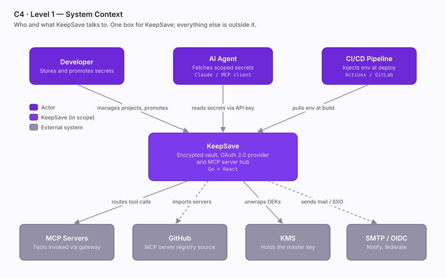
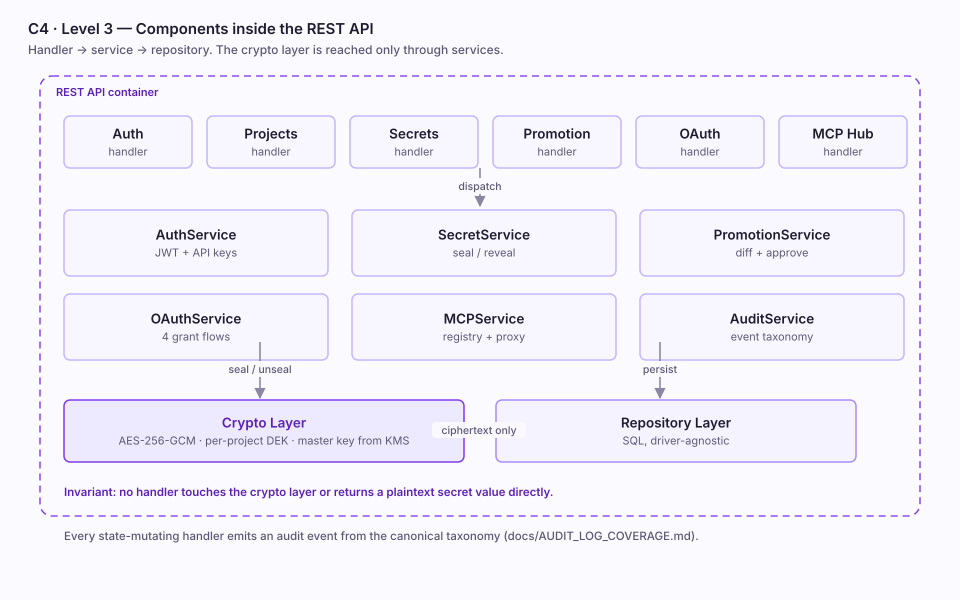
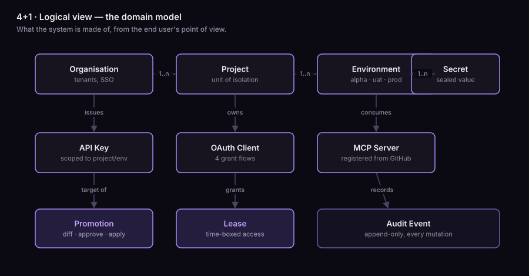
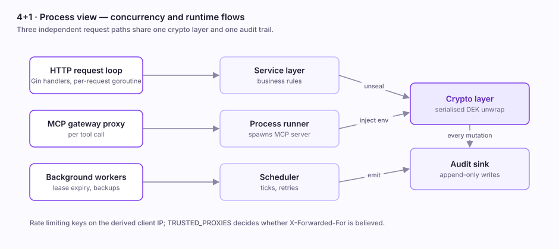
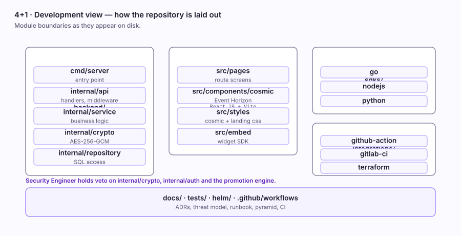
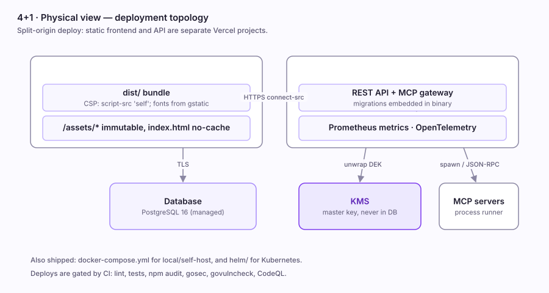
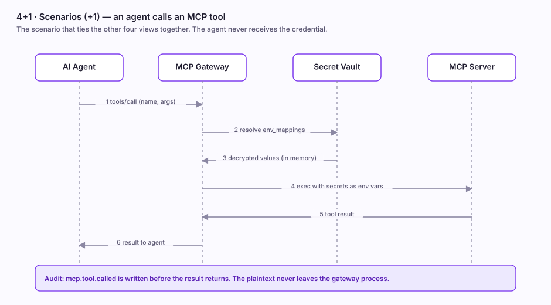
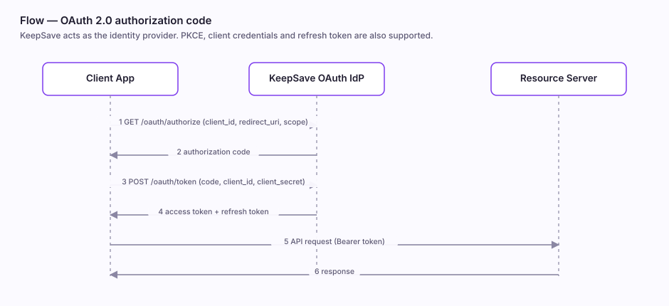

# KeepSave — Architecture Views

Two complementary models describe this system, because they answer
different questions:

- **C4** (Context → Container → Component) zooms in on *structure*: what
  boxes exist and what talks to what.
- **4+1** (Logical, Process, Development, Physical, + Scenarios) covers
  *concerns*: the same system seen by an end user, an operator, a
  developer and a sysadmin, tied together by concrete scenarios.

All diagrams are checked-in SVG under [`diagrams/`](diagrams/). They are
generated rather than drawn by hand, so they stay consistent; see
[Regenerating](#regenerating) below.

> **A note on the palette.** These use the frontend's own Event Horizon
> tokens — deep-space void ground, periwinkle-violet accent, aurora teal
> for healthy state, Geist and Geist Mono — so the documentation and the
> product look like one thing.
>
> The values are hard-coded hex rather than `oklch()` or
> `prefers-color-scheme`. GitHub sanitises SVG and honours neither
> reliably inside ``, so a theme-reactive asset would render
> incorrectly, or vanish, depending on where it was viewed. A fixed dark
> canvas reads correctly everywhere.

---

## C4 — Level 1: System Context

Who and what KeepSave talks to. One box for KeepSave; everything else is
outside it.



Three classes of actor drive the system — a **developer** managing and
promoting secrets, an **AI agent** fetching scoped values at run time,
and a **CI/CD pipeline** pulling environment configuration at build. Four
external systems sit downstream: the **MCP servers** the gateway routes
to, **GitHub** as the registry source for those servers, the **KMS**
holding the master key, and **SMTP/OIDC** for notification and
federation.

The master key is deliberately outside the boundary. It is never stored
in the database — see [`THREAT_MODEL.md`](THREAT_MODEL.md).

---

## C4 — Level 2: Containers

The separately deployable or runnable pieces, and how they communicate.


Note the shape of the trust boundary: **the crypto layer is only ever
reached through the service layer**, and the MCP gateway resolves secrets
through the same path rather than reading storage directly. Nothing
bypasses it.

The frontend and API deploy as **two separate Vercel projects**
(split-origin), which is why the SPA's CSP names an explicit
`connect-src` for the API origin.

---

## C4 — Level 3: Components (REST API)

Inside the API container: handler → service → repository.



Two invariants this diagram exists to make visible, both enforced in
review and in tests:

1. **No handler touches the crypto layer directly**, and no handler
   returns a plaintext secret value. Error responses go through the
   `httperror` package — see
   [`ERROR_HANDLING_STANDARD.md`](ERROR_HANDLING_STANDARD.md).
2. **Every state-mutating handler emits an audit event** from the
   canonical taxonomy in
   [`AUDIT_LOG_COVERAGE.md`](AUDIT_LOG_COVERAGE.md), and the test asserts
   the audit row was written.

---

## 4+1 — Logical view

What the system is made of, from the end user's point of view.



The isolation unit is the **project**; environments hang off it, and
secrets hang off environments. API keys, OAuth clients and MCP servers
are all scoped by that same hierarchy, which is what makes "this agent
may read `uat` but not `prod`" expressible.

---

## 4+1 — Process view

Concurrency and the runtime flows.



Three independent request paths — the HTTP loop, the MCP gateway proxy
and background workers — converge on one crypto layer and one audit
sink. Rate limiting keys on the derived client IP, and `TRUSTED_PROXIES`
decides whether `X-Forwarded-For` is believed at all; with the default
empty value no proxy is trusted, so a forged header cannot spoof the
client IP (CWE-348).

---

## 4+1 — Development view

How the repository is laid out.



The module boundaries are not merely cosmetic: the Security Engineer
holds **veto** over `internal/crypto`, `internal/auth` and the promotion
engine, per [`ROLES.md`](ROLES.md). Changes in those directories are
Type-1 and need an ADR plus sign-off before implementation.

---

## 4+1 — Physical view

Deployment topology.



Also shipped: `docker-compose.yml` for local and self-hosted use, and
`helm/` for Kubernetes. Deploys are gated by CI — lint, tests, npm
audit, gosec, govulncheck and CodeQL.

---

## 4+1 — Scenarios (+1)

The "+1" is what makes the other four concrete. This is the scenario the
whole product exists for.



The load-bearing detail: **the agent never receives the credential.** The
gateway resolves it, passes it to the MCP server as an environment
variable, writes `mcp.tool.called`, and returns only the tool result. The
plaintext never leaves the gateway process and never enters a prompt, a
log or a chat transcript.

---

## Supporting flows

### OAuth 2.0 — authorization code



KeepSave is a full identity provider. Authorization code is shown;
client credentials, PKCE and refresh token are also supported.

### Environment promotion


PROD can require multi-party approval and supports rollback. The whole
pipeline has a kill switch: `KEEPSAVE_PROMOTIONS_ENABLED=false` makes
`/promote` and `/approve` return 503 — see [`RUNBOOK.md`](RUNBOOK.md) §8.

---

## Regenerating

The diagrams are emitted by a single script so geometry, palette and
type stay consistent across all ten. To change one, edit the script and
re-run it rather than hand-editing the SVG:

```bash
python3 scripts/gen_diagrams.py     # writes docs/diagrams/*.svg
```

Two constraints worth knowing before you edit it:

- **SVG `<text>` does not wrap.** Multi-line labels must contain `\n`,
  which the `box()` helper expands into separate lines. A long label
  without one silently overflows its box.
- Keep the fixed light canvas. See the palette note at the top.

## Where else to look

| Need | Doc |
|---|---|
| Narrative architecture overview | [`ARCHITECTURE.md`](ARCHITECTURE.md) |
| Why a decision was made | [`adr/`](adr/) |
| STRIDE pass with file:line refs | [`THREAT_MODEL.md`](THREAT_MODEL.md) |
| Per-subsystem detail | [`system/`](system/) |
| Incident procedures | [`RUNBOOK.md`](RUNBOOK.md) |
