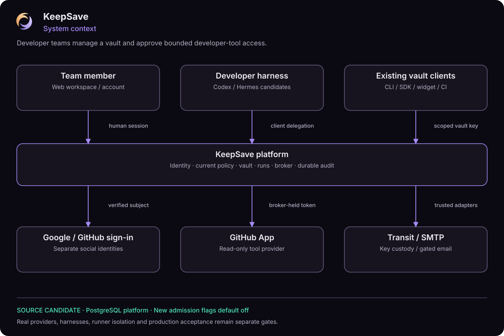
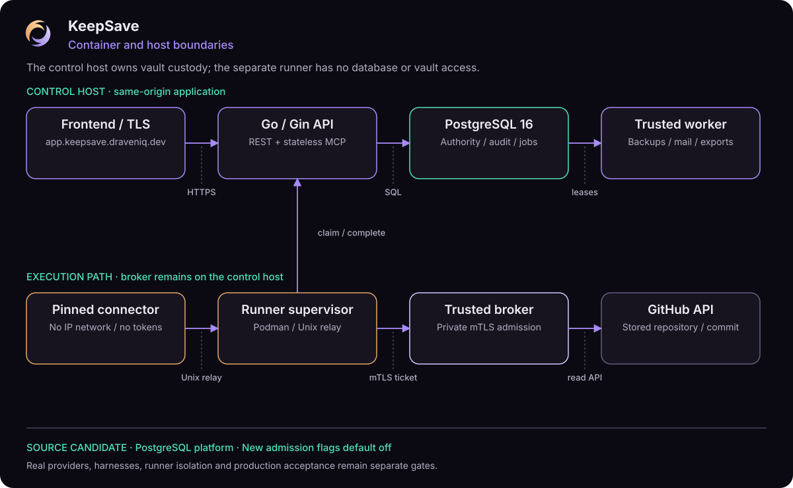
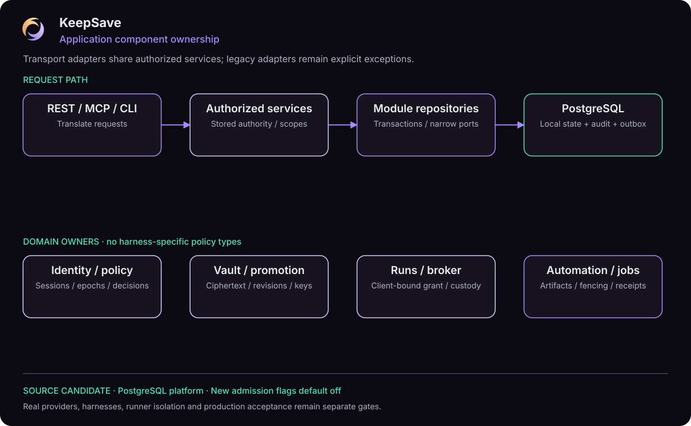
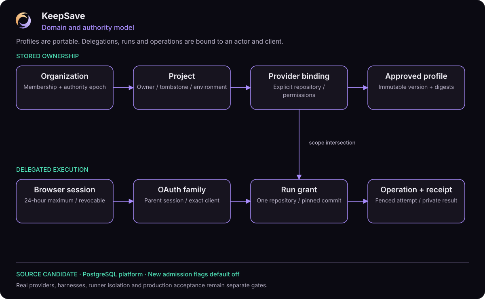
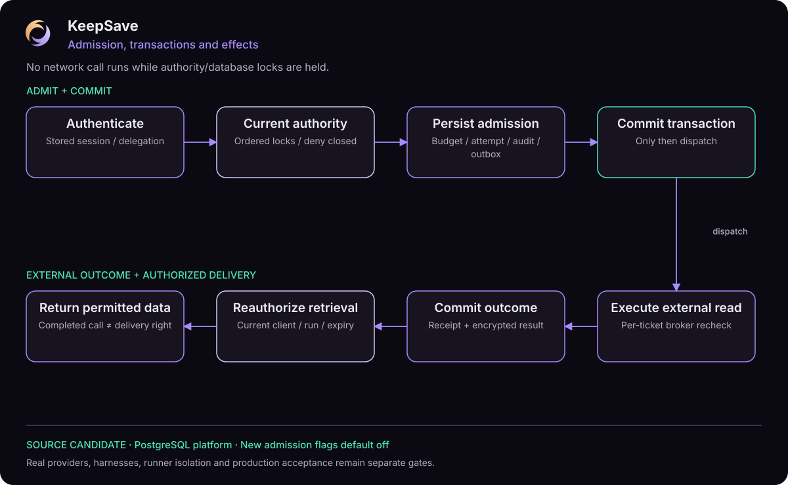
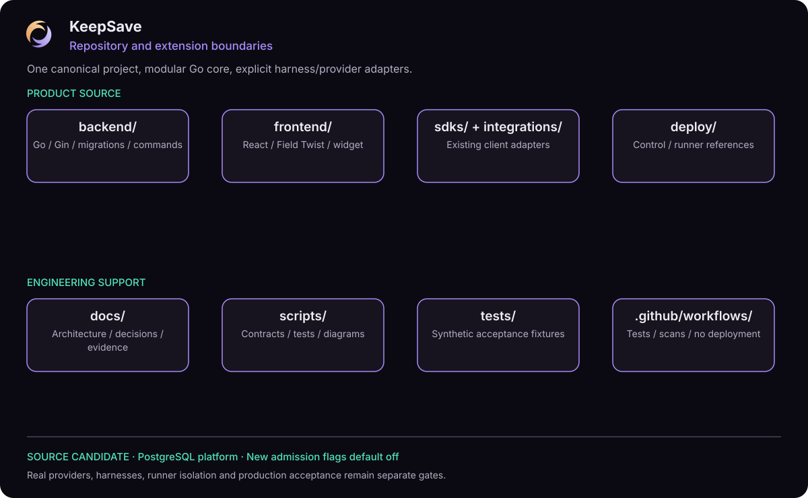
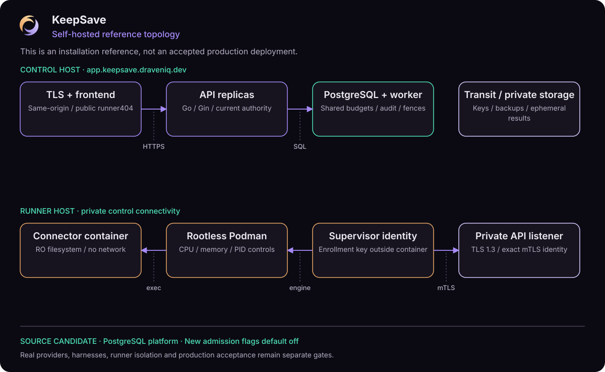
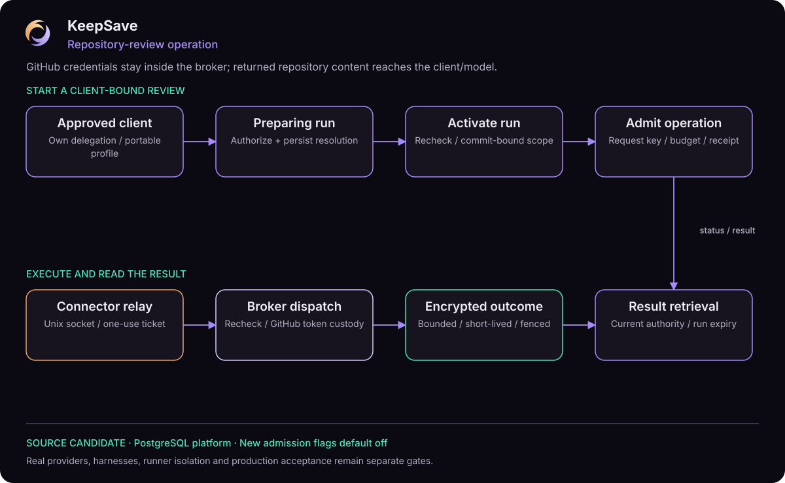
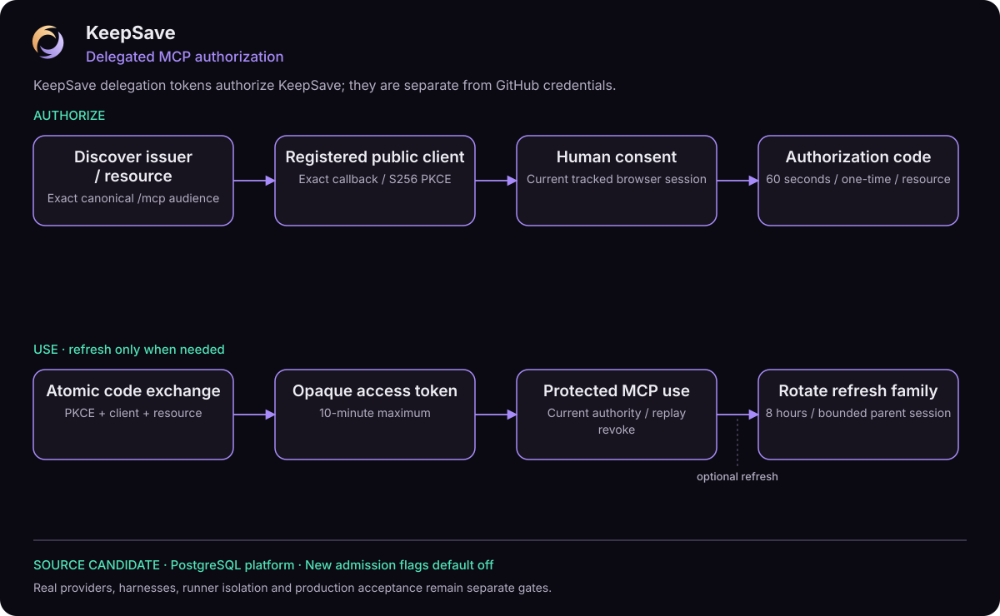
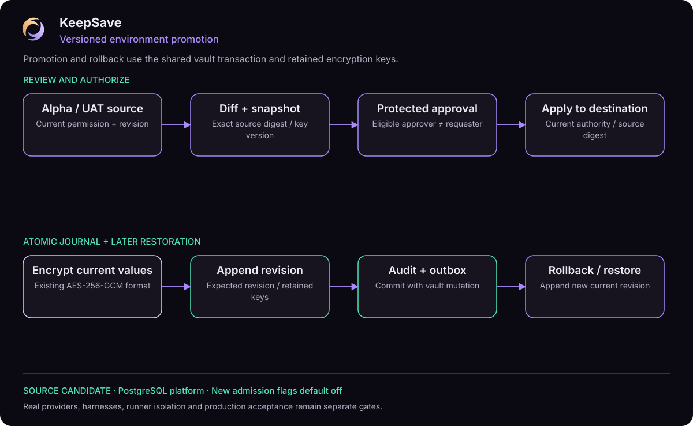

# KeepSave architecture views

These diagrams describe the integrated harness-neutral **source candidate**,
reconciled 4 October 2026. They replace the older API-host execution and split
Vercel application views. Diagram presence does not establish live client,
provider, runner or production acceptance. See [architecture](ARCHITECTURE.md)
and [current status](STATUS.md).

Use the [interactive architecture map](diagrams/harness-neutral.html) for theme
switching, search, focus, tracing and export. Download/open the HTML locally if
your Markdown host displays its source. It is self-contained and opens at rest.
The [typed source](diagrams/harness-neutral.architecture.json) references candidate
`6684aca`; there are no runtime credentials or service connections in the viewer.

## Structure and ownership



Vault clients can receive authorized values. Tool-provider credentials stay in
broker custody; Google/GitHub sign-in are separate external identities. SMTP and
Transit belong to their own operator acceptance boundaries.



The same-origin frontend/API and trusted worker/database are on the control host.
The broker also stays on that trusted host. A separate runner holds its enrollment
identity outside connectors and relays typed operations, with no database/vault
access. Containers never receive GitHub tokens.



REST, MCP and compatibility callers reach the same authorized services and narrow
ports. Local mutation, immutable version, audit and outbox share a transaction.
The legacy exception inventory is explicit; this drawing does not imply every
old source path was rewritten or enabled.

## Authority and runtime



Portable approved profiles are distinct from parent-session/client-bound
OAuth families, runs and fenced operations. Knowing a handle grants no authority.



Dispatch follows committed admission. Provider outcome, stored result and
permission to retrieve are separate; revocation blocks later admissions and
result retrieval while already-admitted work may complete.



See [project structure](PROJECT_STRUCTURE.md) for canonical checkout and folder
roles. The shared core contains no harness-specific policy types.



The separate-host Podman and TLS/mTLS configuration is a reference. Current
preflight denies this development host because CPU delegation is absent; the
diagram makes no isolation or deployment acceptance claim.

## End-to-end and supporting flows



The same approved review profile can be qualified through separate Codex and
Hermes grants. One permitted repository/commit succeeds; a second repository and
revoked result access must fail. Real client/provider exercise remains pending.



S256 public-client delegation is resource-bound to the canonical `/mcp` URL.
Opaque access/refresh families are separate from social login and provider tokens.
Refresh is optional and rotates its family; it is not required before each call.



Protected promotion validates current source/destination authority and exact
snapshot/digest. Rollback/restoration appends revisions through the shared vault.

## Reproduce and verify

Generate the ten static SVGs from the accepted Field Twist mark and
[generator](../scripts/gen_diagrams.py):

```bash
python3 scripts/gen_diagrams.py
python3 scripts/check_docs.py
```

SVG labels use explicit dark surfaces and portable hex equivalents; see
[branding](BRANDING.md). The generator checks node text fit and uses aligned
rails so arrows cannot cut across unrelated nodes. Browser screenshot review is
separate from XML/geometry checks.

The interactive map was created with the local Archify skill v2.17. With that
skill available, run its `validate architecture`, `deliver architecture` and
`visual-check` commands on the checked-in JSON/HTML. Supply `--repo-root` when
verifying the declared repository evidence. Exact delivery/browser hashes and
review scope belong in [the documentation validation record](validation/2026-10-04-documentation/README.md).
No repository build depends on installing that skill. Do not edit the delivered
HTML independently of its source and validation receipt.
