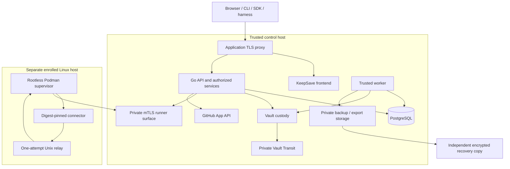

# KeepSave deployment and release plan

Current direction reconciled 2026-10-04: self-hosted control host plus separate
Linux connector runner. The repository contains a locally tested **source
candidate**, not an operationally accepted platform. The canonical project lives
at `/mnt/data/company/apps/KeepSave`. See [architecture](ARCHITECTURE.md),
[acceptance](validation/2026-10-02-harness-neutral-platform/ACCEPTANCE.md) and
[operator runbook](RUNBOOK.md).

The May Vercel/Neon/Fly/Cloud Run topology is historical planning under
[ADR0016](adr/0016-deployment-topology.md). It is superseded for this candidate by
[ADR0028](adr/0028-core-identity-and-vault-release.md) and
[ADR0029](adr/0029-harness-neutral-platform.md); pending independent signatures
are not supplied by a source merge or this documentation update.

## Application and landing

| Surface | Origin | State and responsibility |
|---|---|---|
| Marketing landing | `https://keepsave.draveniq.dev` | Published landing; preserve the accepted Event Horizon / Field Twist identity |
| Full application | `https://app.keepsave.draveniq.dev` | Same-origin SPA, `/api/v1`, social callbacks, delegated OAuth and `/mcp`; deployment target |
| Runner control | Operator-selected private HTTPS listener | Direct TLS 1.3 mTLS with enrolled certificate fingerprint; never the public SPA proxy |

The landing release does not expose the vault/API. The application reference runs
long-lived API and trusted-worker binaries in containers; the repository's
landing-only Vercel configuration is not a backend deployment mechanism.

## Reference topology

The broker performs authenticated GitHub requests on the control host. Connector
containers receive no provider token, database credential, wrapping key, host home
or engine socket and have no IP network. The trusted worker has database/key
access for local jobs; it is not the isolated connector runner.

The [control reference](../deploy/self-hosted/README.md) and
[runner reference](../deploy/runner/README.md) document concrete files and private
configuration. They need actual host/operator qualification. PostgreSQL is required
for new platform guarantees; SQLite and MySQL retain bounded legacy compatibility.

## Release gates

| Gate | Required evidence | Current scope |
|---|---|---|
| Source and independent review | Exact revision, Type-1 Security Engineer and Tech Lead review | Source published October 3; independent signatures pending |
| Remote CI | All applicable jobs pass at intended integration/release revision | October 3 main/develop runs were observed failed on October 4; inspect new exact-revision runs after changes |
| Browser identity | Real Google and GitHub consent/repeat login/linking/revocation on exact callbacks | Synthetic implementation tests; real provider acceptance pending |
| Key and recovery | Installation-specific Transit/key continuity and external-file recovery into a fresh isolated target | Local synthetic external recovery passed; production material/storage drill pending |
| SMTP/team identity | Authenticated certificate-verified send, proof consume/resend/uncertainty | Synthetic contracts; installation-specific SMTP acceptance pending |
| Native clients | Exact Codex and isolated Hermes OAuth, protocol, skill discovery, separate runs and explicit cancellation | Native packages/protocol fixtures checked; real clients pending |
| Provider custody | Disposable GitHub App installation, A success/B denial/revocation/canaries | Synthetic provider checks; live App acceptance pending |
| Runner isolation | Actual rootless cgroups v2 CPU/memory/PID, seccomp, filesystem/egress/relay tests | Reference/preflight tested; observed local host missing CPU delegation |
| Team operations | Two APIs, worker/supervisor/DB/Transit faults, restart, upgrade and compatible rollback | Bounded local two-process revocation; full installation drills pending |
| Capacity | Fixed hardware and exact versions, measured queue/latency/rejection/recovery | No published throughput or availability claim |

Source publication is not a tag, production approval or feature-support declaration.
Do not turn a configured flag/button or package digest into acceptance evidence.
See the detailed G0–G6 [checkpoint](design/2026-10-02-harness-neutral-platform/README.md).

## Prepare the installation

1. Select separate control/runner Linux hosts, PostgreSQL, private TLS/storage and
   a recoverable Vault Transit installation. Use dedicated identities and reviewed
   immutable image digests. Configure DNS/TLS for the application independently
   of the landing.
2. Complete [social sign-in setup](SOCIAL_LOGIN_SETUP.md) using separate development
   and production Google/GitHub identity apps. Keep their backend secrets separate
   from the GitHub App broker private key/installation.
3. Complete private runtime/database configuration outside the checkout, mode 0600.
   Examples contain placeholders; never expose resolved Compose output or copy
   development keys into staging/production. Use `sslmode=verify-full` and the
   intended private CA for the PostgreSQL connection.
4. Validate Compose using `config --quiet`, not a command that prints secrets.
   Structural validation does not start services or prove runtime isolation.
5. Record operator grants by immutable user UUID, SMTP acceptance and selected
   client callbacks/ports. Public signup and workspace ownership grant no global
   operator role. Provider/proof flows stay unavailable while unconfigured.
6. Qualify the runner's real cgroup delegation before enrollment/dispatch. No
   fallback may waive the one-CPU requirement on the current failing host.

## Coordinated existing-database cutover

Keep an external encrypted pre-upgrade bundle and independent recovery material.
Drain all old API/worker writers and old session-unaware binaries before starting
the coordinated cutover. Apply migrations **001–033** using one controlled new
binary; do not edit applied migrations or assume concurrent migration is safe.

Run the trusted `keepsave-vault -action baseline` against the intended drained
installation. It validates retained encrypted records and labels existing values
as a baseline without inventing missing history. Active unenrolled projects refuse
startup. Migration 033 leaves missing historical admitted run scope unknown rather
than granting authority from a mutable binding.

Start the new API/frontend with new platform flags off. Users must reauthenticate;
legacy human JWTs without tracked SID/hash/current status are refused. Verify
current sessions, tenant denial, one new secret revision, stale restoration refusal,
historical access after rotation and audit-chain continuity. Run the isolated
external recovery drill before enabling scheduled backup creation.

Enable only individually qualified identity/team/MCP/run slices. Admission and
broker-dispatch flags are independent kill switches. Keep permitted status,
cancellation, revocation, audit and recovery available during containment.

## Backup and rollback policy

Daily encrypted backups become due at **02:00 UTC** only after recorded recovery
acceptance. Retain 30 verified scheduled bundles and at least two; manual and
pre-upgrade bundles require explicit deletion. Retain key versions while values,
history, snapshots or required backups depend on them. Keep external private copies.

New readers accept v1 and v2 recovery bundles. Old-reader compatibility with v2 is
not promised. Restore source vault data into a fresh isolated PostgreSQL target,
map lifecycle owners explicitly and inspect a metadata preview before any selected
live restore. Sessions, tokens, grants, approvals and ephemeral results are excluded.

Rollback means deploying a reviewed compatible binary against the current journal,
session and encryption contracts. Old binaries that omit these checks are unsupported.
Do not rollback by reversing applied migrations or blindly replacing authority
with an old database snapshot. Measure and record the actual rollback/recovery drill.

## Promotion and publication workflow

Use feature branches for work and `develop` for integration; `main` is the release
line. Push with ordinary Git under explicit owner authorization. Required remote CI,
staging drills, provider/recovery acceptance and independent reviews precede a
production tag/deployment. This repository has no enabled automatic production
application-deployment job. GitHub-only review/repository settings use the web UI;
no `gh` authentication is assumed.

Preserve the Field Twist mark, violet/mint palette and clear task language in setup
screens. Labels distinguish configured, locally tested and operationally accepted
behavior. The technical acceptance ledger, rather than marketing text, governs
support claims.
