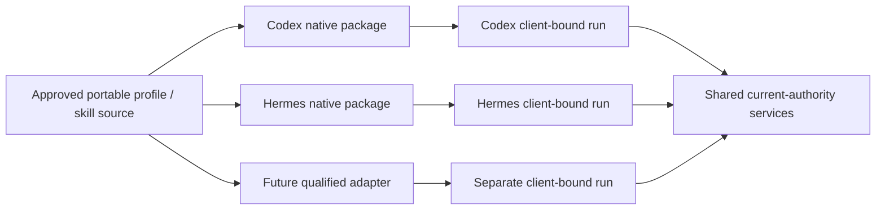

# KeepSave harness engineering and qualification

Reconciled 2026-10-04. KeepSave's access platform is **harness-neutral**: profiles
are portable and runs are bound to the actual registered client delegation.
Codex and Hermes are the first qualification candidates; an exporter or a
self-reported name does not establish universal support. See the
[architecture](ARCHITECTURE.md), [checkpoint](design/2026-10-02-harness-neutral-platform/README.md)
and [dated protocol receipt](design/2026-10-02-harness-neutral-platform/PROTOCOL.md).

This page separates the **product's client adapter contracts** from the
**engineering workflow used to build KeepSave**. Neither local tool settings nor
an agent review supplies server authority or independent human security sign-off.

## Product adapter contract

| Concern | Shared core owns | Harness adapter owns |
|---|---|---|
| Authentication | Current browser parent, resource-bound OAuth family, expiry/replay/revocation | Native public-client OAuth configuration and exact callback settings |
| Permission | Stored ownership/member epoch, binding, approved profile/artifacts, grant/run budgets | No permission decision; translate bounded protocol requests |
| Skills | Immutable instruction-only source, manifest/digest, origin and approval | Native package layout and exported-tree digest |
| Runs/operations | Client-bound admission, commit scope, idempotency, cancellation and receipts | Native discovery/invocation/status/result/cancel experience |
| Credential custody | Vault/broker only; broker authenticates GitHub request | No provider token, SQL, decryption or process execution |
| Compatibility | Evidence-backed capability report | Exact client/build, format, protocol and tested local-control mapping |

`backend/internal/policy` is the common decision vocabulary. `authority` locks
and resolves stored authority; `mcpauth` owns delegation; `mcpgateway` translates
MCP; `harness` renders native configuration; `automation` owns artifacts; `runs`
owns operations/grants and `broker` performs provider calls. Architecture tests
prevent harness-specific SDK/configuration types leaking into the shared core.
Legacy compatibility exceptions must not grow.

The pilot accepts a single bounded instruction-only `SKILL.md` per immutable
artifact. Rich reference-file trees and Skills over MCP are follow-on work;
arbitrary executable skill files/builds are refused. Source/profile/package
approvals bind exact digests and current authority. A changed/revoked dependency
cannot obtain new authority. Local copied instructions are untrusted input.

## Qualification candidates and isolation

| Client | Exact candidate | Callback / tested lane |
|---|---|---|
| Codex | 0.153.3 / rmcp 3.1.3 | `http://127.0.0.1:17701/callback`; package declares `2025-11-25` qualification lane |
| Hermes | Isolated v2026.9.24 / 0.21.5 / Python MCP 2.0.0 | `http://127.0.0.1:17702/callback`; explicit legacy lane and strict redirect handling |

Check each port before registration. Never silently substitute callbacks, enable
dynamic registration or add a weaker authentication fallback. Keep Codex's optional
resource override unset in this pinned candidate; exact discovered `/mcp` metadata
must drive resource-bearing authorization/token/refresh requests without duplicates.
The server supports SDK v1.8.0 restricted modern/legacy lanes, but that is not proof
of a client's actual negotiation.

Use a dedicated Codex workspace and a **separate Hermes profile**. Preserve the
installed Hermes 0.21.3, its selected non-Anthropic provider, sessions and memory.
Do not assume shared sessions, shared memory or bidirectional authority between
harnesses. Export/check/unpack validates files and metadata; it neither installs
a client nor proves administrator enforcement on a device.

## Required evidence per client

Record source/image/client digests, exact build, native package/tree digest,
protocol lane, authentication settings, executed scenarios, skips and limitations.
Use synthetic fixtures in CI; real provider/model-assisted runs use separately
authorized disposable resources.

1. Complete real browser consent with exact issuer/resource/callback/S256 PKCE;
   test omission/mismatch, code replay, native refresh, parent/family revocation
   and invalid present Origin.
2. Discover installation-qualified tools with the exact input-schema digest;
   reject unknown fields, wrong client/run IDs and oversized payloads.
3. Load the native review skill and use the same portable profile through a new
   client-specific run. Repository A succeeds; B fails.
4. Exercise explicit `cancel_operation`/`cancel_run`, expiry and committed
   revocation before new admission **and result retrieval**.
5. Observe native interruption separately. Stopping an RPC does not prove durable
   accepted work stopped; report already-dispatched outcomes honestly.
6. Check package tampering/revocation/changed dependency and unsupported version
   refusal. Local reported digests do not attest a device.

Local synthetic OAuth, SDK handler, parser/renderer/CLI and architecture checks
are recorded in the acceptance ledger. Real Codex/Hermes login, native discovery,
model-assisted review and local administrator control acceptance remain pending.

## Enforcement labels

- **Server-enforced:** stored current authority, expiry, revocation, binding,
  approved artifact scope, broker credential custody and bounded operations.
- **Administrator-configured:** managed native requirements separately tested on
  the selected build/installation; editable defaults are not enforcement.
- **Unverified:** settings or client behavior without an executed receipt.

There is no remote device-attestation claim. An unrestricted device administrator
can bypass local tools. KeepSave controls routed operations; it cannot recall
returned content. Self-hosting KeepSave does not make a harness's model local.

## Engineering workflow

Apply [ADLC](ADLC.md) and [repository rules](../CLAUDE.md). Classify the change,
inspect its threat delta, define concrete success/denial/failure checks, implement
on a short-lived branch and integrate through `develop`. `main` remains the
release line. A source merge is separate from tag/deployment authorization.

Use the smallest useful team with explicit file ownership. Independent searches
can run in parallel; dependent mutations, gates and approvals remain sequential.
Overlapping edits need isolation. Keep checkpoints, evidence dates and source
hashes outside a single agent's context. Do not treat a plan or green structural
check as completed external acceptance.

For security changes, reviewers attempt to refute specific claims using distinct
lenses: tenant/scoped authority, plaintext custody, transaction rollback,
concurrency, revocation and operational failure. Retain the original minimum of three independent verifiers for each security
claim, using different lenses and defaulting to refuted under uncertainty. A
majority clearing a claim is supporting engineering evidence; it is not a
substitute for required Security Engineer/Tech Lead approval.
No agent may manufacture review signatures or bypass a failed release gate.

Required audit/outbox and local mutation commit together; metadata/logs contain
no credential/proof/token values. Authorized vault reads and controlled result
retrieval are explicit plaintext boundaries. Report what was actually tested,
which database was used, and what remains unqualified. Preserve Field Twist
branding while keeping tool names and denial explanations understandable.
