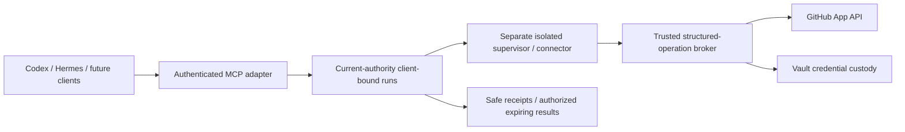

# KeepSave integration inventory

Reconciled 2026-10-04. KeepSave retains its vault clients and adds a
**harness-neutral access candidate**: portable profiles, client-bound runs and
broker-held provider credentials. Local/synthetic checks do not qualify a real
client or provider. Read the [acceptance ledger](validation/2026-10-02-harness-neutral-platform/ACCEPTANCE.md)
and [documentation hub](README.md) before treating an integration as supported.

The canonical project is `/mnt/data/company/apps/KeepSave`. The published landing
is `keepsave.draveniq.dev`; the same-origin full application target is
`app.keepsave.draveniq.dev`. Keep the accepted Field Twist identity in first-party
packages. Native provider logos identify providers and must remain recognizable.

## Vault consumers

| Consumer | Source | Contract and boundary |
|---|---|---|
| Go SDK | [sdks/go](../sdks/go/) | Standalone local module `github.com/santapong/KeepSave/sdks/go`; no new remote module/tag qualification |
| Node SDK | [sdks/nodejs](../sdks/nodejs/) | `@keepsave/sdk` source and local contract tests; package publication is separate |
| Python SDK | [sdks/python](../sdks/python/) | `keepsave` source and local contract tests; package publication is separate |
| CLI | [keepsave CLI](../backend/cmd/keepsave/) | Scoped vault operations and read-only doctor; inspect command help and actual router contract |
| GitHub Actions | [integration source](../integrations/github-action/) | Authorized runtime secret consumption; action distribution/live pipeline qualification separate |
| GitLab CI | [integration source](../integrations/gitlab-ci/) | Authorized CI consumption; review environment scope and output handling |
| Terraform consumer | [integration source](../integrations/terraform/) | Data-source consumer, not a full resource provider; plaintext may enter Terraform state/output |
| Embedded widget | [embed source](../frontend/src/embed/) | Browser component with explicit origin policy; scoped user/API credentials remain distinct |

Vault consumers intentionally receive **authorized plaintext**. In-memory caching
cannot recall values already returned when authority is revoked. Do not describe
these adapters as the credential-confined broker. Environment export is an explicit
plaintext export boundary; avoid committing or logging its output.

Batch reads use `POST /api/v1/projects/:id/secrets/batch` with
`{environment, keys}` and return `{secrets, missing_keys}`. The supported selection
is 1–100 keys; out-of-scope entries are concealed as missing and this exact POST
is classified as read. All references need independent current authorization.
See the maintained [management OpenAPI](../backend/internal/api/openapi/core.json)
for request/response types rather than duplicating route descriptions in adapters.

## Controlled developer tools

The broker makes authenticated GitHub requests; a connector/model never receives
its installation token. The candidate only lists bounded repository trees and
reads bounded UTF-8 files at the stored run commit. It accepts no arbitrary URLs,
HTTP headers, shell commands or broader provider actions. Repository content may
still reach the client/model after an authorized result read.

| Surface | Candidate | Qualification still required |
|---|---|---|
| MCP transport | Official Go SDK v1.8.0; stateless Streamable HTTP; restricted `2026-07-28` and `2025-11-25` lanes | Actual exact-client negotiation/authentication/cancellation |
| Delegated OAuth | Public S256 clients; exact issuer/resource/callback; opaque rotating families bound to a current browser parent | Real consent and native refresh/replay/revocation exercises |
| Codex | Candidate 0.153.3; dedicated workspace/native package | Exact build tool invocation and native skill discovery/use |
| Hermes | Isolated candidate 0.21.5 / v2026.9.24; separate profile | Exact build legacy lane, native skill use and interrupt evidence |
| GitHub App broker | Explicit installation/repository/environment binding; read-only | Disposable live A-success/B-denial/revocation/canary exercise |
| Rootless Podman runner | Separate host, pinned connector, Unix relay and private mTLS | Actual host isolation; observed local host lacks CPU delegation |

Profiles are portable; grants and runs belong to one stored developer and client
family. Another client cannot use a run merely by knowing its ID. Skill text,
configuration and reported package digests do not grant permission or attest a
device. See [harness engineering](HARNESS_ENGINEERING.md),
[protocol receipt](design/2026-10-02-harness-neutral-platform/PROTOCOL.md) and
[setup](design/2026-10-02-harness-neutral-platform/SETUP.md).

Do not change installed Hermes 0.21.3, its chosen non-Anthropic provider, sessions
or memory to qualify the newer isolated candidate. Additional harnesses implement
the same adapter contracts and require their own versioned compatibility evidence;
KeepSave does not promise universal compatibility from an exporter alone.

GitHub **social sign-in** uses a separate OAuth app and requests no repository
permission. It creates no broker connection/binding/grant. New controlled-tool
flags default off. API-host connector build/execution and old OAuth issuance remain
unavailable; registry/catalog metadata does not override that refusal.

## Partner and historical designs

| Product | Guide | Current interpretation |
|---|---|---|
| NEXUS | [nexus_integration.md](nexus_integration.md) | Historical vault/agent/OAuth design; no new live end-to-end qualification |
| MedQCNN | [medqcnn_integration.md](medqcnn_integration.md) | Historical vault/promotion/tooling design; no claim of enabled API-host execution |
| Grovernance | [grovernance_integration.md](grovernance_integration.md) | Historical secret/identity integration reference |
| Seidr | [SEIDR_INTEGRATION.md](SEIDR_INTEGRATION.md) | Design/compatibility fixtures; separate runtime acceptance |

A guide's existence does not prove a deployed partner service. Enterprise SSO,
experimental AI/analytics, assessed compliance, unenforced metadata policy and
non-durable webhook automation remain unavailable in the restricted profile.
External secret-delivery adapters, arbitrary scripts/builds, model credentials,
marketplaces, device attestation and multi-region operation remain deferred.

## Adding an adapter

Keep transport/native-format code outside the shared security core. Call the
same authorized application services used by REST. Define typed operations,
stored targets, schema/artifact digests, exact supported builds and a capability
report. Never introduce SQL, decryption, credential custody or policy decisions
into a harness adapter. Provider adapters accept structured stored targets, not
caller-selected destinations or headers. Record success, denial, failure,
revocation and cancellation acceptance separately from structural validation.
