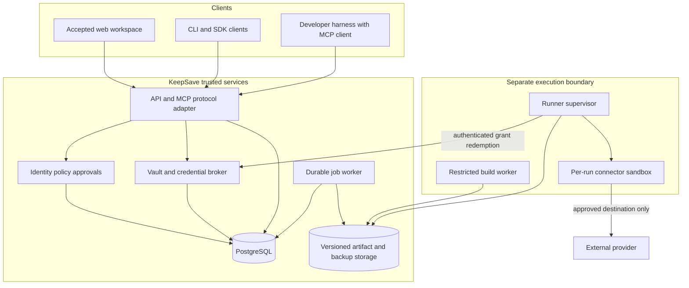

# Proposed backend architecture

Status: design proposal, 2026-09-28. Existing behavior is documented in [REVIEW](REVIEW.md); everything described as a target below requires implementation and verification.

## 1. Pattern: modules around capabilities, adapters at the edges

Keep Go/Gin and the existing database layer. Introduce business modules incrementally, with small consumer-owned interfaces where a boundary needs substitution. A module owns its invariants and tables. HTTP handlers validate/translate input; application services authorize and execute use cases; repositories handle persistence. SQL, Gin contexts, MCP messages, and provider tokens must not spread through domain code.

| Target module | Owns | Reuses/migrates from |
|---|---|---|
| `identity` | Human sessions, organization membership, workload identities, external identity links | auth, organization, social auth, API-key services |
| `policy` | Typed actions, resource resolution, policy revisions, decisions, approval requirements | project-access and scope middleware, access-policy records |
| `vault` | Secret metadata/ciphertext, versions, key versions, imports, templates, reference resolution, recovery | secret/env/project, crypto, version, envfile, template, dependency code |
| `promotion` | Environment transition proposals, approval and rollback state | promotion service/repository and existing DB invariants |
| `broker` | Provider connections, credential bindings, attenuated grants, delivery and revocation | leases, agent tokens, denylist; new provider adapters |
| `mcp` | Protocol adapters, approved server/artifact catalog, installations, tool contracts | MCP handlers/services/models; execution removed from handlers |
| `automation` | Skill versions, harness profiles, run admission, run state and receipts | New product capability; existing CLI becomes one adapter |
| `audit` | Security events, transactional append, chain verification, retention checkpoints | audit repository/helper and taxonomy |
| `jobs` | Outbox, job claims, retries, schedules, durable webhook delivery | event bus, webhook and builder scheduling |
| `insights` | Scoped metadata read models, drift and recommendations, optional provider access | AI/analytics services |

Applications/bookmarks, feedback, and UI settings remain small adjacent modules; they do not gain vault access by joining the application. Split the mixed `sso_service.go` by responsibility as those features move. Do not create generic repositories or interfaces for every struct.

Illustrative destination, migrated a feature at a time:

```text
backend/
  cmd/server/                 # trusted API bootstrap
  cmd/worker/                 # trusted durable jobs; no arbitrary user code
  cmd/runner/                 # separately deployed connector supervisor
  cmd/keepsave/               # developer CLI / compatibility adapter
  internal/app/               # typed wiring, route registration, lifecycle
  internal/identity/
  internal/policy/
  internal/vault/
  internal/promotion/
  internal/broker/
  internal/mcp/
  internal/automation/
  internal/audit/
  internal/jobs/
  internal/insights/
  internal/platform/          # DB/clock/IDs/logging, narrow shared primitives
  migrations/{postgres,mysql,sqlite}/
```

Inside a substantial module, use `service.go`, `types.go`, `ports.go`, `http.go`, and `store.go` or subpackages only as size demands. Existing `internal/service` and `internal/repository` remain behind adapters during migration. Replace the positional `SetupRouter` argument list with a typed `Dependencies` struct and per-module registration.

Dependency rules become CI checks: domain/application code cannot import Gin, `os/exec`, or another module’s storage implementation; only the runner/build adapter can execute third-party code; only vault/broker internals can request secret decryption. Entrypoints and adapters compose modules. The policy evaluator consumes typed attributes, not arbitrary SQL or an AI answer. Shared DTOs contain IDs and metadata, not universal secret-bearing models.

## 2. Application contracts

Every entrypoint—REST, MCP, CLI adapter, scheduled job, import, template, restore and promotion—calls the same authorized use case. Middleware performs authentication and early rejection; it is not the sole authorization boundary.

Conceptual contracts, not a new public SDK or committed implementation:

```text
Principal = {kind, subject_id, tenant_id, actor_id?, parent_grant_id?, expires_at}
Resource  = {tenant_id, project_id, environment_id, type, id, revision}
Action    = typed enum: secret.read_metadata | secret.read_value | secret.write |
            secret.restore | promotion.approve | tool.invoke | grant.issue | ...

Authorize(principal, action, resource, run_context) ->
  Decision {effect: allow|deny|approval_required, reason_code,
            policy_revision, constraints, valid_until, decision_id}

Vault.ChangeSecret(context, principal, command, expected_revision, idempotency_key)
Broker.AuthorizeUse(context, authenticated_runner, grant_id, operation) ->
  connector-scoped capability, never a dashboard/model-visible credential
Runner.Execute(context, job_id, artifact_digest, grant_handle) -> RunReceipt
```

Resolve tenant/environment/secret identity from authoritative rows before checking access. Never trust a body’s `project_id` or a caller’s description of the target. A decision is bound to the exact action/resource/revision; it cannot be reused for another target. Lists are scoped before reading/decrypting and are paginated. Metadata permissions are separate from value disclosure.

## 3. Deployment and trust boundaries



Initially API, policy, vault, broker and audit are modules in one trusted process; the job worker may use the same codebase with a separate entrypoint. Extracting the broker into a separately privileged service is an enterprise custody option after its contract stabilizes. A Go module boundary alone does not isolate compromised code in that process.

The build worker receives source and dependency-fetch credentials only when explicitly necessary, never vault master keys, database credentials, or runtime provider connections. Runtime sandboxes receive an approved artifact and run-specific authority. Neither build nor tool sandboxes mount the API filesystem, host home, container socket, or service-account token by default. The supervisor verifies identity, artifact and policy constraints before starting them. Customer-hosted runners use the same contract, with tenant-bound enrollment and outbound connections; they require a separate operational support decision.

Keep the API’s distroless image. Publish a separate runner image and an independently restricted build image. The first pilot uses a vetted prebuilt connector so arbitrary repository builds are not a prerequisite.

## 4. Consistency and audit

Adopt a Unit of Work around a single database transaction. Repository operations participating in it must use the same transaction handle; never fetch from the pool while holding a single-connection transaction.

| Operation | Must commit together | Outside the transaction |
|---|---|---|
| Secret create/update/restore | Current value/revision, immutable version, audit event, outbox notification | Notification delivery |
| Promotion/rollback | Locked expected revisions, all affected secret/version rows, transition, audit, outbox | Webhooks |
| Grant creation/revocation | Grant state, parent/policy revision, admission/revocation audit, outbox | Provider mint/revoke request |
| Skill/profile approval | Immutable digest-bound approval and audit | Artifact scanning/build |
| Tool execution | Admission record and attempt identity before dispatch; outcome record afterwards | Provider operation |

For concurrent writes use explicit expected revisions, unique constraints, and appropriate row locks, returning a conflict on a stale update. Parent grant validity and child insertion need transactionally checked lineage so simultaneous revoke/mint cannot resurrect authority.

For the audit chain, replace the process-local tip with a persisted chain-head row and database serialization. Start with one global head to preserve the existing chain semantics; measure lock contention before proposing partitioned tenant chains. Use consistent lock ordering and deadlock retries. A failed required audit append rolls back a local mutation. For credential use, fail closed if admission cannot be durably recorded. A crash after an external request may leave its outcome unknown; preserve that state and reconcile it, rather than reporting success or replaying blindly.

Notifications use an outbox row written in the mutation transaction. Workers claim jobs with leases/fencing, acknowledge success, and retry bounded idempotent operations with backoff. This provides at-least-once delivery, not exactly-once external effects. Provider writes need idempotency support or explicit reconciliation; an unknown write outcome requires review. Raw credentials never enter job payloads.

## 5. Vault history, keys, and recovery

First implement a consistent vault lifecycle, preserving the existing cipher algorithm unless an accepted crypto ADR changes it.

1. Add immutable `project_key_versions`; reference a key version from current secrets, historical versions and promotion snapshots. Record a format version so old rows remain readable. A later authenticated-context format can bind tenant/project/environment/secret/version to ciphertext; changing AAD requires its own migration and review.
2. Version 1 is captured on creation. Updates, imports, template application, promotion, rollback and explicit restore create a new version within the same transaction. Backfill only the current value of preexisting secrets, with an honest baseline label; lost history cannot be reconstructed.
3. Restore a historical value by creating a new current revision. Require `secret.restore` and the environment’s approval policy. Metadata history listing does not decrypt every historical value. Corruption is an explicit failure; never silently skip it.
4. Rotation publishes a new active key version and re-encrypts current rows in fenced batches or a bounded transaction. Readers select by key ID, so retained history and snapshots remain readable. Retire an old key only after proving no retained ciphertext or required recovery material depends on it. Test concurrent writes/rotation and interrupted rotation before enabling this path.
5. Preserve the existing secret/version deletion contract. Do not introduce undelete retention without a separate policy. Backup retention necessarily creates a separate recovery window; document and enforce it, and prevent ordinary restore from silently reviving records deleted after the snapshot.

An encrypted backup bundle includes a schema/format version, project/environment IDs, a consistent snapshot of required encrypted records, key-version references/wrapped key material, integrity metadata, and the exact recovery-key dependency. Maintain an off-database copy and a separately protected key-recovery procedure. A database copy without the ability to recover its wrapping key is not sufficient.

Restore first into an isolated verification target: authenticate the bundle, check schema/key availability and counts, decrypt synthetic validation records, and produce a metadata diff. Production restore is a separately approved, tenant-bound operation with expected revisions and explicit merge/replace semantics. Existing metadata-only backups remain identifiable and fail restore with a clear error. Choose concrete recovery time/data-loss targets after the first measured drill; do not advertise a target that has not been tested.

## 6. Data ownership and additive migrations

Proposed entities, introduced only when their delivery stage needs them:

| Entities | Key relationships/invariants |
|---|---|
| Workload identities, identity credentials | Tenant owner, issuer/subject binding, enrollment/revocation state; humans remain separate |
| Policy revisions, approval requests | Immutable policy snapshots; approval binds actor, resource, operation, digest, expiry and parameters |
| Provider connections, credential bindings | Tenant/project/environment + provider account + allowed targets; encrypted credential material; no secret values in installation JSON |
| Grants and grant lineage | Parent authority, workload/run, exact resources/actions, policy revision, expiry, revocation; child never exceeds parent |
| MCP artifacts/tool revisions/installations | Immutable source/build/schema digests; approved installation belongs to a tenant/project; tool identity includes installation |
| Skill versions/harness profiles | Complete content manifests; approved tool/credential requirements; immutable profile versions and compatibility evidence |
| Runs/tool attempts | Actor/workload/run IDs, pinned digests, state, attempts, admission decisions, safe outcomes |
| Key versions/version rows/backups | Explicit encryption dependencies, integrity state, retention and restore validation |
| Outbox/jobs/audit head | Transactional event records, delivery leases, idempotency, chain sequencing |

Add tenant IDs and composite foreign keys where cross-tenant relationships can otherwise be constructed. Map each existing personal project to a personal security scope; preserve URLs/IDs, ownership and current access during backfill. Organization assignment is a deliberate scope transfer that revalidates bindings/grants, not a silent owner-field update. PostgreSQL row-level security is an optional later defense, requiring connection-pool and transaction tests; it does not replace application authorization.

Use expand→backfill→verify→switch→contract migrations. Never edit applied migrations. Preserve the per-dialect directory model. Every migration has fresh-database, upgrade-fixture, failed-backfill and rollback-compatibility tests. For team deployments use a controlled migration job or DB lock and a runtime database role without DDL permissions. The old version must reject unknown formats, never decrypt them with a guessed key.

## 7. Scaling strategy

| Stage | Deployment | Evidence required |
|---|---|---|
| Development | One API, isolated disposable runner, SQLite test profile or local PostgreSQL | Complete local flow; no claims of team isolation from SQLite tests |
| Team pilot | One API, PostgreSQL, durable worker, restricted runner pool, versioned artifact/backup storage | Restart recovery, quotas, revoke/deny tests, controlled connector egress |
| Multiple API replicas | Shared DB authority and limits, DB-serialized audit, coordinated migrations, durable jobs; independently scaled runner pool | Two-instance fault tests, signing-key/denylist refresh, consistent policy decisions, no duplicate unsafe effects |
| Enterprise | Tenant-dedicated/customer-hosted execution where needed, enterprise IdP and chosen KMS adapter | Customer-specific custody, enrollment, offboarding, recovery and operational evidence |

Capacity knobs: per-tenant/workload concurrency, queue length, tool CPU/memory/process/wall-time limits, artifact size, list pagination, DB pool budgets and retry ceilings. Admission rejects overload with retry guidance. Stream requests need explicit proxy buffering/timeouts and disconnect cancellation, rather than inheriting the current fixed response timeout unchanged.

PostgreSQL is the canonical scaled target. Preserve SQLite for local/test use and MySQL compatibility where maintained; mark unsupported capabilities explicitly until parity tests pass. No Redis, Kafka, Kubernetes dependency or separate policy language is necessary for the first team pilot. Add shared infrastructure only when the existing database-based implementation has measured limits or customer requirements justify it.

Before adding API replicas, also solve signing-key refresh/rotation coordination, migration ownership, webhook durability, run leases, per-tenant limits, and audit retention coordination. MCP transport compatibility may have legacy session state; that belongs to the adapter and its routing strategy, not to the run’s authorization identity.

## 8. Maintainable feature delivery

Each new capability ships as a bounded vertical slice: typed use case → authorization matrix → transaction/audit behavior → API contract → negative/failure tests → client integration → operational note. New providers implement credential mint/use/revoke capabilities; new harnesses implement the runner/profile contract; new skills add reviewed artifacts. None should require editing the encryption algorithm or duplicating policy checks.

Keep `/api/v1` behavior stable through adapters; add new management resources and an explicit `/mcp` protocol endpoint. A UI-friendly tool catalog endpoint should have its own typed response, separate from MCP wire envelopes. Generate or validate client types from a single OpenAPI contract and enforce response compatibility with handler tests. Deprecate endpoints only with an explicit migration window.

SDK defaults for strict broker use: no plaintext secret cache, no stale-on-error authorization, retries only for safe/idempotent requests, bounded timeout, cancellation, and cache lifetime never beyond grant expiry. Legacy raw-value SDK/CLI flows remain explicitly separate permissions. Preserve the accepted frontend while adding only the status/approval/connection surfaces needed by these backend slices.
