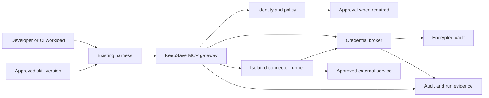

# KeepSave backend direction: vault, MCP, skills, and controlled harness access

Status: **Proposed architecture and delivery plan**. Checked 2026-09-28. No implementation, deployment, or security approval is implied by this document.

## Recommendation

Develop KeepSave into a **credential and access control platform for developer tools and agents**, built on its existing vault. A team should be able to answer: which person or workload used which tool, against which environment, with which permission, under whose approval—and stop further access when needed.

MCP, skills, and harness controls fit this purpose when each has a clear responsibility:

| Component | Responsibility | Example |
|---|---|---|
| Vault | Store and recover credentials securely | A project’s database password and a provider connection |
| MCP gateway | Expose approved tools and enforce access on every call | Read one repository through an approved connector |
| Skill | Package reusable instructions and references | Review a pull request using the team’s checklist |
| Harness | Run the agent, tools, and workflow | A developer’s coding assistant or a managed worker |
| KeepSave policy and broker | Decide permitted access and deliver credentials only where required | A ten-minute, read-only run against one repository |

**A skill requests capabilities; it cannot grant itself permissions.** A harness configuration is a request until KeepSave verifies it against the organization’s policy. Credentials should stay outside prompts and model-visible tool results wherever the connector can execute on the user’s behalf.

The initial customer assumption is a small engineering team with a security owner and organization-controlled credentials. This is a planning assumption based on the request, not evidence of validated customer demand. The first pilot should test both developer convenience and the security owner’s ability to explain and revoke access.

## Architecture at a glance

The core remains a Go **modular monolith**: one application with explicit module boundaries, a shared transaction model, and a small deployment footprint. Code that builds or runs third-party MCP servers moves into a separate, restricted execution service. That separation is needed for credential custody and resource isolation even before traffic grows.

## What the codebase review changes

There is substantial existing code to retain: encrypted storage, promotion approvals, API-key scopes, lease-bound read tokens, a tamper-evident audit chain, database migrations, a CLI, three SDKs, and frontend integration surfaces.

However, the current feature names overstate several end-to-end capabilities. Version history has a repository and read endpoints without a normal write path; backups contain metadata rather than recoverable secret records. MCP execution is a custom single-request subprocess flow. Access-policy records do not form a shared enforcement engine. The audit chain and several background facilities assume one process.

The detailed review also identifies authorization paths to reproduce and fix before extending harness access, including MCP installation ownership and parent-to-lease permission narrowing. These are source findings, not claims of a completed penetration test. See [review and evidence](REVIEW.md).

## Scope and sequence

1. **Establish trustworthy boundaries.** Reproduce and fix the identified authorization gaps; give every credential path an explicit principal and policy decision.
2. **Complete vault recovery.** Atomic version history, restore, rotation compatibility, and a tested encrypted backup/restore drill.
3. **Deliver the MCP foundation.** Standards-based transport and authentication, stable tool identities, accurate client contracts, and connection diagnostics.
4. **Pilot controlled credential use.** One approved connector, one project/environment, short-lived run authority, isolated execution, revocation, and an audit receipt.
5. **Add private skills and harness profiles.** Reviewed versions, capability requirements, adapter compatibility checks, and clear enforcement status.
6. **Prove team scaling.** Multi-instance audit consistency, durable jobs, shared limits, recovery tests, and then enterprise identity integration when a customer requires it.

The delivery plan gives each stage its dependencies and pass/fail criteria. The first useful demonstration is a developer using an approved review skill to read one repository, being denied access to a second repository, and losing further access when the run is revoked.

## Limits that must remain visible

- Gateway policy governs operations routed through KeepSave. A developer-controlled computer can use other tools or credentials outside that route.
- Strong file, shell, and network restrictions require an enforced local sandbox or a managed runner. An editable configuration file or a self-reported harness name cannot prove those restrictions.
- After a raw credential is released to a process, KeepSave cannot guarantee that the process forgot it. Stronger modes use brokered operations; provider revocation and expiry determine the remaining exposure of issued provider tokens.
- GitHub/Google **sign-in** is separate from granting a tool access to repositories or Google data. The existing social-login setup does not establish those provider connections.

## Read the plan

- [Codebase review and evidence](REVIEW.md): coverage, current behavior, implementation gaps, and existing test evidence.
- [Architecture](ARCHITECTURE.md): modules, contracts, data model, consistency, recovery, and scaling.
- [MCP, skill, and harness security](SECURITY.md): credentials, approvals, policy, isolation, revocation, and threat cases.
- [Delivery plan](DELIVERY.md): incremental work packages, acceptance criteria, review gates, and first pilot.
- [Primary-source research](SOURCES.md): current MCP/skills standards and how they affect this proposal.

This proposal records a reasoned expansion of the older Phase A scope in [ROADMAP_NOT](../../ROADMAP_NOT.md): private skills and controlled connector execution support the user’s requested team security use case. Public marketplaces, a general agent IDE, arbitrary code deployment, multi-region hosting, and further AI dashboard features are deferred to make room. The existing frontend remains the accepted design baseline.
