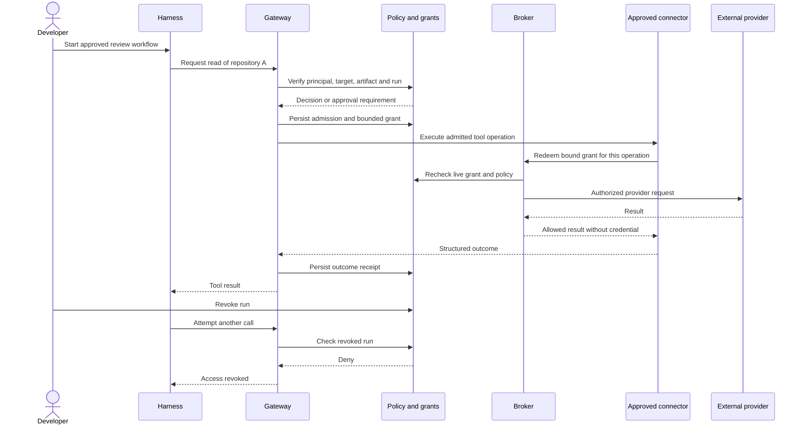

# MCP, skills, harnesses, and credential control

> **Design boundary, clarified 2026-10-04.** These are the original September proposed controls. Later decisions use broker-only upstream credential custody, harness-neutral profiles and separate client-bound runs, with no device-attestation claim. Consult the [current threat model](../../THREAT_MODEL.md), [architecture](../../ARCHITECTURE.md) and [October acceptance checkpoint](../2026-10-02-harness-neutral-platform/README.md) for implemented scope and unverified controls; this document does not supply sign-off.

Status: proposed controls and acceptance obligations, 2026-09-28. This document is a threat/design delta for future implementation, not evidence that these controls already exist.

## 1. What the product can enforce

| Mode | KeepSave can enforce | Limit |
|---|---|---|
| Gateway-connected harness | Identity, allowed tools/targets, credential use through the broker, budgets and audit | Cannot observe/block unrelated shell or network activity on the developer’s machine |
| Managed local harness | Above plus restrictions enforced by the enrolled runtime/OS policy and supported adapter | A developer with unrestricted local administration may bypass controls; self-reported posture is not attestation |
| Managed remote runner | Approved artifact, clean filesystem, restricted network, resource limits, credential-delivery boundary and teardown | Still trusts the runner supervisor, isolation substrate and selected provider; sandbox escapes and permitted-data exfiltration remain threat cases |

Make the mode and its evidence visible. Refuse a profile requiring unavailable controls. Never silently fall back from managed execution to unrestricted local execution. First release supports gateway-connected clients and a controlled connector runner; full desktop management is conditional future scope.

## 2. Identity and credential classes

Keep these distinct in schema, logs and APIs:

1. **Human identity:** signed-in person, organization membership, delegated action and approver identity.
2. **Workload identity:** registered runner, CI job or service, bound to a tenant and its allowed authentication method.
3. **Run authority:** temporary KeepSave grant for one workload/task and pinned profile. A display name, User-Agent, MCP clientInfo or local manifest alone cannot establish identity.
4. **Provider connection:** the upstream authorization to GitHub, Google, a database or another service, with account ownership and provider-specific capabilities.
5. **Provider credential:** an actual access token/password/private key used by an adapter. This has its own lifetime and revocation behavior, independent of the KeepSave run grant.

A user logging in through GitHub or Google does not authorize arbitrary API access to that provider. Add a separate connection and consent/setup flow. Do not repurpose social-login tokens, accept a token intended for another service, or automatically link identities using an unverified email match.

For the harness's **model-provider credential**, support an organization-owned API connection only through the provider's supported integration. A trusted relay can apply the run's permitted models, usage budget and expiry where the provider/runtime supports mediation. Direct local injection has the same custody limits as other raw credentials. Subscription sign-in sessions remain with the official harness: KeepSave should not collect browser cookies or account passwords, or assume a subscription session can be converted into shared API access. Broad model routing is deferred; the initial connector pilot does not require changing the developer's model account.

## 3. Central policy model

Use a typed policy evaluator shared by API use cases, broker and gateway. Deny overrides allow. Effective authority is the intersection of platform restrictions, organization policy, project/environment grants, parent identity authority, approved installation/profile, run grant and tool-specific constraints. Unknown identities/resources/actions or unavailable authoritative state deny access.

For every call, verify:

- Authenticated issuer, subject, intended audience, expiry and revocation.
- Tenant/project/environment from stored resource relationships.
- Human or workload role and explicit action, including metadata versus value access.
- Parent grant lineage, expiry, permitted keys/targets and delegation depth.
- Approved server artifact, tool schema, skill/profile versions when the managed flow requires them.
- Tool arguments against a bounded schema and policy constraints such as repository, operation, path and destination.
- Remaining concurrency/time/cost budgets and any required human approval.

Caller-asserted `skill_id` or `profile_hash` is useful context, not proof that an unmanaged harness is following those instructions. For a managed run the supervisor verifies and records the loaded artifact digests; the gateway independently evaluates the actual tool operation in both modes.

Initially implement a small deterministic rule model in Go with versioned JSON configuration. Avoid an open-ended scripting language for policies. Preserve existing API-key scope grammar through a compatibility adapter; do not accidentally change its historical write→delete implication. New broker actions use explicit privileges.

Suggested separation of responsibilities:

| Role/capability | May do | Must not gain implicitly |
|---|---|---|
| Organization owner/security administrator | Manage members, approve policy/profile/provider bindings, emergency revoke | Unlogged secret reveal or bypass of required separation of duties |
| Project maintainer | Manage non-production configuration, propose installations/skills, inspect runs | Self-approve a protected production change |
| Developer | Start approved runs within project grants, request extra access, cancel own run | Change organization policy or expand a grant |
| Production approver | Approve exact eligible requests within expiry | Approve their own request where separation is required |
| Workload/runner | Execute admitted operations and report receipts | Mint broader grants, change policies or list all credentials |
| Auditor | Read scoped metadata and audit receipts | Read secret values or execute tools |

These are proposed capabilities, not a declaration of today’s role strings. Map existing roles explicitly during migration and test every action/role combination.

## 4. Credential delivery choices

| Mechanism | Use | Control and residual exposure |
|---|---|---|
| Brokered operation | Preferred for connectors KeepSave can mediate | Token remains in a trusted adapter; run gets only an allowed operation result. Enforce method/target/schema, not just hostname. |
| Provider-issued short-lived credential | When the provider supports useful downscoping | Verify actual returned permissions and expiry. Bound delivery to the run/runner. Provider credentials may outlive the KeepSave grant. |
| Static secret injection | Compatibility for tools that require env/file credentials | Explicitly permitted managed-runner mode; minimal env or protected temporary file; never command-line arguments. Cannot guarantee erasure or true provider-side downscoping. |
| Raw secret read/export | Existing developer/application use case | Separate auditable permission; incompatible with a promise that credentials never reach the local harness. |

A five-minute KeepSave lease around a long-lived API key does not transform that key into a five-minute provider credential. GitHub App installation tokens, for example, have their own provider lifetime; brokered use can stop at KeepSave grant expiry while an already-issued token remains governed by GitHub. Request restricted repositories/permissions rather than accepting provider defaults. [GitHub’s installation-token documentation](https://docs.github.com/en/apps/creating-github-apps/authenticating-with-a-github-app/generating-an-installation-access-token-for-a-github-app) describes those bounds.

Store refresh tokens and provider signing keys encrypted; omit them from generic model serialization. Prefer workload federation or enrolled key proof when supported, with short-lived, audience-bound run authority. A limited bootstrap API key may support the early pilot but cannot be reused as a universal runtime credential. Runner enrollment uses a one-time, short-expiry challenge and an operator-approved tenant binding; renewal must recheck enrollment and policy.

## 5. Run flow and revocation

Persist run states `requested → awaiting_approval → admitted → running → succeeded/failed/cancelled/expired`, with `outcome_unknown` for uncertain external effects. Denied admission records do not become runnable jobs. Completed/revoked runs cannot be restarted under old authority; a retry receives an explicit attempt record and is checked again.

Every credential redemption and protected operation checks authoritative grant, parent and policy state. In the strict pilot, do not cache successful authorization. Define revocation’s linearization point as the committed database state: calls admitted after that commit must fail. Calls already dispatched may complete; attempt cancellation and record the result honestly. Network partition or stale authority denies new protected actions. Teardown stops the managed run, cancels queued work and attempts provider revocation where supported.

Local plaintext caches, already-returned data, and issued upstream credentials cannot be retroactively erased by a gateway. Track downstream revocation as `pending/confirmed/unsupported/failed`, retry safely, and show the remaining provider lifetime when known. Current explicit-JTI revocations refresh across instances on a 30-second timer; current lease checks read live state. The proposed strict guarantee requires new tests and cannot be inferred from that cache.

## 6. MCP protocol and upstream connections

Implement `/mcp` with an audited, pinned version of the official Go SDK after a compatibility spike. Keep the old custom gateway as a documented legacy adapter until clients migrate. As checked on 2026-09-28, the current MCP specification resolves to `2026-07-28`; its request-scoped HTTP model differs from `2025-11-25` session/initialization behavior. Pin the supported matrix and test each version rather than assuming one handshake applies to all clients. [Current transport specification](https://modelcontextprotocol.io/specification/2026-07-28/basic/transports/streamable-http), [Go SDK](https://github.com/modelcontextprotocol/go-sdk).

OAuth boundary: KeepSave is the protected resource for inbound MCP requests and a separate client of upstream providers. Validate resource/audience binding, use PKCE and issuer-bound authorization state where required, publish protected-resource metadata, and keep upstream grants separate. Do not forward an inbound KeepSave token as a provider token. Consent must identify the client and target service. Discovery/metadata/token URL fetching is an SSRF boundary. These choices follow [MCP authorization](https://modelcontextprotocol.io/specification/2026-07-28/basic/authorization) and [security guidance](https://modelcontextprotocol.io/docs/2026-07-28/tutorials/security/security_best_practices).

Tool policy uses `(tenant, installation_id, artifact_digest, tool_name, schema_digest)`. Expose collision-safe names and bind them to this identity. Validate request and response structure with size/depth/time limits. Tool descriptions and annotations remain untrusted input; a claimed read-only annotation does not authorize reads or guarantee absence of writes. An approved tool update is a new version and may require reapproval. Required credential mappings belong to the installation and approved policy, not a mutable public server definition.

Origin/host validation, TLS, redirect restrictions, DNS/address checks at connection time, and restricted egress apply to remote MCP/provider calls. Sensitive argument/header values must not enter proxy/access logs. Disable optional server-requested actions until their own permissions and tests exist. Return normal MCP errors/results through the version adapter; never let malformed output bypass filtering.

## 7. Skills and harness profiles

Use the existing Agent Skills `SKILL.md` format. Store governance in a separate versioned KeepSave manifest: origin, publisher, content digest, required tool identities, requested credential references, risk classification, and compatible harness profile versions. It contains no raw tokens. An `allowed-tools` field is a declared request subject to KeepSave and host policy. [Agent Skills format](https://agentskills.io/specification).

For supported hosts, adopt the official `io.modelcontextprotocol/skills` extension: discovery/get plus resource reads, with manifests and content verification. Preserve origin-server identity and complete file digests in approvals; a content change requires renewed approval. Reading a skill does not itself activate it. Host support must be tested; the official overview explicitly describes implementation support as still developing. [Skills extension](https://modelcontextprotocol.io/extensions/skills/overview), [normative specification](https://github.com/modelcontextprotocol/ext-skills/blob/main/specification/stable/skills.mdx).

KeepSave-specific controls:

- Private organization catalog first. Intake→scan→review→approve→publish-to-org→revoke. Scanning and signatures provide evidence/provenance, not a proof of safe behavior.
- Accept immutable bundles in the first release. Reject dynamic skill content for protected runs until a separate review model exists.
- Validate archive paths, symlinks, file counts and total expanded size. Treat supporting scripts and dependencies as executable supply-chain inputs. Fetch and load only required content.
- A changed tool/skill/profile invalidates the relevant approval. Pin nested dependencies; nested skill activation needs its own host approval and cannot expand the run grant.
- An unmanaged host may receive a verified bundle through a download/adapter path; label its execution status honestly. Do not claim the official extension is supported merely because a host can read Markdown.
- Record evidence for whether instructions were loaded by a managed adapter. Do not claim an LLM followed every instruction just because a digest was recorded.

A **harness profile** is an immutable approved configuration: adapter/version, tool and skill digests, project/environment access, credential-delivery modes, sandbox/workspace/network restrictions, time/concurrency limits, required approvals, and permitted model-provider connections. Profile parameters contain references, not provider keys. Adapter conformance reports each control as enforced, unavailable or unverified. Start with one tested adapter plus generic remote MCP support; add others only through the same conformance suite.

Example policy intent: “This developer may run the approved repository-review skill for ten minutes, read repository A through the GitHub connector, and write a local report. It cannot read repository B, reveal the provider token, modify repository settings, or access PROD.” The ten-minute limit governs KeepSave operations; it does not claim GitHub minted a ten-minute token.

## 8. Threat cases and test obligations

| Threat | Required control | Evidence before claiming protection |
|---|---|---|
| Forged workload/profile, stolen bootstrap credential | Enrollment, audience/issuer checks, limited bootstrap, proof of possession where supported | Wrong-run/tenant/runner/audience and replay tests |
| Cross-user installation or wider child lease | Ownership in queries; delegation intersection and real principal IDs | Real-FK create→mint→invoke tests and same-project cross-principal denials |
| Skill/tool prompt injection | Untrusted instructions, independent policy, no self-grants, sandboxed execution | Malicious instructions request extra credentials/tools; server still denies |
| Tool/schema or skill replacement after approval | Digest-bound approvals and authoritative recheck | Change/add/remove artifact between approval and use; no credential release |
| Credential leakage | Brokered operations, restricted delivery, no sensitive telemetry, bounded outputs | Canary credentials absent from prompts/results/errors/logs; encoded/fragmented/network attempts tested |
| Malicious package install | Isolated build with no runtime credentials, locked provenance, bounded logs | Host env/files/socket and private metadata unreachable from fixture build |
| SSRF and confused deputy | Allowlisted destination/account/method, safe metadata retrieval, separate upstream consent | Redirect, DNS rebinding, internal-IP and wrong-provider-token tests |
| Revocation race/outage | Live authority check, lineage, atomic grant transitions, no offline allow cache | Concurrent revoke/mint/call and database/network outage tests |
| Duplicate external effects | Stable attempt/idempotency identity; unknown-outcome state | Worker crash after dispatch; no automatic unsafe replay |
| Broken audit or cross-replica policy | Transactional admission/audit, serialized chain, coordinated policy revision | Audit-write failure and two-replica concurrent append/revoke tests |

Redaction is defense in depth. A malicious connector can transform a secret into valid JSON or send it over permitted channels; output syntax validation does not prove confidentiality. Policy, provider permissions, isolation, egress restrictions and connector review must carry the actual guarantee. Similarly, allowed repository content may itself contain sensitive data; minimizing token disclosure does not eliminate data-egress policy requirements.

## 9. Enterprise path

Integrate an organization’s IdP as an additional authoritative source of identity and access. Evaluate the official [enterprise-managed MCP authorization extension](https://modelcontextprotocol.io/extensions/auth/enterprise-managed-authorization) when the selected IdP and clients support it. Test offboarding of already-issued tokens and in-flight runs; do not assume an IdP configuration change instantaneously invalidates every external token. The [client-credentials extension](https://modelcontextprotocol.io/extensions/auth/oauth-client-credentials) is a candidate for unattended workloads with separately scoped machine identity.

Choose one production key provider and prove bootstrap, rotation, backup restore and outage behavior. Existing AWS/GCP adapter types are not proof they are wired. Platform operators with API-process/master-key access are inside the present trust boundary. Stronger separation of duties, hardware-backed keys, customer-hosted execution, tamper-evident external audit checkpoints and evidence export are later requirements to validate with a design partner. No compliance certification or universal harness-control claim is made by this plan.
