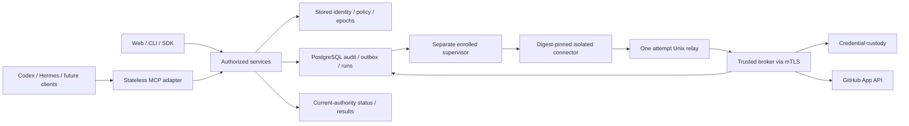

# Harness-neutral implementation checkpoint — 2026-10-02

October3 publication note: the owner authorized committing this source candidate
and publishing through develop to main. The October2 working-tree/test status
below is historical; see the [publication note](../../releases/2026-10-03-source-publication.md)
for the scope and still-pending production gates.

This is the local implementation of the owner's technical plan, based on
`3878e696cbcdeb97615320e5af864eae0885e4df` in
`feat/harness-neutral-platform-20261002`. No commit, integration, tag, provider
configuration, native installation or deployment occurred in this implementation.
The three preexisting planning edits and the separate landing checkout are preserved.

**Implemented does not mean operationally accepted.** The
[acceptance ledger](../../validation/2026-10-02-harness-neutral-platform/ACCEPTANCE.md)
and [protocol receipt](PROTOCOL.md) record executed synthetic checks and external
gates. [ADR0029](../../adr/0029-harness-neutral-platform.md) permits local work;
Security Engineer and Tech Lead signatures remain pending.

## Modules and extension contracts

`policy` remains the common decision vocabulary. `authority` resolves and locks
stored subjects/organizations/projects/current memberships/sessions before
protected state. `vault` owns value/key/history/recovery and ephemeral ciphertext.

Password recovery holds the exclusive stored-user authority barrier and calls
an injected legacy delegation-revocation port. The same transaction expires that
user's retained API keys, revokes their related leases, denylists persisted agent
issuance through its natural expiry, changes the password, consumes the proof,
revokes browser sessions/linking proofs and commits the required audit/outbox.
Issuance identities remain intact; unrelated users retain their authority. An
unwired revocation port refuses recovery rather than issuing a partial reset.
Protected legacy grant minting and vault use recheck authority after the shared
barrier, including requests whose HTTP authentication preceded recovery commit.
`identity` owns proofs, safe method changes, invitation and scoped offboarding.
`auditview` projects only safe journal metadata. `mcpauth` owns delegated OAuth;
`mcpgateway` translates protocol calls. `runs` owns grant/run admission, budgets,
attempts and results; `broker` performs typed provider requests; `automation`
owns immutable instruction/profile/package records; `harness` translates native
formats; `runner` supervises only approved connectors outside the control host.

Portable profile and source digests are independent of client packages. Each
OAuth family and run belongs to one registered client. Native instructions,
reported digests and local settings grant no permission and do not attest a
device. Additional harnesses implement the native exporter/protocol contracts;
qualification is per exact client build, authentication, protocol and controls.
The shared core does not import harness-specific SDKs or configuration types.

## Implemented vertical slices

| Slice | Local behavior | Remaining acceptance |
|---|---|---|
| G0 | Existing social/password sessions, journal/key/recovery foundation retained | Real Google/GitHub consent, installation key/restore/cutover, remote CI, reviews |
| G1 | Shared subject/organization/project/session barriers, epochs, safe denials, read-only doctor and safe audit browse/export; bounded two-process session revocation | Reviewed complete entrypoint matrix and full fault exercises |
| G2 | Lifecycle/reminders; proof/method/invitation/recovery services and UI; scoped preview/idempotent offboard receipts; recovery v2 | Installation-specific SMTP accepted delivery, live identity UAT |
| G3 | Pinned SDK, stateless MCP, discovery/consent/opaque OAuth with replay checks and both synthetic protocol lanes | Exact Codex/Hermes authentication/tool/native-stop interoperability |
| G4 | Broker, bindings, immutable pilot approval, bounded runs/operations/tickets/encrypted results; private mTLS listener and supervisor | Disposable live GitHub App UAT and actual host isolation enforcement |
| G5 | Immutable instruction-only SKILL.md source, portable profiles, native candidate packages, independent approvals/export/check | Both clients discover/use the approved skill; admin settings evidence |
| G6 | Control reference, trusted worker, optional private listener and runner reference/runbooks | Full two-API deployment, fault/upgrade/recovery drill and measured capacity |

The pilot source registry currently accepts one bounded instruction-only
`SKILL.md` per immutable artifact. Reference-file trees and richer artifact
registries can extend the immutable manifest port; arbitrary executable files
remain refused. Minimal review profiles have fixed protective limits, rather
than a general policy editor. This is the pilot management implementation.

## Security and failure behavior

Admissions reconstruct current stored authority, including membership epochs,
approved digests, delegation/session lineage and expiry. Removed/rejoined members
cannot reuse old authority. Offboarding is organization-scoped and preserves
unrelated memberships, personal projects and global browser sessions. It includes
authority inherited through the departed member's connections/workloads/approvals.
Preview and execution bind exact impact; execution uses a stable caller key.

Shared lock ordering starts with sorted known humans, then organizations/projects,
membership, parent sessions/families, provider/runner records, runs/budgets and
attempts, approvals/vault, and finally the audit head. Discovery is revalidated
under locks. A changed ownership discovery fails closed; automatic retries of
discovery are not a production guarantee. Network work never holds these locks.

Run preparation admits bounded reference resolution and activates only after
current-authority revalidation. Protected results require another authorization.
Ten-minute run maximum;30-second provider deadline;4-MiB complete MCP result;
100 provider operations;32-MiB cumulative output;two concurrent operations.
The broker reduces raw content allowance to fit escaped text/structured wrappers.
Mutable-reference fallback, binary/LFS/symlink/submodule traversal and truncated
trees are refused. Upstream call outcomes and delivery permission are separate:
revocation cannot undo an admitted request or recall returned data.

Browser sessions retain24-hour maximum. OAuth code60 seconds/access10 minutes/
family8 hours, bounded by the browser parent. Refresh rotates; replay revokes the
family. An active run pins its admitted delegation token; a refreshed token needs
a newly authorized run. Kill switches deny new admission/dispatch while current
authorized status, receipts, cancellation and revocation remain available.

Email proofs are256-bit random, hash-only for verification, purpose/account-bound,
15-minute-lived, with bounded attempts. Outbox rows carry IDs; delivery material
is ephemeral Vault-encrypted. SMTP requires STARTTLS/certificate validation and
authentication. Acceptance records say SMTP accepted, not delivered. Uncertain
sends are not automatically replayed; explicit resend invalidates the old proof.
Copied proof URLs use browser fragments cleared before submission.

Audit exports are safe metadata snapshots taken in repeatable-read transactions,
published by fenced trusted jobs, downloaded under current authority and expire
in one hour. Defaults31 days/10,000 rows/20 MiB. They contain no value/proof/provider
token/raw request payload. Terminal publication failure cannot become delivery.
Operation results are encrypted, expire no later than their run and are excluded
from backups, audit exports, logs and outbox payloads.

Recovery v2 keeps lifecycle metadata separate from immutable credential revisions.
Legacy v1 fields stay unknown. Responsible users must map explicitly to currently
permitted members (or an isolated newly created custodian). Recovery imports no
users, sessions, tokens, grants, approvals or operation results. AES-256-GCM and
the ciphertext format are unchanged. Historical keys/tombstones remain retained.

## Setup, APIs and qualification

Follow [SETUP.md](SETUP.md), [PROTOCOL.md](PROTOCOL.md),
[control-host reference](../../../deploy/self-hosted/README.md) and
[runner reference](../../../deploy/runner/README.md). New flags default false;
do not turn them into an acceptance claim. `core.json` is the maintained management
OpenAPI source and generated frontend types are checked against it. The public
proxy blocks runner operations; only the dedicated direct mTLS listener serves them.

Use synthetic CI fixtures. Live consent, SMTP, GitHub or model-assisted harness
acceptance requires separately authorized installations/resources. Do not change
the installed Hermes profile/provider/session/memory to qualify the newer candidate.
The landing remains at keepsave.draveniq.dev; the full same-origin application
app.keepsave.draveniq.dev is a deployment target, not a published service here.

## Follow-on priorities

Close G0 and exact-client/provider/isolation gates before calling the platform
supported. Then finish the G6 two-API/worker/supervisor failure and upgrade drills
on fixed hardware, publish measured latency/recovery results, and expand bounded
reference-file manifests and additional adapters behind the same policy/custody
contracts. External secret delivery, arbitrary scripts/builds, model credentials,
SSO/device attestation, marketplace and multi-region operation remain deferred.
