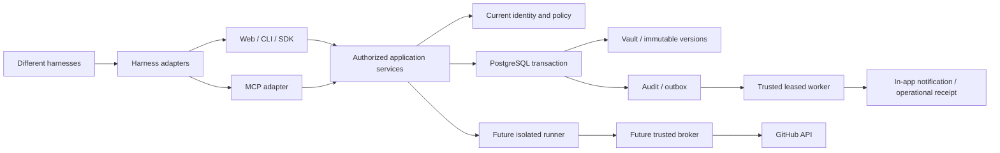

# KeepSave — product development plan

Prepared 2 October 2026 from the integrated `v1.4.0-rc.1` source candidate,
code inspection and primary-source research. This is a proposed delivery plan;
it does not claim new features, customer interviews or production acceptance.

## Product direction

KeepSave should become the self-hosted place where a developer team can answer:
**Who may use this credential, for what work, until when, and what happened?**
Deepen the dependable vault and deliver controlled developer-tool access through
a harness-neutral core. On 2 October the owner clarified that KeepSave must
support different harnesses and accommodate future technology. Codex remains
the first pilot candidate, not a product restriction or a domain dependency.
Keep Go/Gin, PostgreSQL and the modular monolith; avoid another broad rewrite.
Preserve the accepted Event Horizon/Field Twist interface.

The immediate recommendation is to finish core acceptance, then deliver safe
denial explanations, audit search and credential renewal ownership. Team
invitations/offboarding follow. Continue MCP → GitHub broker/runner → private
skills/profiles in their established order. Broader secret delivery comes later.

Supporting artifacts:

- [Research and evidence limits](RESEARCH.md): nine primary sources and their
  relevance, with historical reports separated from current vendor features.
- [Feature specifications and implementation backlog](BACKLOG.md): F01–F09,
  proposed contracts, authorization, data, dependencies and acceptance tests.
- [Existing architecture and delivery](../2026-09-28-backend-platform/DELIVERY.md):
  normative M2–M5 sequence and the approved broker security boundary.
- [Current acceptance ledger](../../validation/2026-10-01-core-release/ACCEPTANCE.md):
  implementation evidence and unfinished operational/release gates.

## Baseline: what is already present

Candidate `8fa8d6e` was integrated into `develop` by merge `1fb27c4` on 2 October
under the owner's renewed merge instruction. Its tree matches the validated
candidate. This is sponsor-directed integration; it does not substitute for
independent Security Engineer/Tech Lead signatures or production acceptance.

| Status | Current capability |
|---|---|
| Implemented and locally exercised | Password/social identity fixtures, explicit linking, canonical email handling, revocable 24-hour sessions and transactional named workspaces. |
| Implemented and locally exercised | Current tenant/role/parent checks, scoped vault grants, PostgreSQL history/restore/rotation, promotion snapshots, encrypted recovery and transactional audit/outbox. |
| Implemented; operational acceptance pending | Private backup maintenance, isolated recovery CLI and same-origin control-host deployment reference. Scheduling stays off until installation-specific recovery acceptance. |
| Acceptance pending | Real Google/GitHub consent, independent reviews, remote CI, staging rollback, production TLS/Transit/storage and coordinated cutover. |
| Unavailable in core | API-host MCP execution, legacy OAuth issuance, experimental AI/analytics, policy metadata controls, enterprise SSO/compliance, non-durable webhooks and plugin execution. |
| Planned | Standards-based MCP, GitHub App broker/isolated runner, private skills, portable access profiles with harness adapters and measured team operations. |

History, backups, session revocation and scope checks are foundations to reuse,
not new roadmap discoveries. New guarantees remain PostgreSQL-only until parity
is demonstrated. Social GitHub sign-in is separate from a GitHub App connection.

## Pain points and priorities

External documentation demonstrates possible solutions; it does not establish
KeepSave customer demand. These priorities are engineering judgments based on
observed repository gaps and the [evidence register](RESEARCH.md).

| Priority | Problem to validate | Proposed outcome | Confidence |
|---|---|---|---|
| P0 | An install can appear ready before its keys, login or recovery work. | F01: task-based setup and operator doctor; finish current release gates. | Strong usability evidence; KeepSave journey still needs team validation. |
| P1 | A developer sees a generic denial without a safe next step. | F02: redacted explanation and correlation ID. | Code gap observed; frequency and benefit are hypotheses. |
| P1 | An incident trail is difficult to page/filter/export. | F03: bounded searchable audit and safe receipts. | Code gap observed; incident workflow needs validation. |
| P1 | Nobody owns renewal, and declared expiry is forgotten. | F04: ownership/lifecycle metadata and durable in-app reminders. | Documented product precedent; KeepSave demand unproven. |
| P1 | Adding a teammate requires UUID exchange; removal lacks a complete summary. | F05: secure invitation flow and organization-scoped offboarding receipt. | Code gaps observed; removal already denies current access. |
| P2 | Losing a login method can lock out a legitimate user. | F06: method safety, verified recovery design and session invalidation. | Code gap observed; auth review required. |
| Strategic | Different AI tools need controlled access without holding provider tokens. | F07: harness-neutral M2–M4 access, initially exercised with Codex/GitHub. | Owner-selected direction plus current product/security precedent; compatibility requires per-client evidence. |
| P2 | Installed configuration is mistaken for a healthy integration. | F08: connection diagnostics and selected read-only drift checks. | Source gap observed; depends on real M2/M3 resources. |
| Later | Developers copy secrets into CI or hosting by hand. | F09: one explicitly authorized delivery adapter. | Vendor precedent only; choose a destination from pilot evidence. |

Do not revive disabled experimental services to fill these gaps. Each new
feature must join the same stored-authority and transaction contracts.

## Maintainable architecture

Use existing services behind adapters and migrate one complete behavior at a
time. The module table is the target ownership contract, not a claim that all
legacy packages already conform.

| Module | New work it owns | Interfaces it exposes |
|---|---|---|
| Identity | Verified contacts, login-method safety, invitations, scoped offboarding. | Current identities/membership and transactional membership mutation ports. |
| Policy | Typed decisions, safe explanation projection, later bounded approvals/grants. | `Authorize`, authorized metadata visibility, decision/correlation references. |
| Vault | Versioned lifecycle metadata, retained keys and existing history/recovery. | Metadata reads/updates and authorized credential operations. |
| Promotion | Existing protected environment changes. | Exact artifact/revision-bound review and mutation, reused by future proposals. |
| Audit and jobs | Cursor read models, receipts, notifications, retries and effect status. | Transactional append/outbox, leased work, safe filtered reads. |
| MCP | Standards transport, consent, tool identity and diagnostics. | Protocol adapter calling authorized application services. |
| Broker | Provider connections, repository-bound pilot runs and authenticated provider calls. | Provider-neutral permitted operations with vetted provider adapters; no provider token export. |
| Automation | Immutable instruction-only skills, portable access profiles and run receipts. | Artifact/compatibility checks, harness-specific packaging and exact version references. |

The worker reauthorizes recipients and targets at execution; an old event is
not an allow decision. Only Vault/Broker may obtain plaintext credential
material; lifecycle inventory, explanations and ordinary receipts do not need
decryption. Only the separate runner executes connectors. The broker performs
authenticated upstream requests and returns permitted results.

Enforce boundaries with the existing architecture tests plus new module ports:
handlers translate requests; modules do not import another module's repository;
no parallel REST/MCP/SDK policy evaluator; no credential or process logic in UI.
Retain typed dependency wiring and compatibility routes.

### Harness-neutral extension contract

This is a proposed architecture refinement following the owner's 2 October
clarification; it does not claim new clients are implemented or verified.

- **Shared core:** principals, resources, policy decisions, grants, approvals,
  revocation, credential custody and receipts must not depend on a Codex type,
  configuration file or client-reported harness name. The resource/operation
  model owns permission semantics; adapters cannot reinterpret them.
- **Independent adapters:** keep harness integration separate from provider
  integration. A new harness handles transport, configuration export, artifact
  packaging and compatibility checks. A new provider handles structured
  upstream operations inside the trusted broker. Neither duplicates policy,
  accesses another module's repository or exports provider credentials.
- **Transport:** use standards-based MCP where the tested client supports it.
  Supported REST/CLI/SDK paths reach the same authorized services. A future
  transport gets its own thin adapter and contract tests; it does not require
  a second authorization implementation. Raw vault export remains a separate,
  explicitly permitted operation with its existing custody boundary.
- **Portable profiles:** a versioned access profile records approved operations,
  resources, artifact digests, duration/response limits and required controls.
  Harness-specific packages reference that exact profile and record their own
  format/version/digest. A changed export cannot reuse approval for a different
  artifact. Never silently translate away a required restriction.
- **Compatibility evidence:** record exact harness/version, transport,
  authentication, tool schemas, cancellation, artifact format and supported
  controls. Distinguish server-enforced controls, independently checked local
  administrator controls and unverified claims. Missing required capabilities
  refuse admission/export; optional capabilities may be omitted explicitly.
  Client capability declarations are hints, not trusted identity or authority.
- **Future integrations:** keep interfaces versioned and additive. Add only
  narrow ports justified by an actual adapter; avoid speculative plugin systems,
  arbitrary builds or executable skill translation. Support is published per
  tested version/capability, never as a promise that every future client works.

The portability acceptance gate exercises the same profile and policy matrix
through two independent real harnesses: one allowed repository, one denied
repository, expiry, revocation, cancellation and safe receipts. A generic MCP
fixture is useful in CI but does not count as the second harness. Codex is the
first candidate; select the second from pilot use and verify its current APIs.
Unsupported local controls must be reported honestly and must not weaken the
server boundary. This gate precedes advertising broad harness compatibility.

### Data and transaction rules

- Add tables and indexed read models through new additive migrations; do not
  edit applied SQL. Tenant IDs and foreign-key ownership constraints accompany
  every new resource. Treat external identifiers as scoped attributes.
- Lifecycle metadata has its own expected metadata revision and immutable
  changes, avoiding false credential-value changes. Metadata, required audit
  and outbox commit together through the shared transaction boundary.
- Store invitation/recovery proof hashes, purpose, identity/session binding,
  expiry, consumed/revoked state and attempt limits. Consume atomically.
  Raw proofs cannot appear in request paths, query logs, telemetry or errors.
- Store notification intent separately from delivery attempts; use unique
  resource/revision/window/recipient keys and existing leases/fencing.
- Add immutable receipt/correlation references without rewriting historical
  hashed audit fields or changing the existing chain format.
- Do not include invitations, sessions, grants, approvals or recovery proofs
  in vault recovery bundles. Do not automatically purge keys/history.
- Lifecycle recovery uses a versioned bundle extension and explicit mapping of
  responsible owners to current target members; old missing fields stay unknown.
- Every new endpoint enters the maintained OpenAPI source, actual-handler
  response checks, generated frontend types and capability acceptance ledger.

### Authority and failure rules

Current stored ownership, membership, role, parent scope, expiry and revocation
remain authoritative. Deny overrides allow; unavailable state denies. An email,
invite URL, run ID, skill, prompt or self-reported harness is never authority.
Detailed denial reasons require permission to inspect that metadata; foreign
and nonexistent resources remain indistinguishable.

Organization offboarding does not revoke unrelated personal sessions or other
organizations. Local denial after commit is distinct from external credential
rotation/revocation. Report upstream work as pending, confirmed, failed,
unsupported or uncertain. Never silently replay an uncertain external effect.
Already returned plaintext cannot be recalled.

Broker custody does not make a harness's model local: permitted repository content
still reaches its configured model. Administrator-managed harness restrictions
are distinct from editable defaults; an unrestricted device administrator can
bypass local tooling. No remote attestation is promised.

## Delivery sequence and gates

Use bounded feature branches, one feature flag per new capability, synthetic
fixtures in CI and a reviewed migration/runbook for each vertical slice. Roles
below are proposed ownership responsibilities, not assigned staff or signoffs.
Effort ranges are estimates for one engineer with review time available; no
calendar commitment or measured velocity is implied.

| Phase | Work | Dependencies | Proposed owner | Estimate / exit |
|---|---|---|---|---|
| R0: accept the core | Independent review, remote CI, real providers, recovery/key/storage and cutover/rollback drills; reconcile stale docs. | Integrated candidate. | Backend + Security + Platform. | No date promised; all applicable acceptance evidence recorded. |
| R1: explain and operate | F01 setup/readiness, F02 denial diagnostics, F03 audit pagination/export. | Current authority/audit contracts; R0 before production. | Backend + client + Platform. | 3–5 engineer-weeks; fresh install and denial/incident journeys pass. |
| R2: maintain a team | F04 lifecycle/in-app reminders, F05 invitations/offboarding; F06 method-safety first. | R1, notification primitive and verified-contact design. | Backend + Security + client. | 4–7 engineer-weeks; replay/race/recipient/offboarding tests and pilot tasks pass. |
| R3: connect harnesses | F07 M2 consent/protocol/diagnostics and common adapter contracts; synthetic work can proceed in parallel after auth design review. | Fixed authorization contracts; R0 before live pilot. | Backend + harness integration. | Previous 2–4 engineer-week estimate covers the protocol slice only; estimate the second adapter after discovery. Real client acceptance remains mandatory. |
| R4: broker a repository | F07 M3 connection/grant/broker/separate runner, F08 health receipts. | M1 audit primitives and accepted M2. | Backend + Platform + Security. | 4–7 engineer-weeks; A allowed/B denied, revocation and isolation proven. |
| R5: govern skills and operate | F07 M4 manifests/profiles then M5 team fault/load/recovery/upgrades; complete F06 recovery. | M3 and reviewed auth/recovery design. | Backend + Platform + client. | Re-estimate after R4; no capacity/availability claim without measurements. |
| R6: selected delivery | F09 one destination from demonstrated pilot need; optional change proposals. | Mature broker custody, effect reconciliation and demand evidence. | Backend + Platform. | Re-estimate after discovery; explicit external-write review required. |

R1/R2 do not postpone the selected strategic pilot indefinitely. Cap concurrent
implementation to one core slice and one synthetic protocol slice; finish a
slice before expanding providers. Real provider setup, messaging, production
changes and stable tagging require their applicable authorization and gates.

Linux Codex remains the initial pilot candidate within the harness-neutral
design. GitHub App read-only, one repository resolved to a commit per ten-minute
run, thirty-second tool timeout and four-MiB maximum response remain pilot
defaults, further constrained by remaining run limits.
Protocol/SDK/CLI pins in the existing proposal are compatibility candidates;
reverify official support and actual client behavior when M2 starts.

## Validation matrix

| Concern | Required proof |
|---|---|
| Tenant/role leakage | Foreign IDs, missing IDs, viewer mutations, removed memberships, narrower parent grants, metadata-oracle and timing review. |
| Auth and proofs | Expiry, replay, simultaneous consume, revoked origin session, canonical collisions, mismatched identity/address, inviter demotion, last-method safety. |
| Transactions | Required audit/outbox failure leaves no partial metadata, membership, notification, grant or receipt; PostgreSQL concurrency tests. |
| Worker behavior | Duplicate delivery, fencing, restart, stale revision, deleted resource, removed recipient, unavailable database, uncertain external effect. |
| Vault continuity | Existing CRUD/import/template/promotion/history/rotation/restoration and isolated recovery continue passing; authority is not recovered. |
| Audit interfaces | Stable pagination ties, concurrent append, bounded filters/export, no credential/token/raw error leakage, old chain continuity. |
| Clients | Actual OpenAPI responses/types, frontend tests/builds and browser flows; selected SDK/CLI/widget acceptance expanded per touched surface. |
| MCP and broker | Real Codex login/list/call/cancel, wrong audience/origin, stolen handles, repo/ref/action denial, revoked runs, credential canaries, runner restrictions. |
| Harness portability | Two independent real harnesses exercise the same profile and authorization cases; required capability gaps refuse safely, changed exports invalidate approval, self-reported harness names confer no authority. |
| Operations | Fresh install, two API instances, worker failure, database outage, external backup restore, compatible upgrade/rollback and measured recovery time. |

Retain race/shuffle, vet, bounded fuzz, dependency and container checks. Use real
PostgreSQL for new transactions/concurrency; SQLite/MySQL remain tested legacy
profiles. A passing structural check is not provider, browser or operator UAT.

## Pilot and prioritization feedback

Recruit a small internal team before expanding scope. Proposed discovery:
4–6 developers/administrators demonstrate current onboarding, denial diagnosis,
renewal, offboarding and incident-review work. Record frequency, workaround,
consequence and willingness to use KeepSave; do not claim those interviews ran.

Measure task completion, time to first authorized secret read, time to resolve
a denial, renewal ownership coverage, offboarding denial/receipt completeness,
audit query success and isolated recovery time. Use task durations and metadata;
do not collect secrets, tokens, repository content or employee rankings.

First establish a baseline. Proposed pilot acceptance is at least four of five
fresh-install participants completing the documented journey without hidden
operator intervention, every required negative-security case passing, and no
unresolved critical/high finding. This is a target, not a measured result.
Compare user-task evidence before increasing scope or assigning ROI claims.

## Boundaries and decisions still needed

Keep the landing at `keepsave.draveniq.dev`; the application origin remains
`app.keepsave.draveniq.dev` with same-origin API. Production rollout follows its
independent review/provider/recovery/operational gates. Keep the first release
24-hour human sessions and the existing audit-retention default.

Use in-app reminders first, copied invitation links first, metadata-only audit
exports, no automatic upstream credential rotation and no default external
sync. Choose any later mail/delivery provider from operator and pilot evidence.
Verify-contact/recovery proof design needs an auth ADR and Security/Tech Lead
review; F02/F05 and changes to authority/audit semantics get appropriate review.

Defer enterprise SSO, mobile apps, PKI/certificate issuance, SSH/database PAM,
Kubernetes operators, arbitrary builds/skill scripts, public marketplaces,
model/session credential relaying, multi-region operation, automatic rotation
across many providers and AI-generated security advice. KeepSave is not a code
deployment engine or a general observability/configuration platform.

Planning is complete when this evidence, backlog, dependencies and gates are
reviewable. Implementation completes only after the applicable feature journey,
denial/failure tests, migration, contract, runbook and pilot evidence pass.
