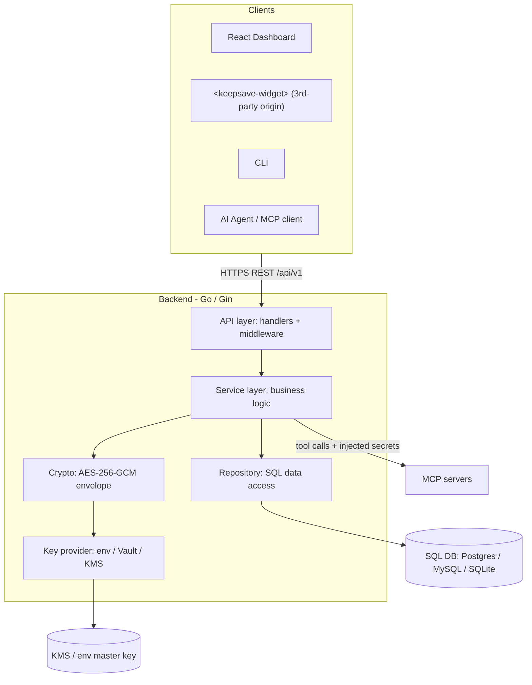
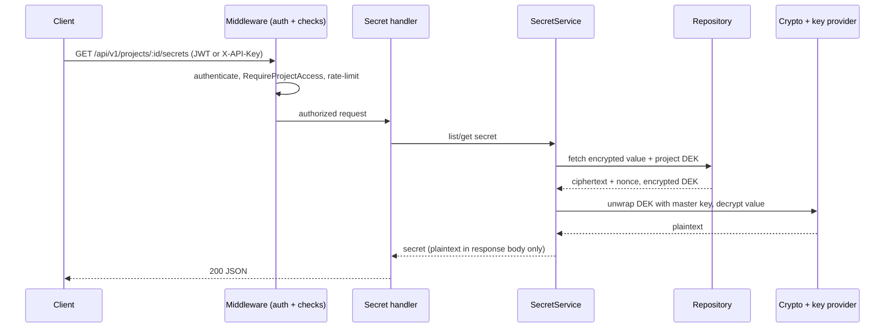

# 1. System Overview

> Part of the **[KeepSave System Documentation](./README.md)**.

This chapter is the big picture: what KeepSave is, how its major pieces fit together, what
happens on a typical request, the technology it is built on, the design decisions that shape
everything else, and where to find each part of the code. Later chapters drill into each area.

## What KeepSave is

AI agents and CI/CD pipelines need access to environment variables — API keys, database URLs,
feature flags — but storing those in `.env` files, source code, or chat logs exposes them.
Promoting configuration between environments (Alpha → UAT → PROD) is manual and error-prone.

KeepSave solves this with:

- **An encrypted vault** — AES-256-GCM encryption at rest for every secret value.
- **An environment promotion pipeline** — Alpha → UAT → PROD with diff review, an audit trail,
  approval gates, and rollback.
- **Scoped API keys for agents** — so an agent can fetch the secrets it needs without those
  secrets appearing in prompts or code.
- **An OAuth 2.0 provider** — authorization-code (with PKCE), client-credentials, and
  refresh-token flows, so KeepSave can act as an identity provider.
- **A central MCP server hub + gateway** — register MCP servers, install them, and route tool
  calls through a gateway that injects the right secrets as environment variables at call time.
- **An embeddable widget** — a `<keepsave-widget>` Web Component that drops into any site with a
  single `<script>` tag.

## High-level architecture

KeepSave is two deployable processes — a Go backend API and a React frontend — plus the
embeddable widget (a separate build of the frontend that runs on third-party origins). The
backend is strictly layered: requests flow down through handlers, middleware, services, and
finally the crypto and repository layers; **there are no upward dependencies**.



The three **trust boundaries** (each crossing is a security event) are:

1. **Network** — everything entering the backend is hostile until authenticated. Enforced by
   TLS termination plus the auth middlewares and request validation.
2. **Caller identity** — once a request is authenticated, downstream code trusts the identity in
   context. Each handler is its own authorization choke point (guards against IDOR).
3. **Key custody** — the master key lives *outside* the database. The DB only ever holds DEKs
   encrypted under the master key, and secret values encrypted under DEKs.

These are described in full, with failure modes, in [`docs/ARCHITECTURE.md`](../ARCHITECTURE.md)
and the [security model](./05-security.md).

## Request lifecycle — the secret-read hot path

The most frequent operation is reading a secret. It exercises the whole stack and shows where
decryption happens:



Two other paths matter: **promotion** (highest blast radius, correctness over speed — see the
[promotion engine](./06-promotion.md)) and **master-key resolution at startup** (runs once; a
failure is fatal *by design* — silent fallback to a default key would be a security disaster).

## Technology

| Layer | Technology |
|-------|------------|
| Backend | Go with the Gin framework (exact toolchain pinned in `backend/go.mod`; see [backend](./02-backend.md)) |
| Database | PostgreSQL (primary), with MySQL and SQLite also supported |
| Encryption | AES-256-GCM envelope encryption (`golang.org/x/crypto`) |
| Auth | JWT + scoped API keys + an OAuth 2.0 provider |
| Frontend | React + TypeScript + Vite (versions in [frontend](./07-frontend.md)) |
| Embed SDK | Web Components with Shadow DOM |
| MCP hub | GitHub integration + a process runner + a JSON-RPC gateway |
| Containers | Docker + Docker Compose (dev) + Helm (Kubernetes) |
| Observability | Prometheus metrics + tracing + structured logging |

## Environments and promotion

KeepSave organizes secrets by **project** and, within a project, by **environment**: `alpha`,
`uat`, and `prod`. Promotion is **forward-only** (`alpha → uat → prod`, no skipping stages and
no backward moves). Non-PROD promotions apply immediately; PROD promotions require a separate
approver (four-eyes). Every promotion is diffed without revealing plaintext, audited, and
reversible via snapshots. The [promotion engine](./06-promotion.md) chapter covers this in full.

## Key design decisions

- **Envelope encryption with a key hierarchy** — master key wraps per-project DEKs, which wrap
  per-secret values. The DB is untrusted at rest. ([ADR-0001](../adr/0001-envelope-encryption.md),
  [ADR-0004](../adr/0004-key-hierarchy.md); see [security](./05-security.md).)
- **Strict layering, no back-edges** — `api → service → crypto`/`repository`. A back-edge (e.g.
  crypto calling service) is treated as a boundary violation.
- **Audit-first** — every state-mutating handler emits an audit event from a canonical taxonomy,
  and tests assert the audit row was written. (See [security](./05-security.md) and
  [`docs/AUDIT_LOG_COVERAGE.md`](../AUDIT_LOG_COVERAGE.md).)
- **No silent fallbacks** — a missing master key, a failed migration, or a leaked dev key are
  fatal at startup rather than silently degraded.
- **The embed widget is its own trust domain** — it assumes the host page is hostile; secrets
  never travel in `postMessage`, and origins are validated against a per-project allow-list
  ([ADR-0006](../adr/0006-embed-widget-origin-allowlist.md); see [embed widget](./08-embed-widget.md)).
- **Decisions are recorded** — non-trivial choices become ADRs; see [governance](./12-governance.md).

## Repository layout

```
KeepSave/
├── backend/                 # Go / Gin REST API
│   ├── cmd/                  # entry points (server, keepsave CLI)
│   ├── internal/            # api, auth, crypto, models, repository, service,
│   │                        #   config, logging, metrics, tracing, events, plugins
│   └── migrations/          # SQL schema (postgres / mysql / sqlite)
├── frontend/                # React + TypeScript dashboard
│   └── src/                 # pages, components, hooks, api, embed (widget)
├── sdks/                    # Go, Node.js, Python client SDKs
├── integrations/           # Terraform (and external integration glue)
├── helm/keepsave/          # Kubernetes Helm chart
├── tests/                  # test strategy docs + Seidr E2E harness
├── docs/                   # all documentation (this set lives in docs/system/)
└── docker-compose.yml      # local dev stack (db + api + frontend)
```

Each top-level area has a dedicated chapter: the [backend](./02-backend.md), the
[frontend](./07-frontend.md), [infrastructure](./09-infrastructure.md),
[testing](./11-testing.md), and [SDKs & integrations](./13-sdks-integrations.md).

## See also

- [KeepSave System Documentation index](./README.md)
- [`docs/ARCHITECTURE.md`](../ARCHITECTURE.md) — the canonical dependency map and trust boundaries
- [Backend Architecture](./02-backend.md) · [Security Model](./05-security.md) · [Promotion Engine](./06-promotion.md)
- [`Roadmap.md`](../../Roadmap.md) — phases and direction
