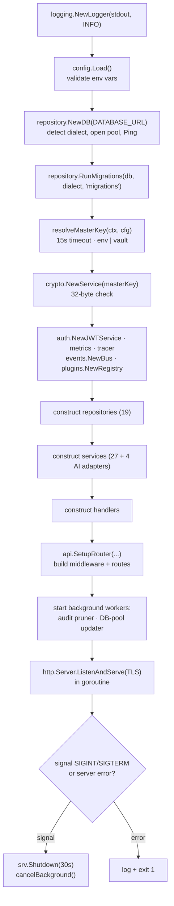
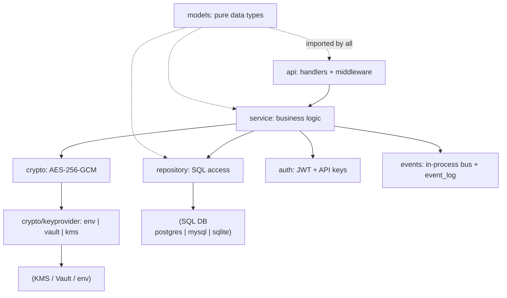

# Backend Architecture

> Part of the **[KeepSave System Documentation](./README.md)**.

The KeepSave backend is a single Go binary built on the [Gin](https://github.com/gin-gonic/gin) HTTP framework. It is organised as a strict downward dependency stack — `api → service → crypto`/`repository` — with cross-cutting `logging`, `metrics`, `tracing`, `events`, and `plugins` packages that depend on nothing above them. This chapter walks the boot sequence, every configuration knob, the ordered middleware pipeline, the layered service/repository wiring, the observability surface, and the background workers. It is grounded in the actual source under `backend/`; where a topic has a canonical doc, this chapter summarises it inline and links out.

The composition root is `backend/cmd/server/main.go`. A second, much smaller binary — `backend/cmd/keepsave/main.go` — is a standalone CLI client (`pull`/`push`/`promote`/`login`/`export`/`import`) that talks to the API over HTTP; it shares no code with the server and is covered in the [SDKs & Integrations](./13-sdks-integrations.md) chapter.

---

## 1. Boot / bootstrap sequence

`main()` in `backend/cmd/server/main.go` runs a fixed, fail-fast startup. Every step that can fail logs a structured error and calls `os.Exit(1)` — there is no silent fallback, by design (a silent fallback to a default key or an unmigrated DB would be a security incident).

Step by step:

1. **Logger.** A structured JSON logger writes to `os.Stdout` at `INFO` level (`logging.NewLogger`).
2. **Config.** `config.Load()` reads and validates every environment variable (see §2). A failure here aborts before any network or DB access.
3. **Database connect.** `repository.NewDB(cfg.DatabaseURL)` auto-detects the dialect from the URL scheme, opens a `*sql.DB` with tuned pool settings, and `Ping`s it. See [data model](./04-data-model.md) for dialect detection and pool sizing.
4. **Migrations.** `repository.RunMigrations(db, dialect, "migrations")` applies any pending SQL migrations transactionally and records them in `schema_migrations`. The migrations directory is resolved relative to the process working directory.
5. **Master key.** `resolveMasterKey(ctx, cfg)` runs under a 15-second timeout and sources the 32-byte master key from the configured provider (`env` or `vault`; `awskms`/`gcpkms` return a clear "not wired in this build" error per [ADR-0012](../adr/0012-kms-auto-unseal.md) / [ADR-0016](../adr/0016-deployment-topology.md)). The key is handed to `crypto.NewService`, which re-checks the 32-byte length.
6. **Shared singletons.** A JWT service (`auth.NewJWTService`), a Prometheus metrics registry (`metrics.NewAppMetrics`), a tracer (`tracing.NewTracer("keepsave-api")`), an event bus (`events.NewBus`), and a plugin registry (`plugins.NewRegistry`) are constructed once.
7. **Repositories → services → handlers.** 19 repositories and 27 services (plus 4 AI-provider adapters) and their handlers are wired by hand (no DI container). See §4 for the full inventory.
8. **Router.** `api.SetupRouter(...)` assembles the middleware chain and registers every route (see §3 and the [API reference](./03-api-reference.md)).
9. **Background workers.** Two goroutines start under a cancellable `bgCtx`: the audit-log pruner and the DB-pool metrics updater (see §6).
10. **Serve.** An `http.Server` (with `ReadHeaderTimeout: 10s`) listens in a goroutine. If TLS cert/key files are configured it serves HTTPS with a TLS 1.2+ config, and optionally starts a `:80 → :443` 301 redirect listener.
11. **Graceful shutdown.** The main goroutine blocks on `SIGINT`/`SIGTERM` (or a fatal server error). On signal it calls `srv.Shutdown(ctx)` with a 30-second grace period (`shutdownGracePeriod`, matching the Kubernetes default `terminationGracePeriodSeconds`), then cancels `bgCtx` so the workers and redirect listener exit cleanly. See [ADR-0011](../adr/0011-graceful-shutdown-and-db-timeouts.md).

### Master-key resolution

`resolveMasterKey` (`main.go`) switches on `cfg.KeyProvider`:

| Provider           | Behaviour                                                                                          |
|--------------------|----------------------------------------------------------------------------------------------------|
| `env` (or empty)   | Requires `cfg.MasterKey` to be exactly 32 bytes (decoded from `MASTER_KEY`); returns it directly.  |
| `vault`            | Builds a `keyprovider.NewVaultProvider` and calls `GetMasterKey(ctx)` (HashiCorp Vault Transit).   |
| `awskms`, `gcpkms` | Returns an explicit error — the cloud-KMS SDK adapters are deferred (FOLLOWUPS #1).                 |
| anything else      | Returns `unknown KEEPSAVE_KEY_PROVIDER` error.                                                      |

The key-provider abstraction lives in `backend/internal/crypto/keyprovider/` (`env.go`, `vault.go`, plus stub `kms_aws.go`/`kms_gcp.go`). See the [security model](./05-security.md) for the envelope-encryption hierarchy and [ADR-0004](../adr/0004-key-hierarchy.md).

---

## 2. Configuration

All configuration is environment-variable driven and loaded once by `config.Load()` in `backend/internal/config/config.go` into a `Config` struct. There is no config file. The `KEEPSAVE_ENV` value (`development` by default, falling back to `APP_ENV`) gates a set of **production hardening checks** that refuse to boot on insecure defaults.

### Environment variables read

| Variable | Default | Purpose / validation |
|----------|---------|----------------------|
| `DATABASE_URL` | — (**required**) | SQL connection string; the scheme selects the dialect. In production, `sslmode=disable` is rejected. |
| `KEEPSAVE_ENV` / `APP_ENV` | `development` | Lowercased; `production` enables the hardening checks below. |
| `KEEPSAVE_KEY_PROVIDER` | `env` | Master-key source: `env`, `vault`, `awskms`, `gcpkms`. |
| `MASTER_KEY` | — (required when provider is `env`) | Base64 of exactly 32 bytes. In production, a key whose SHA-256 matches the leaked dev key in `docker-compose.yml` is **rejected**. |
| `JWT_SECRET` | — (**required**) | HS-style signing secret. In production must be ≥ 32 bytes. |
| `CORS_ORIGINS` | `*` | Comma-separated allow-list (exact or single-`*` glob). In production, `*` is **rejected**. |
| `PORT` | `8080` | HTTP listen port. |
| `AUDIT_LOG_RETENTION_DAYS` | `365` | Positive integer; drives the audit pruner. `0`/unset keeps the default; an invalid value aborts boot. |
| `TLS_CERT_FILE`, `TLS_KEY_FILE` | unset | When both set, the server serves HTTPS (TLS 1.2+). |
| `TLS_REDIRECT` | `false` | When `true` (and TLS enabled), start a `:80 → :443` 301 redirect listener. |
| `TLS_CIPHER_SUITES` | unset | Comma-separated IANA cipher names to restrict the suite list. |
| `VAULT_ADDR`, `VAULT_TOKEN`, `KEEPSAVE_VAULT_KEY_NAME`, `KEEPSAVE_VAULT_CIPHERTEXT` | unset | Vault Transit parameters (used when provider is `vault`). |
| `KEEPSAVE_KMS_KEY_ID`, `KEEPSAVE_KMS_CIPHERTEXT` | unset | Carried in `Config` for the (not-yet-wired) cloud-KMS providers. |

> Note: AI provider configuration (Claude/OpenAI/Gemini/Groq/Mistral/Ollama API keys) is read separately inside `service.NewAIProviderManager()` (`backend/internal/service/ai_provider.go`), not by `config.Load()`. When no provider is configured, the Phase-15 AI features run in a fallback mode.

### Production-mode validations

When `KEEPSAVE_ENV=production`, `Load()` returns an error (aborting boot) if any of these hold:

- `MASTER_KEY` decodes to the **leaked development key** (SHA-256 compared against `leakedDevMasterKeyHashHex`). The dev key committed to `docker-compose.yml` is treated as permanently compromised.
- `JWT_SECRET` is shorter than 32 bytes (`prodMinJWTSecretBytes`).
- `CORS_ORIGINS` is `*`.
- `DATABASE_URL` contains `sslmode=disable`.

These checks are what let the dev experience stay frictionless (`*` CORS, a known key) while making it impossible to ship those defaults to production.

---

## 3. The middleware pipeline

`api.SetupRouter` (`backend/internal/api/router.go`) builds a `gin.New()` engine (Gin is in `ReleaseMode`) and registers middleware **in this exact order**. Order matters: panic recovery must be outermost so it can catch panics from everything below it, and auth middleware is mounted per route-group (not globally) so public routes stay reachable.

| # | Middleware | File | What it does |
|---|------------|------|--------------|
| 1 | `PanicRecoveryMiddleware` | `api/recovery.go` | Outermost. Recovers panics, logs the stack + request path server-side, and returns the canonical `{"error":{...,"error_code":"INTERNAL"}}` 500 shape (replaces `gin.Recovery()` so panics and returned errors look identical to clients). |
| 2 | `TrustedProxyMiddleware` | `api/middleware.go` | Derives the real client IP from `X-Real-IP` / `X-Forwarded-For` and sets `client_ip` + a `scheme` (http/https) on the context, so KeepSave works behind nginx/Traefik/Kong. |
| 3 | `SecurityHeadersMiddleware` | `api/security_headers.go` | Sets `X-Content-Type-Options`, `X-Frame-Options: DENY`, `Referrer-Policy`, `Permissions-Policy`, HSTS, and a strict CSP with no `unsafe-inline`. |
| 4 | `RequestSizeLimitMiddleware(1<<20)` | `api/security_headers.go` | Caps every request body at **1 MiB** via a wrapping `limitedReader`. |
| 5 | `logging.GinMiddleware` | `logging/gin_middleware.go` | Structured per-request access log; **redacts** sensitive query params (`password`, `token`, `api_key`, `code`, `email`, …) before logging. |
| 6 | `CORSMiddleware(corsOrigins)` | `api/middleware.go` | Reflects an allowed `Origin` (exact match or single-`*` glob), sets the CORS headers, and short-circuits `OPTIONS` with 204. Credentials stay disabled (bearer-token model). |
| 7 | `RateLimitMiddleware(100/s, burst 200)` | `api/ratelimit.go` | Global per-IP token-bucket limiter. On exhaustion returns 429 with `Retry-After: 1`. |
| 8 | `metrics.GinMiddleware` | `metrics/middleware.go` | Records request count, in-flight gauge, duration histogram, error counter, and 429 counter, labelled by `METHOD_route`. |
| 9 | `tracing.GinMiddleware` | `tracing/tracing.go` | Starts/propagates a span per request via `X-Trace-ID`/`X-Span-ID` headers; records status and duration. |

After these, **authentication middleware is applied per route group** rather than globally:

| Middleware | File | Applies to |
|------------|------|------------|
| `JWTAuthMiddleware(jwtService)` | `api/middleware.go` | Human/dashboard routes — requires `Authorization: Bearer <JWT>`. Sets `user_id`, `email`. |
| `APIKeyAuthMiddleware(jwtService, apikeyRepo)` | `api/middleware.go` | Agent routes (secrets, leases, applications, `/agent`) — accepts `X-API-Key` (hashed + looked up, expiry-checked) **or** falls back to JWT. Sets `user_id`, `api_key_project_id`, `api_key_scopes`, `api_key_environment`. |
| `RequireProjectAccess(projectRepo)` | `api/project_access.go` | Every `/projects/:id/*` route. Enforces [ADR-0005](../adr/0005-require-project-access-middleware.md): owner, org-member, or correctly-scoped API key, else 403/404. Fails closed and does not leak project existence. |

A handful of routes are intentionally **public** (no auth middleware): `/healthz`, `/readyz`, `/metrics`, `/api/docs`, `/.well-known/openid-configuration`, `POST /api/v1/auth/register`, `POST /api/v1/auth/login`, the OAuth token/JWKS/userinfo/revoke endpoints, `GET /api/v1/mcp/servers/public`, and `GET /api/v1/embed-config/:project_id`. The embed-config route additionally gets a **dedicated stricter limiter** (10 req/min, burst 10) because it is unauthenticated by design (the widget calls it before it has credentials) — see [ADR-0006](../adr/0006-embed-widget-origin-allowlist.md) and the [embed widget](./08-embed-widget.md) chapter.

See the [API reference](./03-api-reference.md) for the per-endpoint auth matrix and the error model.

---

## 4. Layered architecture

KeepSave follows a clean layered design with **no upward edges** (the rule from [`docs/ARCHITECTURE.md`](../ARCHITECTURE.md)): handlers depend on services, services depend on `crypto` and `repository`, and `models` is depended on by everyone while depending on nothing.

Handlers are thin: they parse/validate the request DTO (`api/validation.go`), pull the caller identity from the context (`getUserID`), call exactly one service method, and translate the result or error into JSON. All business logic — encryption, authorization beyond project access, audit emission, multi-step workflows — lives in the service layer. Repositories are the only code that touches `database/sql`.

### Services

Constructed in `main.go` and living in `backend/internal/service/`. Each has a single responsibility:

| Service | Responsibility |
|---------|----------------|
| `AuthService` | Register/login, password hashing, per-account login-lockout, JWT issuance; emits auth audit events. |
| `ProjectService` | Project CRUD, per-project DEK generation/wrapping, and the embed-config allow-list. |
| `SecretService` | Secret CRUD with envelope encrypt/decrypt; emits `secret.*` audit events. |
| `APIKeyService` | API-key issuance (with default/cap expiry per [ADR-0009](../adr/0009-default-api-key-expiration.md)), listing, revocation. |
| `PromotionService` | The Alpha→UAT→PROD engine: diff (HMAC-hashed), execute, approve/reject, rollback. See [promotion engine](./06-promotion.md). |
| `KeyRotationService` | Re-encrypts secrets under a new DEK (per-project) or across all projects; encryption self-verification. |
| `WebhookService` | Webhook registration and delivery with an SSRF guard ([ADR-0013](../adr/0013-webhook-emission-with-ssrf-guard.md)). |
| `OrganizationService` | Organisations and member roles (viewer/editor/admin/promoter). |
| `TemplateService` | Built-in and custom secret templates; applying a template to a project/env. |
| `EnvFileService` | `.env` import/export (parse and render). |
| `DependencyService` | Detects `${VAR}`-style references between secrets and builds a dependency graph. |
| `SSOService` | SSO (OIDC/SAML) provider config per org; encrypts the client secret. |
| `ComplianceService` | Generates SOC2/GDPR/PCI compliance reports. |
| `BackupService` | Encrypted project backups. |
| `SecretPolicyService` | Secret lifecycle policies (max age, rotation reminders). |
| `LeaseService` | Just-in-time, time-limited secret leases for agents. |
| `AgentAnalyticsService` | Agent activity summaries and access heat-maps. |
| `OAuthService` | OAuth 2.0 provider: clients, authorization codes (PKCE), tokens, revocation. |
| `MCPService` | MCP server registry + installations; resolves tools. |
| `MCPBuilderService` | Builds/refreshes MCP server definitions from a GitHub source. |
| `ApplicationService` | The application-dashboard registry (services/links + favourites). |
| `AIProviderManager` | Multiplexes AI providers (Claude/OpenAI/Gemini/Groq/Mistral/Ollama); falls back gracefully when none configured. |
| `DriftService` | Detects config drift between environments (Phase 15). |
| `AnomalyService` | Detects anomalous access patterns and manages alert rules. |
| `UsageAnalyticsService` | Usage trends, forecasts, CSV export. |
| `RecommendationService` | AI-generated secret recommendations. |
| `NLPQueryService` | Natural-language secret search and multi-turn conversation. |
| `IPAllowlistService` | CIDR allow-lists (org/project scoped). *Type defined but **not constructed** in `main.go` — `CheckIPAllowed` is never called.* |

AI provider adapters (`ClaudeProvider`, `OpenAICompatProvider`, `GeminiProvider`, `OllamaProvider`) also live in this package behind the `AIProvider` interface.

### Repositories

Living in `backend/internal/repository/`, each wraps `*sql.DB` + a `Dialect` and owns one table family. They share helpers in `queryhelper.go` (the `Q()` placeholder/`NOW()` rebind, `InsertReturning`/`UpsertReturning`) and `dialect.go`.

| Repository | Tables owned |
|------------|--------------|
| `UserRepository` | `users` |
| `ProjectRepository` | `projects` (+ the `UserHasAccess` authorization query joining `organization_members`) |
| `EnvironmentRepository` | `environments` |
| `SecretRepository` | `secrets` |
| `SecretVersionRepository` | `secret_versions` |
| `APIKeyRepository` | `api_keys` |
| `AuditRepository` | `audit_log` (+ `DeleteOlderThan` for the pruner) |
| `PromotionRepository` | `promotion_requests`, `secret_snapshots` |
| `OrganizationRepository` | `organizations`, `organization_members` |
| `TemplateRepository` | `secret_templates` |
| `DependencyRepository` | `secret_dependencies` |
| `AuthAttemptsRepository` | `auth_login_attempts` (per-email lockout) |
| `SSORepository` | `sso_configs` |
| `ComplianceRepository` | `compliance_reports` |
| `BackupRepository` | `backup_snapshots` |
| `AccessPolicyRepository` | `access_policies` |
| `SecurityEventRepository` | `security_events` — *type defined but **not wired** in `main.go`; no runtime writer* |
| `OAuthRepository` | `oauth_clients`, `oauth_authorization_codes`, `oauth_tokens` |
| `MCPRepository` | `mcp_servers`, `mcp_installations`, `mcp_gateway_log` |
| `ApplicationRepository` | `applications`, `application_favorites` |

> Several Phase-15 services (`DriftService`, `AnomalyService`, `UsageAnalyticsService`, `RecommendationService`, `NLPQueryService`, `LeaseService`, `AgentAnalyticsService`, `SecretPolicyService`) hold the raw `*sql.DB` + `Dialect` directly and run their own SQL rather than going through a dedicated repository type. See the [data model](./04-data-model.md) chapter for the corresponding tables (and an important note about which migrations actually create them).

---

## 5. Observability

The backend ships its own lightweight observability primitives (no external collector dependency at runtime).

- **Structured logging** (`backend/internal/logging/logger.go`). JSON lines with `timestamp`/`level`/`message`/`fields`, level-filtered, mutex-guarded. The Gin access-log middleware (`gin_middleware.go`) logs status, method, path, redacted query, IP, latency, and bytes — escalating to `WARN`/`ERROR` for 4xx/5xx — and **redacts** secret-bearing query params.
- **Prometheus metrics** (`backend/internal/metrics/`). A hand-rolled `Collector` exposes counters, gauges, and histograms in Prometheus exposition format at `GET /metrics`. `AppMetrics` defines `keepsave_http_requests_total`, `..._request_duration_seconds`, `..._requests_in_flight`, `..._http_errors_total`, secret encrypt/decrypt counters, promotion/key-rotation/auth counters, `keepsave_active_api_keys`, webhook + rate-limit counters, and DB-pool gauges. **Labels are never user-controlled** (per `ARCHITECTURE.md`) to bound cardinality.
- **Tracing** (`backend/internal/tracing/tracing.go`). An in-memory ring buffer (cap 10 000 spans) records a span per request; `GET /api/v1/admin/traces` returns the most recent 100. Trace/span IDs propagate via `X-Trace-ID`/`X-Span-ID`.
- **Event bus** (`backend/internal/events/eventbus.go`). An in-process pub/sub that also **persists every event** to the `event_log` table (publish-then-mark-published), supporting replay and an outbox-style unpublished query. Event-type constants (`secret.created`, `promotion.completed`, …) are defined here; the canonical taxonomy is in [`docs/AUDIT_LOG_COVERAGE.md`](../AUDIT_LOG_COVERAGE.md) and [ADR-0014](../adr/0014-audit-log-taxonomy-extension.md).
- **Plugin registry** (`backend/internal/plugins/plugin.go`). A registry for `SecretProvider`, `NotificationSender`, and `Validator` plugins, backed by the `plugins` table. Plugins can be registered/toggled at runtime via the `/api/v1/platform/plugins` endpoints.

The `version.Version` constant (`backend/internal/version/version.go`, currently `1.1.0`) is the single source of truth surfaced by `/healthz`, `/readyz`, and the startup log line.

---

## 6. Background workers & graceful shutdown

Two goroutines start at boot under the cancellable `bgCtx` and exit when it is cancelled at shutdown:

1. **Audit-log pruner** (`startAuditLogPruner` in `main.go`). Deletes `audit_log` rows older than `AUDIT_LOG_RETENTION_DAYS` (default 365) by calling `AuditRepository.DeleteOlderThan`. It runs **once immediately** on startup, then every **24 h** via a ticker. If retention ≤ 0 it logs that it is disabled and returns.
2. **DB-pool metrics updater** (`metrics.StartDBPoolUpdater`). Polls `db.Stats()` every **15 s** (matching a typical Prometheus scrape) and publishes `keepsave_db_open_connections` / `_in_use_connections` / `_idle_connections`, letting operators alert on pool saturation or connection churn from managed-Postgres idle eviction.

When TLS redirect is enabled, a third goroutine (`startHTTPRedirect`) serves the `:80 → :443` 301 listener and tears down with the same context.

**Shutdown timeouts** (per [ADR-0011](../adr/0011-graceful-shutdown-and-db-timeouts.md)):

| Timeout | Value | Where |
|---------|-------|-------|
| HTTP `ReadHeaderTimeout` | 10 s | main server |
| Graceful shutdown grace period | 30 s | `srv.Shutdown` |
| Master-key resolution | 15 s | `resolveMasterKey` |
| HTTP-redirect read / shutdown | 5 s | `startHTTPRedirect` |

On `SIGINT`/`SIGTERM`, the server stops accepting new connections, drains in-flight requests within the grace period, then cancels `bgCtx` so all workers stop. A fatal server error (anything other than `http.ErrServerClosed`) exits with code 1.

---

## 7. Go version & key dependencies

From `backend/go.mod` (Go `1.25.0`):

| Dependency | Role |
|------------|------|
| `github.com/gin-gonic/gin` | HTTP framework / router / middleware. |
| `github.com/golang-jwt/jwt/v5` | JWT signing and validation. |
| `github.com/google/uuid` | UUID generation for all primary keys. |
| `golang.org/x/crypto` | bcrypt password hashing (the AES-GCM crypto uses the stdlib). |
| `github.com/lib/pq` | PostgreSQL driver (and native array handling). |
| `github.com/go-sql-driver/mysql` | MySQL driver. |
| `github.com/mattn/go-sqlite3` | SQLite driver (CGo; used for tests and embedded). |
| `github.com/go-playground/validator/v10` | Struct/binding validation behind Gin's `binding:` tags (indirect). |

The remaining `require` entries are indirect transitive dependencies of Gin and the drivers.

---

## See also

- [API Reference](./03-api-reference.md) — the complete endpoint surface, auth matrix, error model, and rate limiting.
- [Data Model](./04-data-model.md) — dialects, the full table-by-table schema, and how encrypted fields are stored.
- [Security Model](./05-security.md) — envelope encryption, the key hierarchy, auth/authz, and audit.
- [Promotion Engine](./06-promotion.md) — the workflow `PromotionService` implements.
- [`docs/ARCHITECTURE.md`](../ARCHITECTURE.md) — the canonical package dependency map and trust boundaries.
- [`docs/AUDIT_LOG_COVERAGE.md`](../AUDIT_LOG_COVERAGE.md) — the audit-event taxonomy every mutating handler must emit.
- [ADR-0011](../adr/0011-graceful-shutdown-and-db-timeouts.md), [ADR-0005](../adr/0005-require-project-access-middleware.md), [ADR-0006](../adr/0006-embed-widget-origin-allowlist.md), [ADR-0012](../adr/0012-kms-auto-unseal.md) — the decisions behind shutdown, project-access, the embed allow-list, and KMS.
