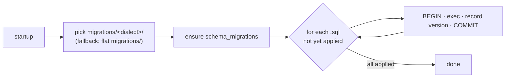
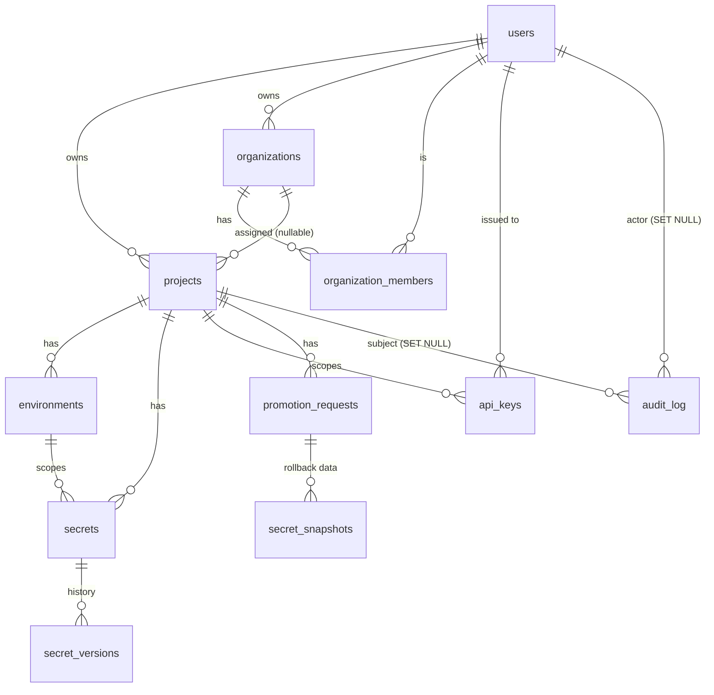

# Data Model

> Part of the **[KeepSave System Documentation](./README.md)**.

KeepSave persists everything in a SQL database that is treated as **untrusted at rest** — every secret value, DEK, and other sensitive blob is encrypted before it is written. This chapter documents the supported dialects and how one is chosen, the connection-pool tuning, the migration mechanism, a table-by-table schema reference grouped by migration, the core entity relationships, how encrypted columns are laid out, and how the Go domain models in `backend/internal/models/` map onto the tables. It is grounded in the SQL under `backend/migrations/` and the structs under `backend/internal/models/`. For *why* the data is encrypted the way it is, see the [security model](./05-security.md).

---

## 1. Supported dialects

KeepSave supports three SQL backends through a `Dialect` interface (`backend/internal/repository/dialect.go`). **PostgreSQL is the canonical production target**; MySQL is parity-maintained for integrators with an existing MySQL estate; SQLite is used for tests and embedded scenarios.

The dialect is **auto-detected from the `DATABASE_URL` scheme** by `DetectDBType` (`backend/internal/repository/db.go` / `dialect.go`):

| URL form | Dialect |
|----------|---------|
| `postgres://…` or `postgresql://…` | PostgreSQL |
| `mysql://…` or a DSN containing `@tcp(` | MySQL |
| `sqlite://…`, `file:…`, a `*.db`/`*.sqlite` path, or `:memory:` | SQLite |
| anything else | PostgreSQL (default) |

The `Dialect` abstraction smooths over the differences the rest of the code would otherwise care about: placeholder style (`$1` vs `?`), `RETURNING` support, `NOW()`, boolean literals (`TRUE` vs `1`), upsert syntax (`ON CONFLICT` vs `ON DUPLICATE KEY`), array params, and date-bucketing functions. The helper `repository.Q(dialect, query)` (`queryhelper.go`) rebinds Postgres-style `$N` placeholders and `NOW()` to the active dialect, so most repository code is written in Postgres syntax and works everywhere.

### Connection pool

`NewDB` configures the pool per dialect (`backend/internal/repository/db.go`):

| Setting | PostgreSQL / MySQL | SQLite |
|---------|--------------------|--------|
| `SetMaxOpenConns` | 25 | **1** |
| `SetMaxIdleConns` | 5 | 1 |
| `SetConnMaxLifetime` | 5 min | — |
| `SetConnMaxIdleTime` | 2 min | — |

The 5-minute `ConnMaxLifetime` is tuned below the idle-eviction window of managed Postgres (e.g. Neon evicts at ~5 min); without it the pool would hand out connections the server has already closed, surfacing as periodic 500s. These same connections are surfaced as the `keepsave_db_*` Prometheus gauges (see [backend architecture §6](./02-backend.md)).

### SQLite specifics

SQLite is opened with **`PRAGMA journal_mode=WAL`** and **`PRAGMA foreign_keys=ON`**, and constrained to a **single writer** (`MaxOpenConns=1`) because SQLite allows only one writer at a time. Migrations are also executed statement-by-statement for SQLite (it cannot run multiple statements per `Exec`), via the `splitSQLStatements` splitter that respects string literals and comments.

---

## 2. Migration mechanism

Migrations run **transactionally at startup**, immediately after the DB connection is established (`repository.RunMigrations` in `backend/internal/repository/migrate.go`, called from `cmd/server/main.go`). The process:

1. Resolve the migrations subdirectory matching the detected dialect: `migrations/postgres/`, `migrations/mysql/`, or `migrations/sqlite/`. If that subdirectory does not exist, fall back to the flat `migrations/` directory (backward-compat).
2. Create a `schema_migrations` table (`version` PK, `applied_at`) if it does not exist.
3. Read every `*.sql` file, sort lexicographically, and for each one not already recorded in `schema_migrations`, run it inside a transaction and record its `version` (the filename without `.sql`). Re-runs are no-ops.

> **Canonical vs. flat migrations — an important nuance.** The per-dialect directories (`postgres/`, `mysql/`, `sqlite/`) are the **source of truth** and run `001`–`009`. The flat top-level files (`001`–`008`) "predate the per-dialect split and are kept as a historical fallback" (`backend/migrations/README.md`); `migrate.go` only uses them when a dialect subdirectory is **absent**. Because the `postgres/` subdirectory **does** exist, a normal PostgreSQL deployment applies `postgres/001–009` and **not** the flat files. The two sets diverge at `006`+: the canonical `postgres/006–009` add OAuth/MCP, the embed allow-list, the promotion self-approval CHECK, and login-attempt tracking, whereas the **Phase-14 application-dashboard** and **Phase-15 AI-intelligence/quota** tables exist **only in the flat `006`/`007`/`008` files**. See §6 for the consequence.

---

## 3. Schema reference — canonical dialect migrations (`postgres/001–009`)

Column types shown are the PostgreSQL forms (`postgres/*.sql`); the `mysql/` and `sqlite/` parity files use the dialect-appropriate equivalents (e.g. `BYTEA → BLOB`, `JSONB → JSON/TEXT`, `TEXT[] → JSON`, `TIMESTAMPTZ → DATETIME/TEXT`).

### 3.1 `001_initial_schema.sql` — core entities

| Table | Purpose | Key columns | Constraints / indexes |
|-------|---------|-------------|------------------------|
| `users` | User accounts | `id` UUID PK, `email` UNIQUE, `password_hash` | unique email |
| `projects` | A secret namespace | `id` UUID PK, `name`, `owner_id` FK→users, `encrypted_dek` BYTEA, `dek_nonce` BYTEA | `idx_projects_owner`; FK cascade on owner delete |
| `environments` | Per-project env scope (alpha/uat/prod) | `id` UUID PK, `project_id` FK→projects, `name` | `UNIQUE(project_id, name)` |
| `secrets` | Encrypted key/value per environment | `id` UUID PK, `project_id` FK, `environment_id` FK, `key`, `encrypted_value` BYTEA, `value_nonce` BYTEA | `UNIQUE(environment_id, key)`; `idx_secrets_project_env` |
| `api_keys` | Scoped agent credentials | `id` UUID PK, `hashed_key` UNIQUE, `user_id` FK, `project_id` FK, `scopes` TEXT[], `environment`, `expires_at` | `idx_api_keys_hashed` |
| `audit_log` | Append-only audit trail | `id` UUID PK, `user_id` FK (SET NULL), `project_id` FK (SET NULL), `action`, `environment`, `details` JSONB, `ip_address` | `idx_audit_log_project(project_id, created_at DESC)` |
| `schema_migrations` | Applied-migration ledger | `version` PK, `applied_at` | — |

### 3.2 `002_promotion_tables.sql` — promotion

| Table | Purpose | Key columns | Constraints / indexes |
|-------|---------|-------------|------------------------|
| `secret_snapshots` | Pre-promotion value snapshots (for rollback) | `id` UUID PK, `promotion_id` FK→promotion_requests, `environment_id` FK, `key`, `encrypted_value` BYTEA, `value_nonce` BYTEA | `idx_secret_snapshots_promotion`; FK added after `promotion_requests` exists |
| `promotion_requests` | A promotion between two environments | `id` UUID PK, `project_id` FK, `source_environment`, `target_environment`, `status` (`pending`/`approved`/`rejected`/`completed`), `requested_by` FK, `approved_by` FK, `keys_filter` TEXT[], `override_policy`, `completed_at` | `idx_promotion_requests_project`, `idx_promotion_requests_status` |

### 3.3 `003_secret_versions.sql` — version history & webhooks

| Table | Purpose | Key columns | Constraints / indexes |
|-------|---------|-------------|------------------------|
| `secret_versions` | Historical secret values | `id` UUID PK, `secret_id` FK, `project_id` FK, `environment_id` FK, `version` INT, `encrypted_value` BYTEA, `value_nonce` BYTEA, `created_by` FK | `UNIQUE(secret_id, version)`; two indexes |
| `webhook_configs` | Webhook endpoints per project | `id` UUID PK, `project_id` FK, `url`, `secret`, `events` TEXT[], `active` | `idx_webhook_configs_project` |
| `webhook_deliveries` | Delivery attempt log | `id` UUID PK, `webhook_id` FK, `event_type`, `payload` JSONB, `status_code`, `success`, `error_message` | `idx_webhook_deliveries_webhook` |

### 3.4 `004_phase6_advanced.sql` — organizations, templates, dependencies

| Table | Purpose | Key columns | Constraints / indexes |
|-------|---------|-------------|------------------------|
| `organizations` | Multi-tenant org accounts | `id` UUID PK, `name`, `slug` UNIQUE, `owner_id` FK | — |
| `organization_members` | User↔org membership + role | `id` UUID PK, `organization_id` FK, `user_id` FK, `role` (viewer/editor/admin/promoter) | `UNIQUE(organization_id, user_id)`; two indexes |
| `secret_templates` | Predefined key sets for stacks | `id` UUID PK, `name`, `stack`, `keys` JSONB, `created_by` FK, `organization_id` FK, `is_global` | org/global indexes |
| `secret_dependencies` | `${VAR}` reference graph | `id` UUID PK, `project_id` FK, `environment_id` FK, `secret_key`, `depends_on_key`, `reference_pattern` | `UNIQUE(project_id, environment_id, secret_key, depends_on_key)` |

This migration also **adds `organization_id`** (nullable FK) to `projects`, which is what `ProjectRepository.UserHasAccess` joins against to grant org-members access.

### 3.5 `005_phase7_12.sql` — enterprise, security, agent, platform

A large migration adding twelve tables and several `ALTER`s:

| Table | Purpose |
|-------|---------|
| `sso_configs` | SSO (OIDC/SAML) provider config per org; `client_secret_encrypted` + `client_secret_nonce`. `UNIQUE(organization_id, provider)`. |
| `ip_allowlists` | CIDR allow-lists scoped to org or project. |
| `secret_policies` | Per-project lifecycle policy (`max_age_days`, `rotation_reminder_days`, `require_rotation`). `UNIQUE(project_id)`. |
| `compliance_reports` | Generated SOC2/GDPR/PCI reports (`data` JSONB). |
| `backup_snapshots` | Encrypted backups (`encrypted_data` + `data_nonce`, `size_bytes`). |
| `session_tokens` | Tracked sessions for token revocation (`token_hash`, `revoked`). |
| `security_events` | Security event log (`event_type`, `severity`). |
| `secret_leases` | JIT, time-limited agent access grants (`api_key_id` FK, `secret_keys` TEXT[], `expires_at`, `revoked`). |
| `agent_activities` | Per-API-key agent action log. |
| `event_log` | Persistent event-bus store (`event_type`, `aggregate_id`, `payload` JSONB, `published`). |
| `access_policies` | Project access policies (`policy_type` time/IP/geo, `config` JSONB). |
| `plugins` | Plugin registry (`plugin_type`, `config` JSONB, `enabled`). `name` UNIQUE. |

`ALTER`s in this file: `api_keys.last_used_at` (stale-key detection) and `users.password_changed_at` / `failed_login_attempts` / `locked_until`.

### 3.6 `006_oauth_mcp_hub.sql` — OAuth provider & MCP hub

| Table | Purpose | Notable columns |
|-------|---------|-----------------|
| `oauth_clients` | Registered OAuth 2.0 clients | `client_id` UNIQUE, `client_secret_hash`, `redirect_uris`/`scopes`/`grant_types` TEXT[], `is_public` |
| `oauth_authorization_codes` | Short-lived auth codes (PKCE) | `code` UNIQUE, `client_id` FK, `user_id` FK, `code_challenge`, `expires_at`, `used` |
| `oauth_tokens` | Access/refresh tokens | `access_token_hash` UNIQUE, `refresh_token_hash` UNIQUE, `client_id` FK, `scopes` TEXT[], `expires_at`, `revoked` |
| `mcp_servers` | MCP server registry | `owner_id` FK, `github_url`, `transport`, `status`, `env_mappings`/`tool_definitions` JSONB, `install_count`, `is_public` |
| `mcp_installations` | A user's install of a server | `user_id` FK, `mcp_server_id` FK, `project_id` FK, `config` JSONB. `UNIQUE(user_id, mcp_server_id)` |
| `mcp_gateway_log` | Proxied tool-call log | `tool_name`, `request_payload` JSONB, `response_status`, `duration_ms` |

### 3.7 `007_embed_origin_allowlist.sql` — embed widget allow-list

No new tables — adds two columns to `projects` ([ADR-0006](../adr/0006-embed-widget-origin-allowlist.md)):

- `allowed_origins TEXT[] NOT NULL DEFAULT '{}'` — the per-project integrator origin allow-list.
- `embed_policy_enabled BOOLEAN NOT NULL DEFAULT FALSE` — explicit opt-in feature flag, with a partial index `WHERE embed_policy_enabled = TRUE`.

### 3.8 `008_promotion_self_approval_check.sql` — four-eyes DB invariant

No new tables — adds a CHECK constraint `promotion_requests_no_self_approval` enforcing `requested_by <> approved_by` (when both are set). This is the DB-level belt-and-suspenders behind the app-layer rule that a single compromised account cannot move secrets to PROD ([ADR-0007](../adr/0007-approver-not-requester-db-invariant.md)).

### 3.9 `009_auth_login_attempts.sql` — per-account lockout

| Table | Purpose | Key columns |
|-------|---------|-------------|
| `auth_login_attempts` | Per-email login-failure tracking (defence against distributed credential stuffing) | `email` PK, `failed_count`, `last_failed_at`, `locked_until` (+ partial index on `locked_until`) |

---

## 4. Entity-relationship diagram (core)

Beyond this core, the schema includes the larger **Phase 7–15** table families documented in §3.5–§3.9 and §6: enterprise (`sso_configs`, `compliance_reports`, `backup_snapshots`, `secret_policies`, `ip_allowlists`), security (`security_events`, `session_tokens`, `auth_login_attempts`), agent/JIT (`secret_leases`, `agent_activities`), platform (`event_log`, `access_policies`, `plugins`), OAuth (`oauth_clients`/`oauth_authorization_codes`/`oauth_tokens`), MCP (`mcp_servers`/`mcp_installations`/`mcp_gateway_log`), the application dashboard (`applications`/`application_favorites`), and AI intelligence (`drift_checks`, `drift_schedules`, `anomalies`, `anomaly_rules`, `access_timeseries`, `secret_recommendations`, `nlp_query_log`, `ai_provider_configs`, `usage_quotas`).

---

## 5. How encryption fields are stored

KeepSave uses AES-256-GCM **envelope encryption** (`backend/internal/crypto/crypto.go`), and that shape is visible in the schema as paired `(ciphertext, nonce)` columns. The database never stores any plaintext secret value or any unwrapped key.

- **`projects.encrypted_dek` / `projects.dek_nonce`** — each project has its own 32-byte Data Encryption Key, stored encrypted under the **master key** (`Service.EncryptDEK`). The master key lives outside the DB (env/Vault/KMS — see [backend architecture §1](./02-backend.md)).
- **`secrets.encrypted_value` / `secrets.value_nonce`** — each secret value is encrypted under its project's **DEK** (which is itself unwrapped with the master key at use time).
- The same `(encrypted_*, *_nonce)` pattern recurs for `secret_versions`, `secret_snapshots`, `backup_snapshots.encrypted_data`/`data_nonce`, and `sso_configs.client_secret_encrypted`/`client_secret_nonce`.

So a database dump alone is insufficient to recover any secret: an attacker would also need the master key to unwrap the DEKs. The full key hierarchy, rotation, and threat analysis are in the [security model](./05-security.md), [ADR-0001](../adr/0001-envelope-encryption.md), and [ADR-0004](../adr/0004-key-hierarchy.md).

---

## 6. Domain models and how they map to tables

The Go structs in `backend/internal/models/` are pure data types (no behaviour) and map roughly one-to-one onto tables. Highlights:

| Model file | Structs (→ table) |
|------------|-------------------|
| `models.go` | `User`→users, `Project`→projects, `Environment`→environments, `Secret`→secrets, `APIKey`→api_keys, `AuditEntry`→audit_log, `PromotionRequest`→promotion_requests, `SecretSnapshot`→secret_snapshots, `SecretVersion`→secret_versions, `Organization`→organizations, `OrgMember`→organization_members, `SecretTemplate`→secret_templates, `SecretDependency`→secret_dependencies, `SSOConfig`, `IPAllowlistEntry`, `SecretPolicy`, `ComplianceReport`, `BackupSnapshot`, `SecurityEvent`, `SessionToken`, `SecretLease`, `AgentActivity`, `Event`→event_log, `AccessPolicy`, `Plugin`; plus the transient `DiffEntry`, `DependencyNode`, `EnvFile`. |
| `oauth.go` | `OAuthClient`, `OAuthAuthorizationCode`, `OAuthToken` (+ the `OAuthTokenResponse` wire type). |
| `mcp.go` | `MCPServer`, `MCPInstallation`, `MCPGatewayLog` (+ JSON-RPC gateway request/response types). |
| `application.go` | `Application`→applications, `ApplicationFavorite`→application_favorites. |
| `ai.go` | `DriftCheck`, `DriftSchedule`, `Anomaly`, `AnomalyRule`, `AccessTimeSeries`, `SecretRecommendation`, plus AI provider config/status and NLP result types. |
| `quota.go` | `UsageQuota`→usage_quotas. |
| `conversation.go` | `ConversationMessage` (NLP, transient). |

### Custom column types

Two custom types implement `database/sql`'s `driver.Valuer`/`sql.Scanner` so the same struct works across dialects (defined in `models.go`):

- **`StringList`** (`[]string`) — backs array columns (`scopes`, `keys_filter`, `secret_keys`, `allowed_origins`, OAuth `redirect_uris`/`scopes`/`grant_types`, …). It **serialises as JSON** for storage but its `Scan` auto-detects and parses **both** the PostgreSQL array literal `{a,b,c}` and JSON `["a","b","c"]`, so it round-trips whether the column is a native `TEXT[]` (Postgres) or a JSON/TEXT column (MySQL/SQLite). For native Postgres `TEXT[]` columns the repositories also use `pq.Array` directly when scanning (e.g. `ProjectRepository.scanProject`).
- **`JSONMap`** (`map[string]interface{}`) — backs `JSONB`/JSON columns (`audit_log.details`, `secret_templates.keys`, `event_log.payload`, `plugins.config`, `access_policies.config`, MCP `env_mappings`/`tool_definitions`, …). `Value` marshals to JSON (`{}` when nil); `Scan` unmarshals `[]byte`/`string`.

Fields holding ciphertext, nonces, or password/secret hashes are tagged `json:"-"` so they are never serialised into API responses (e.g. `User.PasswordHash`, `Project.EncryptedDEK`/`DEKNonce`, `Secret.EncryptedValue`/`ValueNonce`).

### Where the Phase-14/15 tables actually come from

Following the §2 nuance: the structs in `application.go`, `ai.go`, and `quota.go` map to tables (`applications`, `application_favorites`, `drift_checks`, `drift_schedules`, `anomalies`, `anomaly_rules`, `access_timeseries`, `secret_recommendations`, `nlp_query_log`, `ai_provider_configs`, `usage_quotas`) whose `CREATE TABLE` statements live **only in the flat top-level `migrations/006_application_dashboard.sql`, `007_phase15_ai_intelligence.sql`, and `008_phase15_quotas.sql`** — they are **not** present in the canonical `postgres/`, `mysql/`, or `sqlite/` subdirectories (which stop at `009` with OAuth/embed/promotion/auth changes). Because no service creates these tables at runtime, a deployment that runs the per-dialect migrations would be missing them. **This is a notable gap flagged here for the audit team to confirm against the intended deployment path.**

---

## See also

- [Backend Architecture](./02-backend.md) — the repository layer, pool tuning, and the migration step in the boot sequence.
- [Security Model](./05-security.md) — envelope encryption, the key hierarchy, and rotation.
- [Promotion Engine](./06-promotion.md) — how `promotion_requests` and `secret_snapshots` are used.
- [API Reference](./03-api-reference.md) — the endpoints that read/write these tables.
- [`backend/migrations/README.md`](../../backend/migrations/README.md) — the per-dialect migration conventions.
- [ADR-0001](../adr/0001-envelope-encryption.md), [ADR-0004](../adr/0004-key-hierarchy.md), [ADR-0006](../adr/0006-embed-widget-origin-allowlist.md), [ADR-0007](../adr/0007-approver-not-requester-db-invariant.md) — the decisions behind encryption, the key hierarchy, the embed allow-list, and the promotion CHECK.
