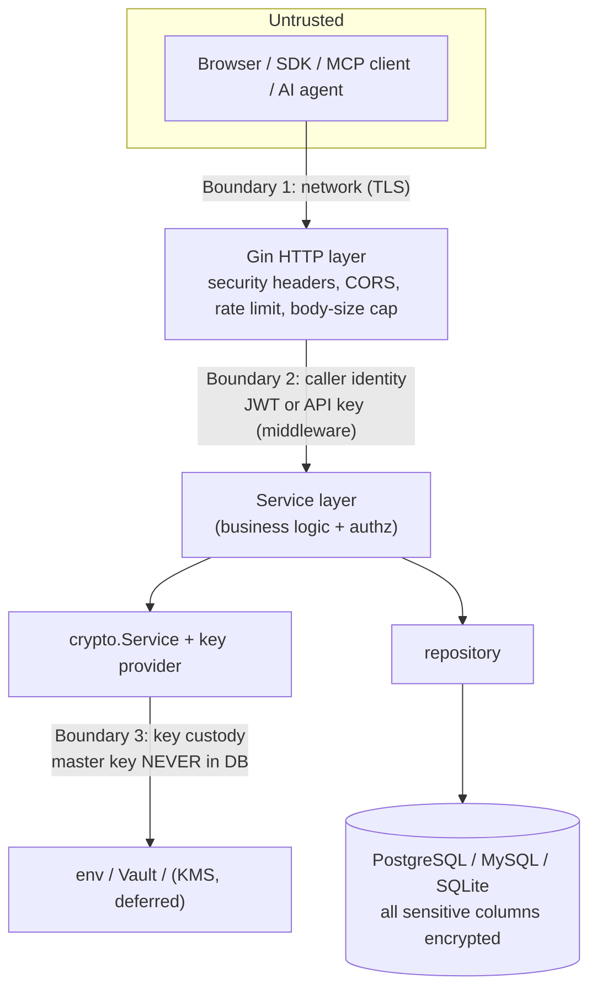
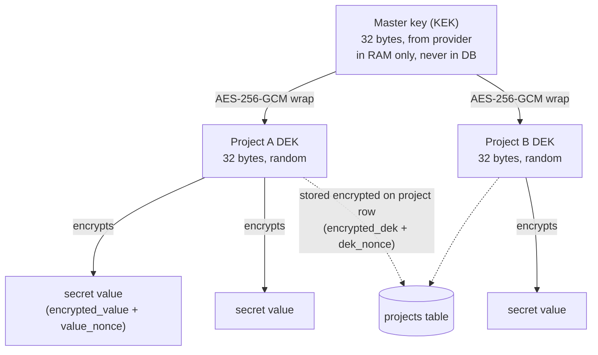
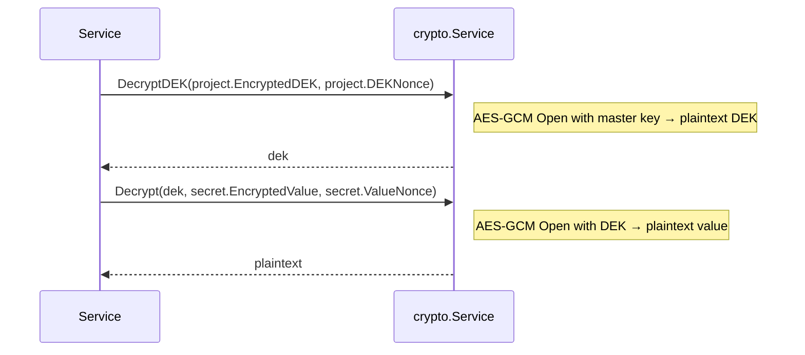

# 5. Security Model

> Part of the **[KeepSave System Documentation](./README.md)**.

KeepSave's entire reason to exist is to keep other people's secrets safe, so this chapter is the
security core of the system. It covers the trust boundaries, the AES-256-GCM envelope-encryption
key hierarchy, the master-key providers, authentication (JWT + API keys) and authorization
(project-access + four-eyes), the audit-log taxonomy, error sanitization, and the transport-layer
controls — every claim grounded in the actual code, with deferred/aspirational controls called out
explicitly. For the full STRIDE pass with file:line evidence, see
[`docs/THREAT_MODEL.md`](../THREAT_MODEL.md); for the "why" behind each decision, the
[ADRs](../adr/).

> **Reading note for auditors.** Several controls are described in accepted ADRs but are **not yet
> in the code** (KMS auto-unseal, RS256/JWKS, per-use API-key audit emission, the audit
> alert-metric). This chapter marks each one **Deferred** and links the tracking doc. Where this
> chapter and the canonical [threat model](../THREAT_MODEL.md) disagree, it is because the code has
> moved since the threat model was last re-baselined; those deltas are listed in
> [§ Known doc/code deltas](#known-doccode-deltas).

---

## 5.1 Trust boundaries

KeepSave treats the database as **untrusted at rest** — the data-at-rest threat model assumes the
DB can be exfiltrated (backup compromise, insider, cloud misconfiguration). Three boundaries
matter:



| # | Boundary | Control | Code |
|---|----------|---------|------|
| 1 | **Network** | TLS terminates in front of (or at) the API; production refuses `sslmode=disable`; HSTS emitted when TLS terminates at the Go process | `backend/internal/config/config.go:107`, `backend/internal/api/security_headers.go:21` |
| 2 | **Caller identity** | `JWTAuthMiddleware` / `APIKeyAuthMiddleware` *identify* the caller; `RequireProjectAccess` *authorizes* them per project | `backend/internal/api/middleware.go`, `backend/internal/api/project_access.go` |
| 3 | **Key custody** | The 32-byte master key lives only in process memory, sourced from an external provider — never written to the DB | `backend/internal/crypto/`, `backend/cmd/server/main.go` |

**Assets** (per the [threat model](../THREAT_MODEL.md)): the master key (KEK), per-project DEKs,
secret plaintext, OAuth client secrets, API-key hashes, the audit log, and backup snapshots.
ADR-0016 split the frontend (Vercel) and backend onto distinct origins, adding a public-internet
hop between the SPA and the API; that boundary is bearer-token-only with a CORS allow-list (see
[§5.8](#58-transport-headers-and-network-controls) and [embed widget](./08-embed-widget.md)).

---

## 5.2 Cryptography: AES-256-GCM envelope encryption

KeepSave encrypts every secret value with **AES-256-GCM** (an AEAD: ciphertext tampering fails to
decrypt rather than silently returning garbage) under a **two-level key hierarchy** chosen in
[ADR-0001](../adr/0001-envelope-encryption.md) and [ADR-0004](../adr/0004-key-hierarchy.md). The
implementation is standard-library only (`crypto/aes`, `crypto/cipher`, `crypto/rand`) — no
third-party crypto dependency — and lives in `backend/internal/crypto/crypto.go`.

### Key hierarchy



- **Master key (KEK):** 32 random bytes. Wraps DEKs; never encrypts secret values directly. Held
  only in `crypto.Service.masterKey` (`crypto.go:12-14`) after boot.
- **Per-project DEK:** generated with `crypto/rand` at project creation (`Service.GenerateDEK`,
  `crypto.go:25-31`), wrapped under the master key (`EncryptDEK`, `crypto.go:34-36`), and stored on
  the project row as `encrypted_dek` + `dek_nonce` (`BYTEA`). The blast-radius boundary is the
  **project**: leaking one project's DEK exposes only that project.
- **Per-secret value:** each secret value is sealed under its project's DEK with a **fresh 96-bit
  random nonce** per encryption (`encrypt`, `crypto.go:58-76`). Stored as `encrypted_value` +
  `value_nonce`.

There is **no KDF** — both the master key and DEKs are 32 random bytes used directly as AES-256
keys ([ADR-0004](../adr/0004-key-hierarchy.md) §Consequences). This is fine for AES-GCM but means
purpose-bound subkeys (e.g. a separate audit-log MAC key) would require an ADR change.

### Nonce handling

Every call to `encrypt`/`decrypt` allocates a fresh nonce of `aead.NonceSize()` (12 bytes) from
`crypto/rand.Reader` (`crypto.go:69-72`); the nonce is returned alongside the ciphertext and
persisted next to it. GCM nonces must never repeat under the same key — random 96-bit nonces are
safe well below the birthday bound at KeepSave's scale (per-project DEK, thousands of secrets max),
and [ADR-0001](../adr/0001-envelope-encryption.md) §Open-questions tracks adding a counter/alert at
2^28 encryptions per DEK (not yet implemented). Ciphertexts are **not** algorithm-tagged on disk
(raw `BYTEA`), so a future scheme migration needs a version-byte prefix or a new column.

### Where ciphertext and nonces live

| Asset | Encrypted column | Nonce column | Table |
|-------|------------------|--------------|-------|
| Project DEK | `encrypted_dek` | `dek_nonce` | `projects` |
| Secret value | `encrypted_value` | `value_nonce` | `secrets` |
| Promotion snapshot value | `encrypted_value` | `value_nonce` | `secret_snapshots` |

The model structs tag these `json:"-"` so they are never serialized to clients
(`backend/internal/models/models.go` — `Secret`, `SecretSnapshot`). See the
[data model](./04-data-model.md) chapter for the full schema.

### Decrypt path

To read a secret value the service walks the hierarchy:



The GCM authentication tag is what makes tampering with `encrypted_dek` or `encrypted_value` fail
loudly (`aead.Open` returns an error, surfaced as `"decrypting: %w"` — `crypto.go:89-91`). That
error is sanitized before it reaches the client (see [§5.7](#57-error-sanitization)).

---

## 5.3 Master-key providers

The master key is sourced through the pluggable `keyprovider.Provider` interface
(`backend/internal/crypto/keyprovider/provider.go`): `Name()`, `GetMasterKey(ctx)`, `Rotate(ctx)`.
Every provider runs the shared `validateKey` 32-byte check so a short/long key cannot pass startup.

| Provider | File | Status | How it gets the key |
|----------|------|--------|---------------------|
| **env** | `keyprovider/env.go` | **Wired (default)** | base64-decodes a 32-byte key from `MASTER_KEY` |
| **Vault Transit** | `keyprovider/vault.go` | **Wired** | `POST {addr}/v1/transit/decrypt/{key}` with `X-Vault-Token`, base64-decodes `data.plaintext` |
| **AWS KMS** | `keyprovider/kms_aws.go` | **Code exists, NOT wired (deferred)** | `AWSKMSDecrypter.Decrypt` on a pre-wrapped blob |
| **GCP KMS** | `keyprovider/kms_gcp.go` | **Code exists, NOT wired (deferred)** | `GCPKMSDecrypter.Decrypt` on a pre-wrapped blob |

> **Important (verified against `backend/cmd/server/main.go:281-303`).** `resolveMasterKey` wires
> only **`env`** and **`vault`** today. Selecting `awskms` or `gcpkms` returns an explicit error —
> *"is not wired in this build (deferred per ADR-0016, tracked as FOLLOWUPS #1)"*. The provider
> structs and their narrow decrypter interfaces are fully written and unit-tested, but the SDK
> adapters are not yet imported in `main.go`. [ADR-0012](../adr/0012-kms-auto-unseal.md) (KMS
> auto-unseal as the production default, **Accepted**) plans the wiring plus startup
> retry/backoff; until [`docs/FOLLOWUPS.md`](../FOLLOWUPS.md) #1 lands, the code does **not** yet
> match the ADR's intent. There is also **no startup retry/backoff** for Vault today — it is a
> single attempt.

`Rotate()` returns `ErrUnsupported` on every provider — master-key rotation is the responsibility
of the underlying KMS/Vault and is performed out-of-band (regenerate the wrapped key, restart).
`EnvProvider` is explicitly **development-only** ([ADR-0004](../adr/0004-key-hierarchy.md);
[threat model](../THREAT_MODEL.md) Assumptions).

### Dev-key leak detection and production hardening

`backend/internal/config/config.go` enforces several production refusals at startup (when
`KEEPSAVE_ENV=production`):

- **Leaked dev-key refusal.** The 32 decoded bytes of `MASTER_KEY` are SHA-256'd and compared to a
  hardcoded hash of the dev key committed to `docker-compose.yml`; a match aborts boot with
  *"MASTER_KEY matches the development key … generate a fresh 32-byte key for production"*
  (`config.go:17`, `:86-90`). The dev key is treated as permanently leaked.
- `MASTER_KEY` must base64-decode to **exactly 32 bytes** (`config.go:83-85`).
- `JWT_SECRET` must be **≥ 32 bytes** in production (`config.go:99-101`).
- `CORS_ORIGINS=*` is **rejected** in production (`config.go:104-106`).
- `sslmode=disable` in `DATABASE_URL` is **rejected** in production (`config.go:107-109`).

> **Deferred:** [ADR-0012](../adr/0012-kms-auto-unseal.md) §Open-question 2 proposes refusing to
> start when `KEEPSAVE_KEY_PROVIDER=env` in production. That refusal is **not implemented** — env
> provider in production is currently allowed (only the *leaked* dev key is rejected).

### Key rotation services

- **DEK rotation — implemented.** `KeyRotationService.RotateProjectKey`
  (`backend/internal/service/keyrotation_service.go:36-108`) generates a new project DEK, decrypts
  every secret in every environment under the old DEK, re-encrypts under the new DEK with fresh
  nonces, and atomically swaps `encrypted_dek`/`dek_nonce` on the project row. `RotateAllProjects`
  and `VerifyProjectEncryption` (decrypt-all health check) are also implemented. *Note:* the file's
  doc comment says "master key rotation", but the code rotates **per-project DEKs**, not the master
  key. **No audit event is emitted** from this service today — the [threat model](../THREAT_MODEL.md)
  §1 row R flags this gap, and the taxonomy reserves `key.dek_rotated`
  ([`AUDIT_LOG_COVERAGE`](../AUDIT_LOG_COVERAGE.md)).
- **JWKS / RS256 rotation — Deferred.** [ADR-0008](../adr/0008-rs256-jwks-rotation.md) (RS256 +
  `kid`-keyed JWKS rotation, **Proposed**) is **not implemented**. JWTs are still **HS256** (see
  [§5.4](#54-authentication)), and the JWKS endpoint returns an **empty** key set with the note
  *"KeepSave currently uses HS256 for JWT signing. JWKS with RS256 support is planned."*
  (`backend/internal/api/handlers_oauth.go:228-229`).

---

## 5.4 Authentication

Two primitives ([ADR-0002](../adr/0002-auth-model.md)): **JWT for humans**, **API keys for
agents**. A request may present either; the API-key path is tried first, then JWT
(`APIKeyAuthMiddleware` → `JWTAuthMiddleware`, `backend/internal/api/middleware.go:163-195`).

### JWT (humans)

| Property | Value | Code |
|----------|-------|------|
| Algorithm | **HS256** (HMAC-SHA256, single shared `JWT_SECRET`) | `auth/auth.go:39` |
| TTL | **24 hours**, fixed (no refresh flow) | `auth/auth.go:25` |
| Claims | `user_id` (UUID), `email`, `exp`, `iat` | `auth/auth.go:11-15, 30-37` |
| Alg-confusion guard | parser rejects any non-HMAC signing method | `auth/auth.go:50-52` |

A leaked JWT is valid until its 24h expiry — there is **no denylist/revocation**
([ADR-0002](../adr/0002-auth-model.md) §Open-questions; [threat model](../THREAT_MODEL.md) §2 row T,
residual Medium). `JWT_SECRET` rotation invalidates all live sessions at once.

### API keys (agents)

Generated as `ks_` + 32 random bytes hex-encoded; the **raw key is shown once** and only its
**SHA-256 hash** is stored (`auth/apikey.go:11-32`). Lookup hashes the presented key and matches the
row (`middleware.go:166-190`).

| Property | Value | Code / ADR |
|----------|-------|------------|
| Prefix | `ks_` | `auth/apikey.go:11` |
| At-rest form | SHA-256 hex (64 chars), `UNIQUE` | `auth/apikey.go:21-25`, `api_keys.hashed_key` |
| Scopes | `StringList` (default `["read"]` when omitted) | `apikey_service.go:74-76`, `models.go:59` |
| Environment scope | optional `*string`; pins the key to one environment | `models.go:60`, `middleware.go:185-187` |
| Expiry default | **now + 90 days** when omitted | `apikey_service.go:27, 39-42` |
| Expiry ceiling | **365 days**; past or over-ceiling → `ErrAPIKeyExpiryOutOfRange` | `apikey_service.go:32, 43-47` |
| Expiry enforcement | expired key → 401 at the middleware | `middleware.go:176-180` |

API-key expiry defaults follow [ADR-0009](../adr/0009-default-api-key-expiration.md) (90d default,
365d ceiling, matching GitHub fine-grained PATs); the goal is that no `ks_` key is immortal.
Revocation is a **row delete** (`apikey_service.Delete`).

> **Deferred — last-used tracking.** There is **no** `last_used_at` column on the `APIKey` model or
> the `api_keys` table, and the middleware does **not** record per-use timestamps. Likewise
> [ADR-0015](../adr/0015-safego-helper-and-audit-emission.md) Head 2 (per-use `auth.call` audit
> emission in `APIKeyAuthMiddleware`, **Proposed**) is **not implemented** — successful API-key
> auth currently leaves no middleware-layer audit trail. (Head 1 of ADR-0015, the `getUserID`
> helper, *is* implemented — see [§5.5](#55-authorization).)

### Passwords

| Control | Value | Code |
|---------|-------|------|
| Hash | **bcrypt** at `bcrypt.DefaultCost` (cost 10) | `auth/password.go:9-15` |
| Complexity | ≥ 8 chars; upper + lower + digit + special required (default policy) | `auth/password_policy.go:19-27, 30-67` |
| Lockout | **10 consecutive failures within 15 min → 15-min soft-lock** (per email) | `auth_service.go` (`ErrAccountLocked`), `repository/auth_attempts_repo.go`, migration `009_auth_login_attempts.sql` |

Lockout is a per-account defense against distributed credential stuffing where one email is
targeted from many IPs; it complements the per-IP [rate limiter](#58-transport-headers-and-network-controls).
On the login path, `AuthService.Login` checks `locked_until` first (emitting an audit row on a
locked attempt), verifies the password with a constant-time bcrypt compare, registers a failure or
resets the counter, and wraps `sql.ErrNoRows` as a generic *"invalid credentials"* so login does
not leak which emails exist (`auth_service.go`).

---

## 5.5 Authorization

Identifying the caller is not enough; KeepSave must assert the caller may touch the **resource**.

### Project-access middleware (ADR-0005)

`RequireProjectAccess` (`backend/internal/api/project_access.go:56-111`) guards every
`/projects/:id/*` route group ([ADR-0005](../adr/0005-require-project-access-middleware.md)), closing
a cluster of nine IDOR findings. Logic:

1. **API-key path:** if `api_key_project_id` is in context, it **must** equal `:id` — else 403
   *"api key not scoped to this project"* (closes cross-project scoped-key abuse).
2. **JWT path:** `projectRepo.UserHasAccess(userID, projectID)` checks owner/organization
   membership.
3. **Failure modes chosen to avoid leaking project existence:** bad UUID → 400; unknown project
   (`sql.ErrNoRows`) → 404; authenticated but no access → 403.

The `getUserID` context helper (`project_access.go:22-36`) replaces ~58 fragile
`c.MustGet("user_id").(uuid.UUID)` sites with a fail-closed comma-ok lookup — Head 1 of
[ADR-0015](../adr/0015-safego-helper-and-audit-emission.md).

### Scope and role model

- **API-key scopes** (e.g. `read`, `write`, `promote`) live on the key row and are placed in
  context by the middleware (`middleware.go:184`), but **no handler currently reads them** — the
  value is validated as an accepted *string* at key-creation time yet gates nothing at request
  time. **A scoped key is therefore not yet least-privilege:** a `read`-scoped key can create,
  update, and delete secrets. What actually constrains an API key is its **project** (and optional
  **environment**) binding — enforced by `APIKeyAuthMiddleware` + `RequireProjectAccess` — together
  with the route's auth type: **promotion routes mount `JWTAuthMiddleware` only**
  (`backend/internal/api/router.go`), so an API key cannot promote at all (and the `promote`-scope
  gate the [threat model](../THREAT_MODEL.md) §3 row E describes is not implemented). Per-handler
  scope enforcement is tracked but **not yet built**; see [§ deltas](#known-doccode-deltas).
- **Organization roles** (`OrgMember.Role`) gate org-level operations; per
  [ADR-0014](../adr/0014-audit-log-taxonomy-extension.md) (Proposed) role changes do not yet emit a
  `role.changed` audit event.

### Four-eyes promotion invariant (ADR-0007)

A single compromised account must not be able to move secrets to PROD. This is enforced in **two
independent layers** ([ADR-0007](../adr/0007-approver-not-requester-db-invariant.md), **Accepted**):

1. **Service guard:** `ApprovePromotion` returns `ErrSelfApproval` when
   `promotion.RequestedBy == approverID` (`backend/internal/service/promotion_service.go:241,
   254-256`).
2. **DB CHECK constraint:** `promotion_requests_no_self_approval` —
   `CHECK (requested_by IS NULL OR approved_by IS NULL OR requested_by <> approved_by)` — catches
   any code path that bypasses the service guard
   (`backend/migrations/postgres/008_promotion_self_approval_check.sql`).

See the [promotion chapter](./06-promotion.md) for the full approval workflow.

---

## 5.6 Audit logging

> *If an action is not in the audit log, it didn't happen — and the feature isn't done.*
> ([`AUDIT_LOG_COVERAGE`](../AUDIT_LOG_COVERAGE.md), operating principle.)

Every state-mutating handler (secret / project / api-key / promotion) **MUST** emit an audit event
from the canonical taxonomy, and the corresponding test **MUST** assert the row was written; PRs
failing either are rejected (CLAUDE.md governance). The taxonomy uses `entity.action` names — e.g.
`secret.created`, `apikey.created`, `promotion_requested`, `promotion_completed`,
`promotion_rejected`, `promotion_rollback`, `auth.login`, `auth.login_failed`. The full table lives
in [`docs/AUDIT_LOG_COVERAGE.md`](../AUDIT_LOG_COVERAGE.md); summarize-then-link rather than
duplicate.

**Storage.** Audit rows go to a single `audit_log` table via `AuditRepository.Create`
(`backend/internal/repository/audit_repo.go:21-35`): `user_id`, `project_id`, `action`,
`environment`, `details` (JSON), `ip_address`, `created_at`. Rows are pruned after a retention
window (`AUDIT_LOG_RETENTION_DAYS`, default 365) by a background pruner
(`startAuditLogPruner`, `cmd/server/main.go`).

**Non-blocking emit.** Audit emission must never fail the primary mutation. The `emitAudit` helper
(`backend/internal/service/audit_helper.go:18-25`) logs and swallows the error; the promotion
service calls `auditRepo.Create(...)` directly and ignores the returned error the same way. The
rationale: if Postgres is healthy enough to commit the mutation, audit on the same DB should also
succeed; a failing audit table is its own operational signal, and a degraded audit table must not
block a working write path ([`AUDIT_LOG_COVERAGE`](../AUDIT_LOG_COVERAGE.md) §"Why audit-emit
failures don't fail the request").

> **Deferred — alert metric.** The spec requires a failed audit emit to increment an alertable
> `keepsave_audit_emit_failed_total{event}` metric. That metric is **not wired** anywhere in the
> code — the actual behavior is **log-only** (`log.Printf`). Auditors should treat the alert as
> aspirational until it ships.

> **Deferred — `actor_type`.** [ADR-0014](../adr/0014-audit-log-taxonomy-extension.md) (Proposed)
> adds an `actor_type` discriminator (`user`/`api_key`/`service_account`/`system`). The `AuditEntry`
> struct and `audit_log` schema **do not** have it yet, so an API-key-driven mutation is recorded
> under the owning user's UUID, indistinguishable from a dashboard action.

---

## 5.7 Error sanitization

Raw errors from the bottom layers (pgx/`database/sql`, `crypto/cipher`) must never reach the
client; sanitization happens in **one** place ([`ERROR_HANDLING_STANDARD`](../ERROR_HANDLING_STANDARD.md)).

```
handler  → client     (sanitized: a stable code + a safe message)
service  → handler    (rich: fmt.Errorf("context: %w", err) chains)
repo/crypto → service (raw: pgx, sql, crypto/cipher errors)
```

The implementation is `backend/internal/api/errors.go` (note: the standard doc proposes a package
named `httperror/`; the shipped type lives in `package api` as `HTTPError`). An `HTTPError` carries
a stable `Symbol`, an HTTP `Status`, a safe `Message`, and an **unexported `cause`** that is logged
server-side but **never serialized** (`errors.go:30-38`). Sentinels: `ErrInvalidInput`,
`ErrUnauthorized`, `ErrForbidden`, `ErrNotFound`, `ErrConflict`, `ErrRateLimited`, `ErrInternal`
(`errors.go:43-51`). `WrapError` is the single sink: it sends `{Status, Message, Symbol}`, logs the
cause, maps `sql.ErrNoRows` → 404, and reports anything unrecognized as a 500 `INTERNAL` with the
cause logged but the client seeing only *"internal error"* (`errors.go:91-116`). A leak test
(`backend/internal/api/error_leak_test.go`) asserts no response body contains `pq:`, `pgx:`,
`sql:`, `crypto/cipher`, or validator strings.

---

## 5.8 Transport, headers, and network controls

### Security headers

`SecurityHeadersMiddleware` (`backend/internal/api/security_headers.go:12-25`) sets, on every
response:

| Header | Value |
|--------|-------|
| `X-Content-Type-Options` | `nosniff` |
| `X-Frame-Options` | `DENY` |
| `X-XSS-Protection` | `1; mode=block` (legacy/deprecated; emitted for older browsers) |
| `Referrer-Policy` | `strict-origin-when-cross-origin` |
| `Permissions-Policy` | `camera=(), microphone=(), geolocation=()` |
| `Content-Security-Policy` | strict — `default-src 'self'`, no `'unsafe-inline'`, `frame-ancestors 'none'` |
| `Strict-Transport-Security` | `max-age=31536000; includeSubDomains; preload` |

### Request size, rate limiting, CORS

- **Body-size cap:** `RequestSizeLimitMiddleware(1 << 20)` — **1 MiB** per request
  (`security_headers.go:28-35`; mounted at `router.go`).
- **Rate limiting:** an in-process per-IP **token bucket** (`backend/internal/api/ratelimit.go`):
  global **100 req/s, burst 200**; the embed endpoints get a tighter **10/min** bucket. Over-limit
  → 429 with `Retry-After: 1`. (In-process state means this is per-replica, not cluster-wide.)
- **CORS:** `CORSMiddleware` reflects only allow-listed origins; `Access-Control-Allow-Credentials`
  is **unconditionally false** (bearer-token only — enabling cookies would open CSRF and needs a
  Type-1 ADR); glob patterns allow at most one `*` (`middleware.go:54-132`). `CORS_ORIGINS=*` is
  forbidden in production. See the [API reference](./03-api-reference.md) and
  [ADR-0016 trust-boundary section](../THREAT_MODEL.md) (§8).

### Webhook SSRF guard (ADR-0013)

Outbound webhooks are a server-side-request-forgery surface (an attacker-registered URL could point
the API at cloud metadata or RFC1918 hosts). `ValidateWebhookURL`
(`backend/internal/service/url_safety.go:17-59`) — the shipped implementation of
[ADR-0013](../adr/0013-webhook-emission-with-ssrf-guard.md) — rejects:

- non-`https` schemes (plain `http` allowed only in dev);
- cloud-metadata hostnames (`metadata.google.internal`, etc.) **before** DNS;
- hosts resolving to **link-local `169.254.0.0/16` / `fe80::/10`** (always, including dev — covers
  AWS/GCP IMDS);
- in production, also loopback, `0.0.0.0/8`, `10/8`, `172.16/12`, `192.168/16`, `100.64/10` (CGNAT),
  `::1`, `fc00::/7`;
- an optional operator-set `K8S_SERVICE_CIDR` (honored in all envs).

> **Scope note.** The shipped guard validates at **registration time** and resolves the host once;
> the broader ADR-0013 program (delivery-time re-resolution to defeat DNS rebinding, body-buffered
> retries, per-org signing-secret rotation, bounded delivery budget) is a multi-part plan — verify
> per-part wiring against `webhook_service.go` before relying on any single part. The file name is
> `url_safety.go`, not `url_validator.go` as the ADR drafted.

---

## 5.9 Security invariants checklist

These must always hold; a violation is a security bug.

- [ ] The master key is **never** persisted to the database, logged, or serialized — RAM only.
- [ ] Every secret value is stored **encrypted** (`encrypted_value` + `value_nonce`); plaintext
      never lands in a column.
- [ ] Every AES-GCM encryption uses a **fresh random 96-bit nonce**; nonces are never reused under a
      key.
- [ ] Each project has its **own DEK**; DEKs are stored wrapped under the master key only.
- [ ] API keys are stored as **SHA-256 hashes**; the raw key is shown exactly once.
- [ ] Production refuses the **leaked dev master key**, `JWT_SECRET` < 32 bytes, `CORS_ORIGINS=*`,
      and `sslmode=disable`.
- [ ] Every `/projects/:id/*` route is preceded by **`RequireProjectAccess`**; a scoped API key
      may act only on its own project. *(Scope values — `read`/`write`/`promote` — are advisory
      only and not yet enforced at any handler; see [§ Scope and role model](#scope-and-role-model).)*
- [ ] A promotion **approver ≠ requester**, enforced at both the service layer (`ErrSelfApproval`)
      and the DB layer (CHECK constraint).
- [ ] Every state-mutating handler **emits an audit event** and the test asserts the row.
- [ ] No handler returns a **raw DB/crypto error** to the client; all go through `WrapError`.
- [ ] `Access-Control-Allow-Credentials` stays **false**; auth is bearer-token only.
- [ ] Outbound webhook URLs are **SSRF-validated** before the request is made.

---

## Known doc/code deltas

For the audit team — places where this chapter intentionally diverges from a canonical doc because
the **code** is the ground truth:

| Topic | Doc says | Code reality |
|-------|----------|--------------|
| `/promote/diff` plaintext leak | [threat model](../THREAT_MODEL.md) §3 row I lists *"Diff endpoint returns full plaintext SourceValue/TargetValue … High"* | **Fixed/stale.** `models.DiffEntry` exposes `SourceHash`/`TargetHash` (truncated HMAC), never plaintext. See [promotion §6.2](./06-promotion.md). |
| Audit alert metric | [`AUDIT_LOG_COVERAGE`](../AUDIT_LOG_COVERAGE.md) requires `keepsave_audit_emit_failed_total` | **Not wired.** Behavior is log-only. |
| AWS/GCP KMS | [ADR-0012](../adr/0012-kms-auto-unseal.md) Accepted; ADR-0004 "use a KMS in prod" | **Not wired** in `main.go` — only `env` + `vault`; KMS returns an explicit error (FOLLOWUPS #1). |
| RS256 / JWKS | [ADR-0008](../adr/0008-rs256-jwks-rotation.md) | **Proposed, not implemented.** JWT is HS256; JWKS endpoint returns an empty set. |
| `actor_type` on audit rows | [ADR-0014](../adr/0014-audit-log-taxonomy-extension.md) | **Proposed, not implemented.** `AuditEntry` has no `actor_type`. |
| Per-use API-key audit + last-used | [ADR-0015](../adr/0015-safego-helper-and-audit-emission.md) Head 2 | **Not implemented.** No middleware `auth.call`; no `last_used_at` column. (`getUserID` helper *is* implemented.) |
| API-key scope enforcement | scope values `read`/`write`/`promote` imply least-privilege; [threat model](../THREAT_MODEL.md) §3 row E expects a `promote`-scope gate | **Not enforced anywhere.** `api_key_scopes` is set in context (`middleware.go:184`) but never read by any handler; a key is gated only by its project/environment binding (and promotions by four-eyes), so a `read` key can write/delete. |
| `EnvProvider` in prod | [ADR-0012](../adr/0012-kms-auto-unseal.md) §OQ-2 (refuse-to-start) | Only the *leaked dev key* is rejected; env provider is otherwise allowed in prod. |
| KeyRotationService scope | file doc comment says "master key rotation" | Rotates **per-project DEKs**, not the master key; emits **no audit event**. |
| Threat-model file:line refs | many `promotion_service.go:215-240`-style anchors | Stale — current line numbers differ; cite this chapter's refs for the live tree. |

---

## See also

- [KeepSave System Documentation index](./README.md)
- [Promotion Engine](./06-promotion.md) — the four-eyes workflow and diff hashing in depth
- [Data Model](./04-data-model.md) — where encrypted columns and audit rows live
- [Backend Architecture](./02-backend.md) — the middleware pipeline and boot sequence
- [API Reference](./03-api-reference.md) · [Embed Widget](./08-embed-widget.md)
- [`docs/THREAT_MODEL.md`](../THREAT_MODEL.md) — full STRIDE pass with file:line evidence
- [`docs/AUDIT_LOG_COVERAGE.md`](../AUDIT_LOG_COVERAGE.md) · [`docs/ERROR_HANDLING_STANDARD.md`](../ERROR_HANDLING_STANDARD.md)
- ADRs: [0001](../adr/0001-envelope-encryption.md) · [0002](../adr/0002-auth-model.md) · [0004](../adr/0004-key-hierarchy.md) · [0005](../adr/0005-require-project-access-middleware.md) · [0007](../adr/0007-approver-not-requester-db-invariant.md) · [0008](../adr/0008-rs256-jwks-rotation.md) · [0009](../adr/0009-default-api-key-expiration.md) · [0012](../adr/0012-kms-auto-unseal.md) · [0013](../adr/0013-webhook-emission-with-ssrf-guard.md) · [0014](../adr/0014-audit-log-taxonomy-extension.md) · [0015](../adr/0015-safego-helper-and-audit-emission.md)
