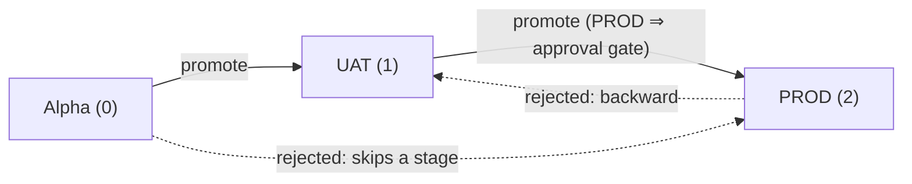
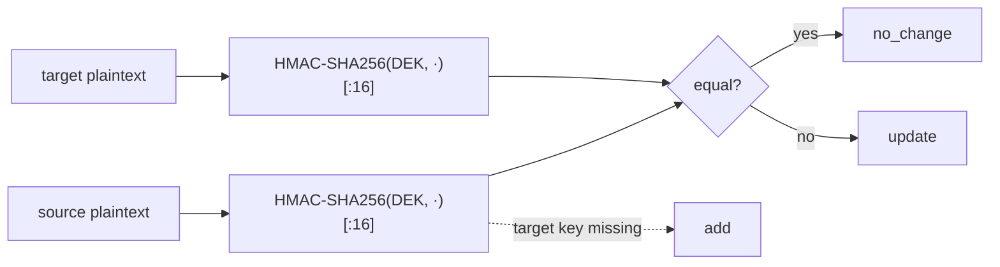
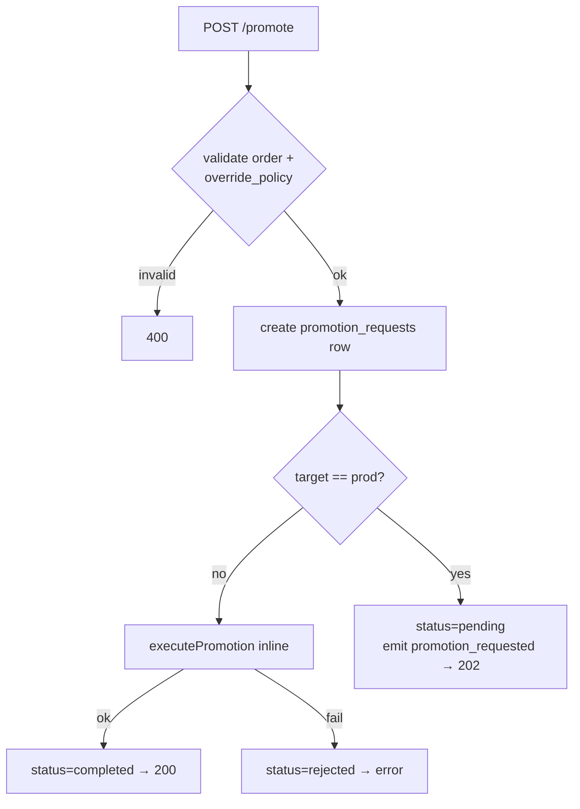
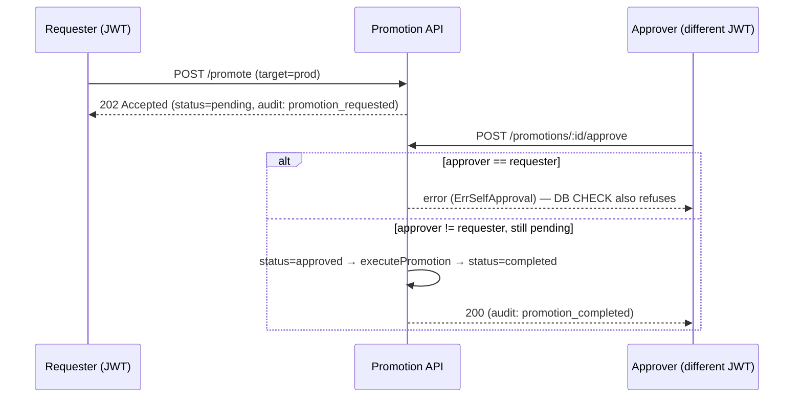
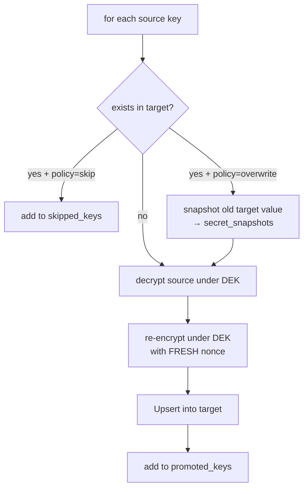
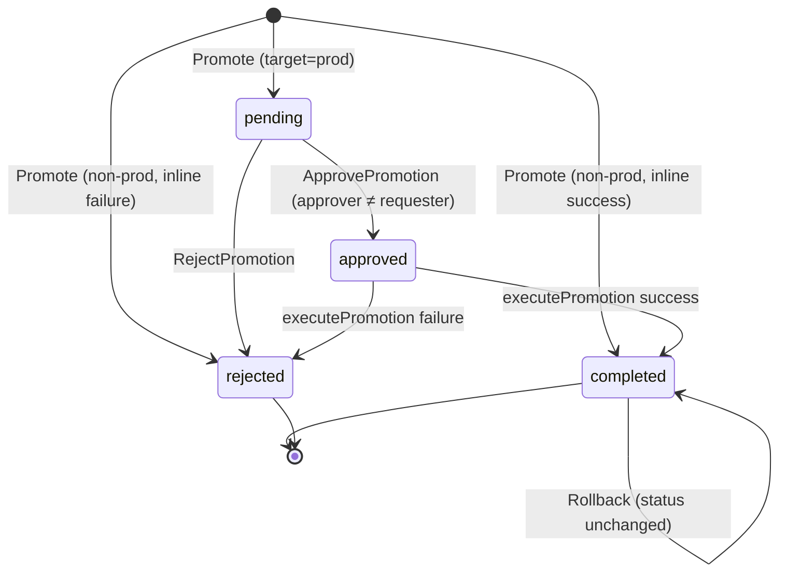

# 6. Promotion Engine

> Part of the **[KeepSave System Documentation](./README.md)**.

The promotion engine is KeepSave's differentiator: a controlled pipeline that moves secrets
forward through **Alpha → UAT → PROD** without leaking them in flight, silently overwriting them,
or letting a single person push to production. This chapter covers the forward-only pipeline, the
plaintext-free diff, the promote/approve/reject workflow with its four-eyes invariant, execution
(snapshot-before-overwrite and re-encryption), rollback, and the audit trail emitted at each step —
all grounded in `backend/internal/service/promotion_service.go`. The design rationale is
[ADR-0003](../adr/0003-promotion-engine.md); the four-eyes invariant is
[ADR-0007](../adr/0007-approver-not-requester-db-invariant.md). Security primitives referenced here
(envelope encryption, the audit taxonomy, project-access authorization) are detailed in the
[security chapter](./05-security.md).

---

## 6.1 The Alpha → UAT → PROD pipeline

A promotion copies secrets from a **source** environment to the **next** environment. Two invariants
are enforced by `validateEnvironmentOrder`
(`backend/internal/service/promotion_service.go:68-81`), which ranks environments with a fixed map
(`alpha=0, uat=1, prod=2`, `:35-39`):

- **Forward-only.** `srcOrder >= tgtOrder` is rejected — you cannot promote PROD → UAT, UAT → Alpha,
  or an environment to itself.
- **No stage-skipping.** `tgtOrder - srcOrder > 1` is rejected — Alpha → PROD is not allowed; you
  must go Alpha → UAT, then UAT → PROD.

Both `Diff` and `Promote` call `validateEnvironmentOrder` first, so an illegal pair is refused
before any decryption happens. Unknown environment names are rejected as *"invalid environment
name"*. PROD is identified by the literal name `prod` (`targetEnv == "prod"`); ADR-0003 §Open-questions
notes this string compare should move into per-project config if environments ever become
configurable.

**Authorization.** All promotion routes are mounted under `JWTAuthMiddleware` **and**
`RequireProjectAccess` (`backend/internal/api/router.go`), so promotion is a **human-JWT** operation
scoped to a project the caller can access; API-key agents cannot drive promotions. (See
[security §5.5](./05-security.md#55-authorization). Note the handlers do not additionally check a
`promote` scope.)

---

## 6.2 Diff phase — plaintext never appears

Before promoting, a caller previews what would change via
`POST /api/v1/projects/:id/promote/diff` → `PromotionService.Diff`
(`promotion_service.go:92-180`). The diff compares source and target **without revealing either
plaintext**, which is the whole point — a diff response must be safe to show in a dashboard or log.

How it works:

1. Decrypt the project DEK and list the source + target secrets for the requested environments
   (`:97-125`), applying an optional `keysFilter`.
2. For each source key, decrypt the source value (and the target value if the key exists) under the
   project DEK.
3. Instead of returning the value, return a **truncated keyed hash**:
   `hashSecretForDiff(dek, value)` = `HMAC-SHA256(key=DEK, value)` hex-encoded and truncated to the
   first **16 hex chars (64 bits)** (`:21, 28-33`).
4. Classify the action by comparing the two hashes:
   - source key absent in target → `add`
   - hashes equal → `no_change`
   - hashes differ → `update`

**Why a keyed (HMAC) hash, not a plain hash.** Using the **project DEK as the MAC key** means an
attacker who observes a diff response cannot match a hash against a guessed secret value (a
dictionary/preimage attack) without first stealing the DEK — the very thing the
[encryption scheme](./05-security.md#52-cryptography-aes-256-gcm-envelope-encryption) protects.
Truncating to 64 bits keeps the response compact while making collision-driven false
`no_change` results vanishingly unlikely (HMAC truncation is safe per RFC 2104 §5). The wire type is
`models.DiffEntry { Key, Action, SourceHash, TargetHash, SourceExists, TargetExists }` — there is
**no value field**.

> **Precision note for auditors.** The source comment at `:165-166` calls the equality a
> "constant-time compare", but the code uses a plain Go string comparison
> `entry.SourceHash == entry.TargetHash` (`:167`), **not** `hmac.Equal`/`subtle.ConstantTimeCompare`.
> The values being compared are already truncated HMACs of the same DEK-keyed function, so this is
> a low-risk timing surface (an attacker would be timing equality of values they cannot compute),
> but the comment overstates the implementation.
>
> This also supersedes the [threat model](../THREAT_MODEL.md) §3 row I finding ("Diff endpoint
> returns full plaintext SourceValue/TargetValue … High") — that finding predates the hash-based
> `DiffEntry` and is **stale**; current code returns hashes only.

---

## 6.3 Promote flow

`PromotionService.Promote` (`promotion_service.go:184-236`) is driven by
`POST /api/v1/projects/:id/promote`. Request fields (`PromoteRequest`):

| Field | Meaning |
|-------|---------|
| `source_environment` / `target_environment` | the pair (validated forward-only, no-skip) |
| `keys` | optional key filter; empty = all source keys |
| `override_policy` | `skip` (default) or `overwrite` — what to do when the target already has a key |
| `notes` | free-text recorded on the request |

Behavior splits on the target:

- **Non-PROD (Alpha → UAT):** a `promotion_requests` row is created and the promotion is
  **executed inline immediately** (`executePromotion`, `:222-235`). If execution fails, the request
  is marked `rejected` and the error is returned. The handler responds **200 OK**.
- **PROD (UAT → PROD):** a `promotion_requests` row is created with status `pending`, a
  `promotion_requested` audit event is written, and the function returns **without executing**
  (`:210-220`). The handler responds **202 Accepted**. Execution waits for a separate approval.

`override_policy` defaults to `skip` and only `skip`/`overwrite` are accepted (`:197-202`).

---

## 6.4 Approval workflow and four-eyes

A `pending` PROD promotion is resolved by a **second** human via
`POST /api/v1/projects/:id/promotions/:promotionId/approve` →
`ApprovePromotion` (`promotion_service.go:243-273`) or rejected via the sibling reject endpoint.

**Four-eyes invariant (ADR-0007).** The approver must not be the requester; a single compromised
account cannot both request and approve a PROD change. This is enforced in **two independent
layers**:

1. **Service guard.** `ApprovePromotion` returns `ErrSelfApproval`
   (*"requester cannot approve their own promotion"*) when `promotion.RequestedBy == approverID`
   (`:241, 254-256`).
2. **DB CHECK constraint.** `promotion_requests_no_self_approval` —
   `CHECK (requested_by IS NULL OR approved_by IS NULL OR requested_by <> approved_by)` — backstops
   any future code path that bypasses the guard
   (`backend/migrations/postgres/008_promotion_self_approval_check.sql`, mirrored for MySQL/SQLite).

Approval also requires the promotion to still be `pending` (`:250-252`); approving an
already-resolved promotion errors. On approval the row moves to `approved`, then `executePromotion`
runs; **if execution fails, the row is set back to `rejected`** (`:262-265`).

**Rejection.** `RejectPromotion` (`:276-302`) requires `pending` status, sets the row to `rejected`
(recording the rejecter in `approved_by` and stamping `completed_at`), and emits a
`promotion_rejected` audit event.

> **Gap (documented, not a bug in this chapter).** There is **no distinct `promotion_approved`
> audit event** emitted between approval and execution — the approval is only observable via the
> `promotion_completed` event that `executePromotion` writes. Both the
> [threat model](../THREAT_MODEL.md) §3 row R and
> [`AUDIT_LOG_COVERAGE`](../AUDIT_LOG_COVERAGE.md) (which lists `promotion_approved` as **new**)
> flag this; the event is **not yet implemented**. Similarly, the ADR-0007 service guard returns
> `ErrSelfApproval` but does **not** emit the planned `promotion.approve_rejected` audit event.

---

## 6.5 Execution: snapshot, re-encrypt, upsert

`executePromotion` (`promotion_service.go:305-400`) is the only path that mutates target secrets; it
is called inline for non-PROD and post-approval for PROD. Per source key (after applying the key
filter):

1. **Check the target.** `GetByEnvAndKey(tgtEnv, key)` — does the key already exist in the target?
2. **Apply override policy.** If it exists **and** `override_policy == "skip"`, the key is added to
   `skippedKeys` and left untouched (`:352-355`).
3. **Snapshot before overwrite.** If the target value exists (and will be overwritten), its current
   `encrypted_value` + `value_nonce` are copied into `secret_snapshots` keyed by this promotion
   (`CreateSnapshot`, `:357-363`) — this is what rollback restores.
4. **Decrypt then re-encrypt with a fresh nonce.** The source value is decrypted under the project
   DEK and **re-encrypted under the same DEK with a brand-new random nonce** (`crypto.Encrypt`,
   `:365-374`).
5. **Upsert into the target** (`secretRepo.Upsert`, `:376-379`) and record the key in
   `promotedKeys`.

After the loop, the promotion is marked `completed` and a `promotion_completed` audit event is
written carrying `promoted_keys[]`, `skipped_keys[]`, and `override_policy` (`:384-397`).

**Why decrypt-and-rewrap, not copy the ciphertext?** Although one project DEK encrypts every
environment, copying the source ciphertext+nonce verbatim would make the source nonce a target nonce.
The moment a source secret is edited and re-promoted, you would have a **(nonce, key) reuse with
different plaintexts** — which catastrophically breaks AES-GCM confidentiality and authenticity.
Re-encrypting with a fresh nonce avoids this entirely ([ADR-0003](../adr/0003-promotion-engine.md)
Option A vs B). The cost is that **plaintext exists in process memory** for the duration of a
promotion — an accepted trade-off.

---

## 6.6 Snapshots and rollback

Each overwrite records the **prior** target value in `secret_snapshots`
(`promotion_id, environment_id, key, encrypted_value, value_nonce`), so a completed promotion can be
undone without prior planning — someone realizing mid-incident they need to revert.

`Rollback` (`promotion_service.go:403-440`), behind
`POST /api/v1/projects/:id/promotions/:promotionId/rollback`:

1. Requires the promotion to be `completed` (`:409-411`) — you can only roll back a finished
   promotion.
2. Loads every snapshot for the promotion (`GetSnapshotsByPromotionID`, `:413-416`).
3. **Upserts each snapshotted (encrypted) value back into its environment** (`:420-429`) — the
   ciphertext is restored as-is; no decryption happens on the rollback path.
4. Emits a `promotion_rollback` audit event with `restored_keys[]` (`:432-437`).

> **Behavioral notes.** Rollback restores only keys that were **overwritten** (those have
> snapshots); keys that were newly **added** by the promotion have no snapshot and are therefore
> **not deleted** by rollback. Rollback also **does not change the promotion's status** — the row
> stays `completed` after a rollback (there is no `rolled_back` state), so a promotion can be
> rolled back more than once. These are limits to be aware of, not failures.

---

## 6.7 Promotion status state machine

`promotion_requests.status` is one of `pending`, `approved`, `rejected`, `completed`, updated only
through `UpdateStatus` (`promotion_repo.go:111-126`), which also stamps `completed_at` for the
terminal `completed`/`rejected` transitions and records `approved_by`.

Note the asymmetry: a **non-PROD** promotion never passes through `pending`/`approved` — it lands
directly in `completed` (or `rejected` on failure). Only **PROD** promotions traverse the approval
states.

---

## 6.8 Audit trail per step

Every consequential step emits an event from the canonical taxonomy
([`AUDIT_LOG_COVERAGE`](../AUDIT_LOG_COVERAGE.md); see [security §5.6](./05-security.md#56-audit-logging)).
Emission is **non-blocking** — the promotion service calls `auditRepo.Create(...)` and ignores the
error so a degraded audit table cannot fail a promotion.

| Step | Event | Key metadata | Code |
|------|-------|--------------|------|
| PROD promote requested | `promotion_requested` | `promotion_id`, source/target env, `status: pending_approval` | `:213-218` |
| Execution completed (inline or post-approval) | `promotion_completed` | `promoted_keys[]`, `skipped_keys[]`, `override_policy` | `:390-397` |
| Rejected | `promotion_rejected` | `promotion_id`, source/target env | `:290-294` |
| Rolled back | `promotion_rollback` | `restored_keys[]` | `:432-437` |

> **Not emitted today (tracked):** `promotion_approved` (the distinct approval event) and
> `promotion.approve_rejected` (the four-eyes rejection event) — see [§6.4](#64-approval-workflow-and-four-eyes).
> A non-PROD promotion emits only `promotion_completed`, **not** `promotion_requested` (that event is
> PROD-only).

Audit history for a project is readable via `GET /api/v1/projects/:id/audit-log`
(`handlers_promotion.go:194-219` → `ListAuditLog`), newest first.

---

## 6.9 Edge cases and invariants checklist

- [ ] Promotions are **forward-only** and **single-stage** — Alpha→UAT and UAT→PROD only; backward
      and skip are refused before any work.
- [ ] **Plaintext never appears in a diff** — only truncated DEK-keyed HMAC hashes.
- [ ] **Non-PROD executes inline (200); PROD requires approval (202)** and stays `pending` until a
      second user acts.
- [ ] The **approver ≠ requester** — enforced at the service layer (`ErrSelfApproval`) **and** the
      DB layer (CHECK constraint).
- [ ] Approve/reject require the promotion to still be **`pending`**.
- [ ] Every overwrite is **snapshotted first**; values are **re-encrypted with a fresh nonce**, never
      copied verbatim (avoids GCM nonce reuse).
- [ ] **Rollback** restores overwritten keys from snapshots and works only on `completed` promotions;
      newly-added keys are not removed and status is unchanged.
- [ ] Every consequential step **emits an audit event** (with the known `promotion_approved` gap).
- [ ] All promotion routes require **JWT auth + project access** (`RequireProjectAccess`).

---

## See also

- [KeepSave System Documentation index](./README.md)
- [Security Model](./05-security.md) — envelope encryption, the audit taxonomy, four-eyes, authz
- [Data Model](./04-data-model.md) — `promotion_requests`, `secret_snapshots`, the self-approval CHECK
- [API Reference](./03-api-reference.md) — the `/promote`, `/approve`, `/reject`, `/rollback` endpoints
- [Backend Architecture](./02-backend.md) — handler → service → repository layering
- [`docs/THREAT_MODEL.md`](../THREAT_MODEL.md) §3 — promotion-engine STRIDE rows
- ADRs: [0003 (promotion engine)](../adr/0003-promotion-engine.md) · [0007 (approver ≠ requester DB invariant)](../adr/0007-approver-not-requester-db-invariant.md) · [0001 (envelope encryption)](../adr/0001-envelope-encryption.md) · [0004 (key hierarchy)](../adr/0004-key-hierarchy.md)
