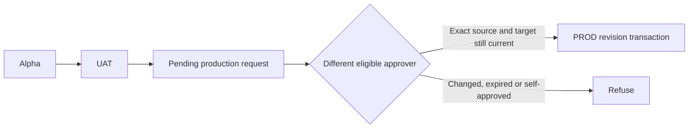

# 6. Environment promotion

Part of the [system documentation](README.md). Source reconciled October 4, 2026.

Promotion remains the controlled **Alpha → UAT → PROD** vault workflow. Current
PostgreSQL composition uses
[`promotion_vault.go`](../../backend/internal/service/promotion_vault.go) and
[`vault/promotion.go`](../../backend/internal/vault/promotion.go) through the same
authorized vault transaction as CRUD/history/rotation. The legacy promotion
service is a compatibility adapter, not the authority for new journal guarantees.
See [ADR0003](../adr/0003-promotion-engine.md),
[ADR0017](../adr/0017-promotion-engine-integrity.md) and
[ADR0028](../adr/0028-core-identity-and-vault-release.md).

## Request, approval and execution

Only forward adjacent environment pairs are accepted; Alpha → PROD, backwards,
same-environment and unknown pairs are refused. The request selects source/target,
optional keys, `skip` or `overwrite`, and notes. Current tracked human/project
permission is checked in the application service; API keys are not promotion
administrators.

```mermaid
flowchart LR
    A[Alpha] --> U[UAT]
    U --> R[Pending production request]
    R --> C{Different eligible approver}
    C -->|Exact source and target still current| P[PROD revision transaction]
    C -->|Changed, expired or self-approved| D[Refuse]
```

Alpha → UAT executes in its request transaction. UAT → PROD creates a pending
request without writing production values. Another eligible current administrator
or promoter approves; the requester cannot self-approve. The database invariant
also refuses equal requester/approver identities. A concurrent execution winner
uses conditional state transition, so another approver cannot execute it twice.

The bound request captures exact parameters and source/target revision digests
with a 30-minute expiry. Approval rechecks those records and current authority;
editing source or target requires a new request rather than moving the approval
to changed content. Required request/approval/completion audit events share the
local transaction. Failed execution does not claim successful promotion.

## Diff and value continuity

`POST /projects/{id}/promote/diff` returns keys, add/update/no-change classification
and keyed hash metadata, not source/target plaintext. The trusted vault may
briefly decrypt values to compare them; that does not make the diff response a
value-read contract. Corrupt ciphertext is an explicit failure.

Applying a promotion preserves the overwritten target as a retained snapshot,
then encrypts the source value with a fresh nonce and journals the resulting
target revision. Existing values can be skipped according to policy. Revision,
snapshot dependencies, status, required audit and outbox commit together.
Project key rotation retains historical/snapshot key versions rather than making
rollback unreadable.

Rollback is an authorized new journal mutation using retained snapshot material
and current revision checks. It is not a database rewind and cannot silently
overwrite a newer target edit. Project/secret tombstones remain outside active
access; recovery/promotion does not offer undelete.

## Incident controls and validation

`KEEPSAVE_PROMOTIONS_ENABLED=false` denies new promote/approve requests while
permitted status, diff, rejection and rollback remain available for incident
handling. Authentication and project access still run before the refusal.

Current acceptance covers actual-router role/self-approval/source-drift denial,
transaction rollback, concurrency and snapshot continuity after rotation on
PostgreSQL. Read the [ledger](../validation/2026-10-02-harness-neutral-platform/ACCEPTANCE.md)
for executed scope. Old comments claiming a missing approval audit or relying
solely on legacy nontransactional code are historical. Production changes still
require independent review and installation recovery/cutover acceptance.
