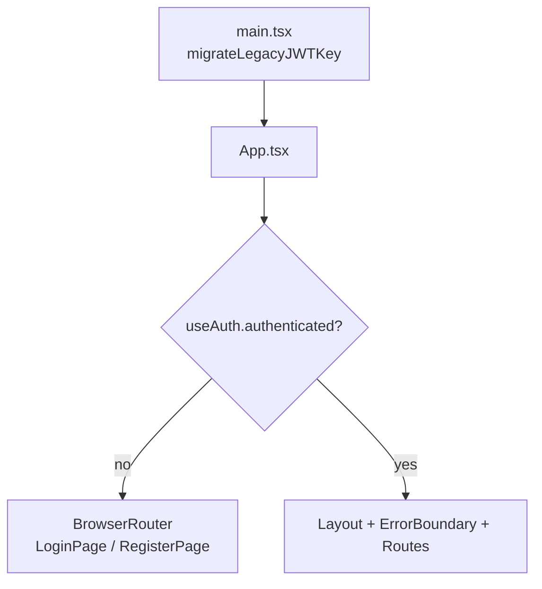
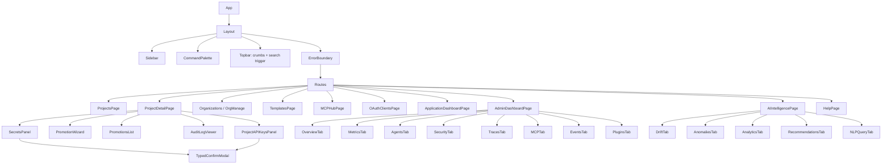

# Frontend Architecture

> Part of the **[KeepSave System Documentation](./README.md)**.

KeepSave ships a single-page React dashboard (`frontend/`) that is the human-facing console for projects, secrets, promotions, API keys, the MCP hub, and the admin/observability dashboards. It is a thin client: all secrets, encryption, and authorization live in the [backend](./02-backend.md), and the frontend never sees a plaintext secret it did not explicitly request through an authenticated API call. This chapter grounds every claim in the source under `frontend/src/` so an engineer or auditor can navigate the app, understand how authentication state is held in the browser, and know exactly which surfaces handle secret material.

The same codebase produces a **second, independent artifact** — the embeddable `<keepsave-widget>` — which has its own trust model and is documented separately in [Embeddable Widget](./08-embed-widget.md).

---

## 1. Tech stack and build

| Concern | Choice | Where |
|---|---|---|
| UI library | React 19 | `frontend/package.json` (`react`, `react-dom` `^19.0.0`) |
| Build tool / dev server | Vite 6 | `frontend/vite.config.ts` |
| Language | TypeScript 5.8, `strict` mode | `frontend/tsconfig.json` |
| Routing | React Router 7 (`react-router-dom`) | `frontend/src/App.tsx` |
| Component primitives | Radix UI (dialog, dropdown, select, tabs, toast, tooltip, etc.) | `frontend/src/components/ui/` |
| Styling | Tailwind CSS 4 (`@tailwindcss/vite`) + a hand-written design-token sheet | `frontend/src/index.css`, `frontend/src/styles/keepsave.css` |
| Charts | Recharts 3 | `frontend/src/components/dashboard/` |
| Icons | `lucide-react` | throughout |
| Tests | Vitest 4 + Testing Library + jsdom | `frontend/vite.config.ts` (`test` block), `*.test.ts(x)` |

`tsconfig.json` enables `strict`, `noUnusedLocals`, `noUnusedParameters`, and `noFallthroughCasesInSwitch`, and the `@/*` path alias maps to `src/*` (mirrored by the Vite `resolve.alias`). Per the project conventions in `CLAUDE.md`, `any` is disallowed.

### 1.1 Two build outputs

The repository builds two distinct bundles from one source tree:

| Output | Config | Entry | Result | npm script |
|---|---|---|---|---|
| Main SPA | `frontend/vite.config.ts` | `index.html` → `src/main.tsx` | App in `dist/` | `npm run build` |
| Widget library | `frontend/vite.embed.config.ts` | `src/embed/index.ts` | `keepsave-widget.{es,umd}.js` in `dist-embed/` | `npm run build:widget` |

The widget config is a Vite **library build** (`build.lib`, global name `KeepSave`, `es` + `umd` formats, sourcemaps on). `npm run build:all` produces both. Every build runs `tsc -b` first, so a type error fails the build.

```jsonc
// frontend/package.json — scripts
"dev":          "vite",                                    // SPA dev server (port 3000)
"build":        "tsc -b && vite build",                    // SPA → dist/
"build:widget": "tsc -b && vite build --config vite.embed.config.ts", // widget → dist-embed/
"build:all":    "npm run build && npm run build:widget",
"test":         "vitest run",
"test:watch":   "vitest"
```

### 1.2 Dev server and the `/api` proxy

The dev server runs on port 3000 and proxies `/api` to the backend on `http://localhost:8080` with `changeOrigin: true` (`frontend/vite.config.ts`). This is why local development needs no CORS configuration and no `VITE_API_BASE_URL`: the SPA calls the relative path `/api/v1/...` and Vite forwards it to Gin. In production (e.g. Vercel) the SPA and backend live on different origins, so `VITE_API_BASE_URL` is set instead (see §6). SPA routing in production is handled by a catch-all rewrite to `index.html` in `frontend/vercel.json`.

---

## 2. App bootstrap

### 2.1 `main.tsx` — legacy key migration before first render

`frontend/src/main.tsx` runs one side effect **before** mounting React: `migrateLegacyJWTKey()` (from `src/api/client.ts`). Older builds stored the JWT under `jwt` / `auth_token`; the canonical key is now `keepsave_token`. The migration copies any legacy value into the canonical key and deletes the stragglers, idempotently, so the auth hook reads a consistent key on boot. React then mounts `<App/>` inside `<React.StrictMode>` at `#root`.

### 2.2 `App.tsx` — auth-gated routing

`frontend/src/App.tsx` calls `useTheme()` (to apply the persisted theme) and `useAuth()`, then branches on `auth.authenticated`:

- **Unauthenticated:** only two routes are mounted — `/register` (`RegisterPage`) and a catch-all `*` that renders `LoginPage`. Both receive `auth.login` as `onLogin(user, token)`. There is no authenticated chrome (no sidebar/layout) in this state.
- **Authenticated:** the full app renders inside `<Layout>` wrapped by an `<ErrorBoundary>`, with the route table below. A trailing `*` route `<Navigate to="/" replace/>` redirects unknown paths home.

In both states a `<Toaster/>` is mounted so toasts work pre- and post-login.



---

## 3. Routing

All routes are declared in `App.tsx`. Pages live in `frontend/src/pages/`. Three pages own **nested** routers of their own (`ProjectDetailPage`, `AdminDashboardPage`, `AIIntelligencePage`), declared with a trailing `/*` in `App.tsx`.

| Route | Page component | Purpose |
|---|---|---|
| `/` | `ProjectsPage` | List/create/delete projects (the home screen). |
| `/projects/:id/*` | `ProjectDetailPage` | A single project; hosts nested tabs (§3.1). |
| `/organizations` | `OrganizationsPage` | List/create organizations. |
| `/organizations/:id` | `OrganizationManagePage` | Manage one org: members, roles, projects, SSO, compliance. |
| `/templates` | `TemplatesPage` | Secret templates (built-in + custom), apply to a project. |
| `/mcp-hub` | `MCPHubPage` | Browse/register/install MCP servers; gateway tools. |
| `/oauth-clients` | `OAuthClientsPage` | Register/manage OAuth clients. |
| `/applications` | `ApplicationDashboardPage` | The application launcher dashboard. |
| `/applications/settings` | `ApplicationSettingsPage` | Settings for the application dashboard. |
| `/ai/*` | `AIIntelligencePage` | AI features; hosts nested tabs (§3.1). |
| `/admin/*` | `AdminDashboardPage` | Observability/admin; hosts nested tabs (§3.1). |
| `/help` | `HelpPage` | Static docs / integration help. |
| `*` | `Navigate → /` | Redirect unknown paths. |

> Note: `frontend/src/pages/APIKeysPage.tsx` exists but is **not** mounted in `App.tsx`; API-key management is reached per-project via the `ProjectAPIKeysPanel` tab (§3.1). Treat `APIKeysPage` as latent/legacy.

### 3.1 Nested route tables

**`ProjectDetailPage`** (`/projects/:id/*`) renders a tab strip plus a nested `<Routes>`. The `Tab` union is `secrets | promote | promotions | audit | api-keys`:

| Nested path | Element | Tab label |
|---|---|---|
| index (`/projects/:id`) | `SecretsPanel` | Secrets |
| `promote` | `PromotionWizard` | Pipeline |
| `promotions` | `PromotionsList` | History |
| `audit` | `AuditLogViewer` | Audit |
| `api-keys` | `ProjectAPIKeysPanel` | API Keys |

**`AdminDashboardPage`** (`/admin/*`) — tabs from its `TABS` array; current tab derived from the pathname:

| Nested path | Element | Tab |
|---|---|---|
| index | `OverviewTab` | Overview |
| `metrics` | `MetricsTab` | Metrics |
| `agents` | `AgentsTab` | Agents |
| `security` | `SecurityTab` | Security |
| `traces` | `TracesTab` | Traces |
| `mcp` | `MCPTab` | MCP Hub |
| `events` | `EventsTab` | Events |
| `plugins` | `PluginsTab` | Plugins |

Each dashboard tab is re-mounted on refresh via a `key={refreshKey}` prop, and a `TimeRangeSelector` drives the time window.

**`AIIntelligencePage`** (`/ai/*`) — tabs `Overview / drift / anomalies / analytics / recommendations / query`, each mapped to a nested route element defined inside the same file (e.g. `DriftTab`, `AnomaliesTab`, `NLPQueryTab`). These use the dedicated AI client (`src/api/ai.ts`, §5.3).

### 3.2 Component hierarchy



---

## 4. Components

### 4.1 Layout / chrome

| Component | File | Responsibility |
|---|---|---|
| `Layout` | `components/Layout.tsx` | App shell: sidebar + topbar + main; owns the global **Cmd/Ctrl-K** keydown handler that opens the command palette; renders a mobile menu trigger. |
| `Sidebar` | `components/Sidebar.tsx` | Static nav sections (Vault / Platform / Intelligence / Help) with active-route highlighting; theme toggle; logout; user initial/email. |
| `CommandPalette` | `components/CommandPalette.tsx` | Cmd-K navigation menu over a fixed `ACTIONS` list; arrow keys move selection, Enter navigates, Esc/click-outside closes. |
| `Breadcrumbs` | `components/Breadcrumbs.tsx` | Path-segment breadcrumb with a `ROUTE_LABELS` map (standalone helper). |
| `ErrorBoundary` | `components/ErrorBoundary.tsx` | Class component; `getDerivedStateFromError` renders a "Something went wrong" fallback with a "Try Again" reset. Wraps the authenticated route tree. |

### 4.2 Project feature panels

These are the security-relevant screens; all are rendered inside `ProjectDetailPage`.

| Component | File | Notes (grounded in source) |
|---|---|---|
| `SecretsPanel` | `components/SecretsPanel.tsx` | Env tabs (alpha/uat/prod); list with masked values (`••••`); reveal-on-click with a **30s auto-hide timer** (`REVEAL_TIMEOUT_SECONDS = 30`, `revealRemaining` countdown, FU 0i); inline edit; add form; copy-to-clipboard via `navigator.clipboard`; delete routed through `TypedConfirmModal` (not `window.confirm`). |
| `PromotionWizard` | `components/PromotionWizard.tsx` | Multi-step (`configure → review → ...`) flow: pick a promotion path, fetch a **diff preview** before executing, choose an override policy, submit. PROD promotions surface a "pending approval" outcome. |
| `PromotionsList` | `components/PromotionsList.tsx` | History of promotions with status filter; approve/reject; rollback gated by a confirm target. |
| `ProjectAPIKeysPanel` | `components/ProjectAPIKeysPanel.tsx` | Create scoped keys (default scope `read`, optional environment); raw key shown **once** in a card with copy; delete via typed confirm. |
| `AuditLogViewer` | `components/AuditLogViewer.tsx` | Tabular audit log with search and expandable rows. |

### 4.3 Dashboard tab components

Under `components/dashboard/`: the tab bodies (`OverviewTab`, `MetricsTab`, `AgentsTab`, `SecurityTab`, `TracesTab`, `MCPTab`, `EventsTab`, `PluginsTab`) plus presentational helpers `StatCard`, `ChartCard`, `HeatmapGrid`, `TraceWaterfall`, `TimeRangeSelector`. Metrics parsing uses `utils/parsePrometheus.ts` (the `/metrics` text endpoint is fetched by `getPrometheusMetrics`).

### 4.4 Common UI primitives and modals

| Group | Files |
|---|---|
| Radix-wrapped primitives | `components/ui/{badge,button,card,collapsible,dialog,dropdown-menu,input,label,select,separator,skeleton,table,tabs,textarea,toast,toaster,tooltip}.tsx` |
| Confirmation modals | `ConfirmDialog.tsx` (simple yes/no), `TypedConfirmModal.tsx` (must type an exact, case-sensitive `confirmPhrase` to enable the destructive button — replaces `window.confirm`, FU 0j) |
| Misc | `AppChatbot.tsx` (application-dashboard assistant) |

---

## 5. State, hooks, and the API client

### 5.1 Hooks

KeepSave uses **no Redux/Zustand**. State is React-local plus a few `localStorage`-backed hooks and a module-level toast store.

| Hook | File | Behavior |
|---|---|---|
| `useAuth` | `hooks/useAuth.ts` | Source of truth for session state. Reads `keepsave_user` (PII: id/email) and derives `authenticated` from `isAuthenticated()` (JWT expiry). Listens for the `keepsave:session-expired` window event to drop state, and runs a **60s `setInterval`** that clears token + user if the JWT is no longer valid. Exposes `login(user, token)` and `logout()`. |
| `useTheme` | `hooks/useTheme.ts` | Theme stored in `keepsave_theme` (default `dark`); applies `data-theme` to `<html>`; `toggle()` flips light/dark. |
| `useToast` / `toast` | `hooks/useToast.ts` | Shadcn-style reducer with a module-level `memoryState` and listener list; `TOAST_LIMIT = 5`. Lets non-React code (e.g. effects) raise toasts via the exported `toast()`. |
| `useSidebar` | `hooks/useSidebar.ts` | Collapsed state persisted in `keepsave_sidebar_collapsed`. |

### 5.2 The main API client (`api/client.ts`)

A flat module of `async` functions over `fetch`, not a class. Key mechanics:

- **Base URL resolution:** `const BASE_URL = import.meta.env.VITE_API_BASE_URL ?? '/api/v1'`. In production set `VITE_API_BASE_URL` to the absolute backend origin (e.g. `https://api-uat.keepsave.example/api/v1`); in dev leave it unset so requests hit `/api/v1` and the Vite proxy forwards them (§1.2).
- **Token storage and migration:** canonical key `JWT_STORAGE_KEY = 'keepsave_token'`; `migrateLegacyJWTKey()` folds legacy `jwt`/`auth_token` into it (called from `main.tsx`).
- **Expiry check:** `isAuthenticated()` base64-decodes the JWT payload and treats the token as expired when `exp` is within **60 seconds** of now (`parseJWTExpiry`).
- **Bearer injection:** every `request()` attaches `Authorization: Bearer <token>` when a token is present, plus `Content-Type: application/json`.
- **401 handling:** on a `401` the client clears the token, removes `keepsave_user`, dispatches `window` event `keepsave:session-expired`, and throws `"Session expired. Please log in again."` `useAuth` listens for that event and forces re-login.
- **Error shape:** non-OK responses throw `Error(data.error.message ?? data.error ?? "Request failed…")`, tolerating both the string and structured (`{ code, message }`) error envelopes from the backend's `httperror` package.
- **No-content:** `204` returns `undefined`.

The client covers the full dashboard surface — roughly 100 functions across auth, projects, secrets, promotions, audit, API keys, organizations, templates, env import/export, admin/observability, SSO/compliance/backups/policies, agent leases/analytics, platform events/plugins/access-policies, OAuth clients, MCP servers/installations/gateway, dependency graph, the application dashboard, project key rotation, and Prometheus metrics. Rather than re-list them, see the canonical [API reference](./03-api-reference.md); the function names in `api/client.ts` map 1:1 to those endpoints.

> Security note carried in code: `rotateProjectKeys` and `exportEnv` comments flag known IDOR findings (audit A01-F5 / A01-F3) whose architectural fix is the `RequireProjectAccess` middleware ([ADR-0005](../adr/0005-require-project-access-middleware.md)). The client wiring does not change exploitability — see [Security Model](./05-security.md).

### 5.3 The separate AI client (`api/ai.ts`)

AI Intelligence uses its own small client. It **imports `JWT_STORAGE_KEY` from `client.ts`** (so it reads the same token) but hard-codes `BASE_URL = '/api/v1'` and reimplements `request()`. It covers AI providers, drift detection, anomaly scan/ack/resolve, usage trends/forecast, recommendations, and the NLP query. Note: because it does not use the shared base-URL resolution, it relies on same-origin/proxied access to `/api/v1`.

### 5.4 State management summary

- **Session/identity:** `localStorage` (`keepsave_token`, `keepsave_user`) read through `useAuth`.
- **UI prefs:** `localStorage` (`keepsave_theme`, `keepsave_sidebar_collapsed`).
- **Screen data:** React `useState`/`useEffect` per page/panel; no global store.
- **Toasts:** module-level reducer store in `useToast.ts`.

---

## 6. Styling

Styling is **Tailwind 4 plus a hand-authored token sheet**. `src/index.css` imports `./styles/keepsave.css` then `tailwindcss`, and declares an `@theme` block of CSS-variable color tokens; dark mode is a Tailwind custom variant bound to `[data-theme="dark"]` (`@custom-variant dark (&:is([data-theme="dark"] *))`). `keepsave.css` (~980 lines, the "Archival Terminal" design) defines the `--ks-*` design tokens and the bespoke `ks-` class system used by `Layout`/`Sidebar`/`SecretsPanel`/etc., for both `[data-theme="dark"]` and light. `useTheme` toggles the `data-theme` attribute on `<html>`, which flips both systems at once. `lib/utils.ts` exposes the `cn()` (clsx + tailwind-merge) helper used across components.

---

## 7. Tests

Frontend tests use Vitest + Testing Library (`jsdom`), configured in the `test` block of `vite.config.ts` with `setupFiles: ./src/test-setup.ts` (which imports `@testing-library/jest-dom`). Present test files:

| File | Covers |
|---|---|
| `api/client.test.ts` | `isAuthenticated` (valid/expired JWT), `clearToken`, `JWT_STORAGE_KEY`, all three `migrateLegacyJWTKey` paths, request auth-header injection, error/401/204 handling. |
| `components/SecretsPanel.test.tsx` | Env tabs, load/display, env switch, reveal/hide, add-secret, empty state, load error. |
| `components/PromotionWizard.test.tsx` | Configure step, diff preview → review, execute success, PROD pending message, back navigation. |
| `pages/LoginPage.test.tsx` | Form render, `onLogin` on success, error on failure, link to register. |
| `pages/ProjectsPage.test.tsx` | List render, empty state, create flow, descriptions. |
| `embed/{auth,api,styles}.test.ts` | Widget unit tests — see [Embeddable Widget §tests](./08-embed-widget.md). |

---

## 8. Client-side storage and known UX-state gaps

The JWT and basic user PII are stored in `localStorage` (`keepsave_token`, `keepsave_user`). This is the deliberate dashboard trade-off (refresh-without-relogin vs. token-on-disk) discussed in [EMBED_STATE](../EMBED_STATE.md) ("Dashboard storage debt"); the rule is that this pattern is **never** extended to secret plaintext. The embed widget holds nothing in storage (see chapter 08).

Per-screen state coverage (loading / empty / error / denied / revealed / editing) and its security flags are tracked in [UX_STATE_INVENTORY](../UX_STATE_INVENTORY.md). Two items have since advanced past what that doc records and are reflected above: revealed-secret **auto-hide** is implemented in `SecretsPanel` (FU 0i), and destructive actions use the **typed-confirmation modal** rather than `window.confirm` (FU 0j). The `HelpPage` legacy-`jwt` key reference noted there is mitigated app-wide by `migrateLegacyJWTKey`.

---

## See also

- [Embeddable Widget](./08-embed-widget.md) — the second frontend artifact and its trust model.
- [API Reference](./03-api-reference.md) — the endpoints behind `api/client.ts` and `api/ai.ts`.
- [Security Model](./05-security.md) — auth, token handling, IDOR findings, error sanitization.
- [Promotion Engine](./06-promotion.md) — the backend behind `PromotionWizard`/`PromotionsList`.
- [UX_STATE_INVENTORY](../UX_STATE_INVENTORY.md) — per-screen state matrix and gaps.
- [EMBED_STATE](../EMBED_STATE.md) — storage rules and dashboard storage debt.
- [`frontend/src/`](../../frontend/src/) — the source for everything above.
