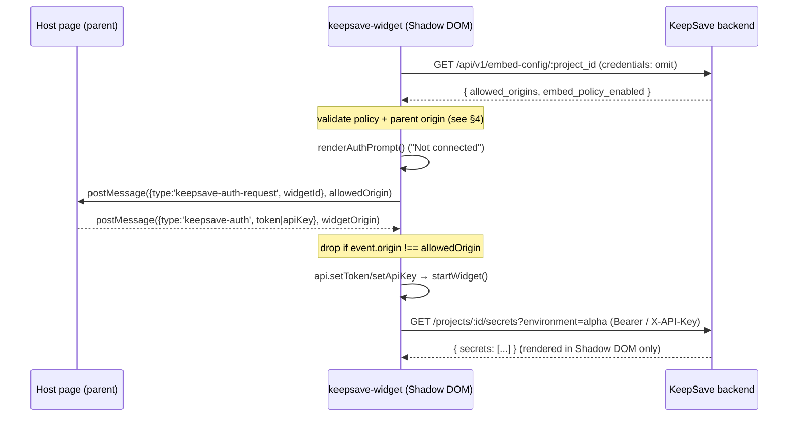
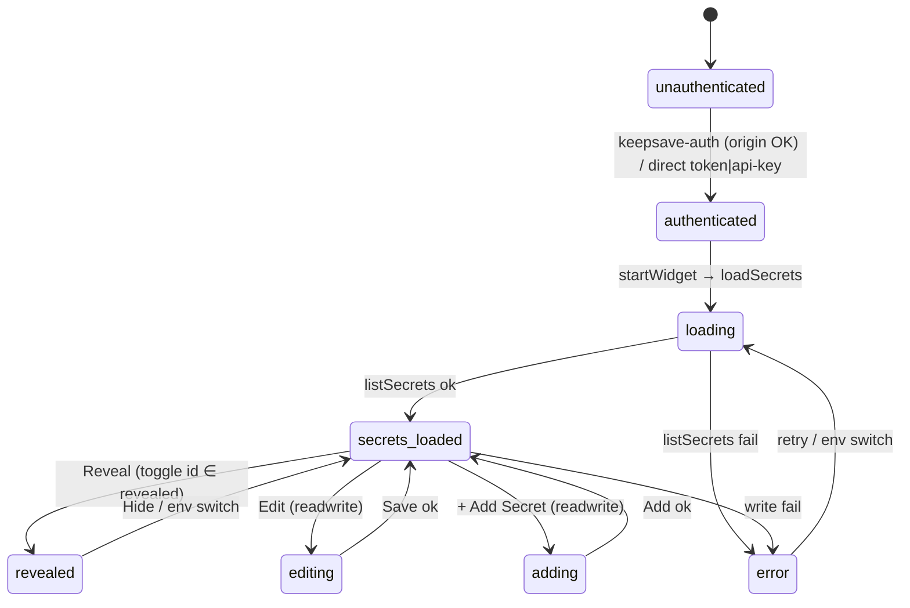

# Embeddable Widget

> Part of the **[KeepSave System Documentation](./README.md)**.

KeepSave ships an embeddable `<keepsave-widget>` Web Component so a third party can drop a small, self-contained secrets panel into their own page with a single `<script>` tag. Because the widget runs on **integrator origins** — outside KeepSave's own trust domain — it is treated as its own attack surface: it isolates itself in Shadow DOM, holds credentials and plaintext only in memory, and (for the postMessage auth path) refuses to start until the server confirms the host origin is allow-listed. This chapter documents the widget end to end from `frontend/src/embed/`, with the security invariants made explicit for auditors.

The widget is built as a standalone library bundle (`vite.embed.config.ts`, entry `src/embed/index.ts`), separate from the dashboard SPA — see [Frontend Architecture §1.1](./07-frontend.md).

---

## 1. Integration model

The integrator includes one script (the UMD or ES bundle, global name `KeepSave`) and places one element. `src/embed/index.ts` re-exports the public surface and **auto-registers** the element on import:

```ts
// frontend/src/embed/index.ts
export { KeepSaveWidget, register } from './keepsave-widget';
export { KeepSaveAPI } from './api';
export type { Secret } from './api';
export type { AuthMessage, AuthRequestMessage } from './auth';
export type { WidgetMode } from './widget';
register();              // defines <keepsave-widget> if not already defined
```

`register()` calls `customElements.define('keepsave-widget', KeepSaveWidget)` (guarded against double-registration) in `src/embed/keepsave-widget.ts`. The element attaches an **open** Shadow Root in its constructor, so the widget's markup and the single injected `<style>` are scoped away from the host page's CSS (and vice versa).

---

## 2. Attributes and modes

`KeepSaveWidget.observedAttributes` are read from `src/embed/keepsave-widget.ts`:

| Attribute | Required | Meaning | Default |
|---|---|---|---|
| `project-id` | yes (postMessage mode) | KeepSave project UUID. | `''` |
| `api-url` | yes when SPA origin ≠ backend origin | Absolute backend base URL. | `window.location.origin` |
| `theme` | no | `light` or `dark`. | `light` |
| `mode` | no | `read` or `readwrite` (see below). | `read` |
| `api-key` | no | Direct API-key auth (host-trusted). | — |
| `token` | no | Direct JWT auth (host-trusted). | — |

**Lifecycle:** `connectedCallback` runs `setup()` once; `attributeChangedCallback` re-runs `setup()` when any attribute other than `theme` changes (a `theme` change only re-applies styles), and `disconnectedCallback` tears down the auth handshake listener.

**Read vs. readwrite** (`mode`): in `read` the renderer shows only Reveal/Hide; in `readwrite` it additionally renders the Add form and per-secret Edit/Delete actions (`src/embed/widget.ts` — `renderAddForm`, `renderSecretItem` gated on `this.mode === 'readwrite'`). Mode is a UI affordance only; the backend's API-key scopes are the real authorization boundary ([Security Model](./05-security.md)).

> Operator note ([EMBED_ORIGIN_POLICY](../EMBED_ORIGIN_POLICY.md), ADR-0016): when KeepSave's SPA and backend are on different origins, `api-url` **must** point at the backend. Without it the widget falls back to the host page's origin and every API call 404s.

---

## 3. Authentication

The widget supports three ways to obtain credentials, selected in `setup()`. The first two are direct (host already trusts itself); the third is the cross-origin handshake and is the most secure.

### 3.1 Direct token / direct api-key

If the `token` attribute is present, `setup()` calls `api.setToken(token)` and starts immediately; likewise `api-key` → `api.setApiKey(apiKey)`. These bypass the postMessage path entirely (the boot sequence in §4 does not run). The trade-off, per [EMBED_ORIGIN_POLICY](../EMBED_ORIGIN_POLICY.md): a credential placed in an HTML attribute is observable by every script on the host page, so attribute mode is appropriate only when the host fully controls and trusts its own page.

### 3.2 postMessage handshake (most secure)

When neither `token` nor `api-key` is set, the widget runs the **origin-allow-list boot sequence** (§4) and then performs a `postMessage` handshake with the parent page, so the credential is delivered out-of-band by the host rather than embedded in the DOM. The protocol is defined in `src/embed/auth.ts`:

| Direction | Message type | Shape | Target/origin rule |
|---|---|---|---|
| Widget → parent (outbound) | `keepsave-auth-request` | `{ type, widgetId }` | `window.parent.postMessage(req, allowedOrigin)` — **never `'*'`** |
| Parent → widget (inbound) | `keepsave-auth` | `{ type, token? , apiKey? }` | accepted only if `event.origin === allowedOrigin` (strict equality) |

`createAuthHandshake(widgetId, onAuth, { allowedOrigin })` returns `{ start, destroy }`:

- **`start()`** refuses to do anything if `allowedOrigin` is empty or `'*'` (logs an error and returns — defence-in-depth even if the boot check were bypassed). Otherwise it installs a `message` listener that **drops** any event whose `origin !== allowedOrigin` (logging a warning, never invoking `onAuth`), and posts the `keepsave-auth-request` to `window.parent` **at the specific origin**. A valid inbound `keepsave-auth` carrying a `token` or `apiKey` invokes `onAuth`, which sets the credential on the API client and starts the widget.
- **`destroy()`** removes the listener (called on disconnect or before re-`setup()`).

The policy permits outbound types `keepsave-auth-request`, `keepsave-resize`, `keepsave-error` and inbound `keepsave-auth` only; the current code implements `keepsave-auth-request` and `keepsave-auth`. **Secret values are never carried in any postMessage**, in either direction (see §6).



---

## 4. Origin-allow-list boot sequence (ADR-0006)

Before the postMessage handshake can run, the widget consults a **server-side, per-project** allow-list. This closes the confused-deputy finding where a malicious host could post a fake `keepsave-auth` and make the widget run with the attacker's token (audit A04-F2; STRIDE-S). The boot logic is `bootPostMessageAuth()` in `src/embed/keepsave-widget.ts`:

1. **Require `project-id`.** Missing → render the inert auth prompt, log an error, stop.
2. **Fetch config:** `GET {api-url}/api/v1/embed-config/:project_id` with `credentials: 'omit'`. The response shape is `{ project_id, allowed_origins, embed_policy_enabled }`. This endpoint is **unauthenticated and rate-limited**, and returns an **identical 404** for "unknown project" and "policy disabled", to avoid being a project-ID enumeration oracle (backend `handlers_embed.go`; see [API reference](./03-api-reference.md)).
3. **Refuse unless enabled.** A `404`, a non-OK status, a fetch error, or `embed_policy_enabled === false` → auth prompt + console error, stop.
4. **Strip wildcards.** Any `'*'` entry is filtered out of `allowed_origins` (the server strips it too; belt-and-suspenders). An empty resulting list → refuse and render the prompt.
5. **Detect the parent origin.** `detectParentOrigin()` prefers `document.referrer`'s origin (the framing parent) and falls back to `window.location.origin`. If it is **not** in `allowed_origins`, refuse (logs which origin was rejected).
6. **Only then** render the prompt and call `startPostMessageAuth(parentOrigin)`, which wires `createAuthHandshake` with that exact `allowedOrigin`.

Refusal is permanent for the current `setup()` cycle and always shows the "Waiting for authentication… / The host page must provide credentials via postMessage." prompt while surfacing a `console.error` for operators. Rationale, options considered, and the migration/rollback plan are in [ADR-0006](../adr/0006-embed-widget-origin-allowlist.md); the target policy and host-side CSP guidance are in [EMBED_ORIGIN_POLICY](../EMBED_ORIGIN_POLICY.md). The security implications also appear in [Security Model](./05-security.md).

---

## 5. Widget state machine

After authentication the UI is driven by `WidgetRenderer` (`src/embed/widget.ts`) over an in-memory `WidgetState` (environment, `secrets`, `loading`, `error`, `revealed: Set<string>`, `editingId`/`editingValue`, `showAddForm`/`newKey`/`newValue`). The default environment is `alpha`; the env tabs are `alpha/uat/prod`, and switching environments clears the `revealed` set, closes any edit, and reloads.



This aligns with the canonical [EMBED_STATE](../EMBED_STATE.md), which also enumerates the per-transition audit obligations. Two gaps that doc records are worth flagging for auditors: most state-mutating transitions in the widget do **not yet** emit a `widget.*` audit event back to the backend (server-side audits exist for create/update/delete), and the auto-hide / page-visibility timers described next are specified there as required behavior.

### Rendering and XSS hygiene

`WidgetRenderer` builds HTML strings and injects them into the Shadow Root. All untrusted text (secret keys, values, error messages, form buffers) is escaped through `escapeHtml` (textContent round-trip) or `escapeAttr` (entity-encodes `& " ' < >`) before interpolation, mitigating injection from secret material. Delete is confirmed with the native `confirm()` in this lightweight bundle.

---

## 6. Storage and data-handling rules

These are hard invariants for the embed surface (see [EMBED_STATE](../EMBED_STATE.md) "Storage rules"):

- **In-memory only.** Tokens, API keys, plaintext secret values, and edit buffers live only in `KeepSaveAPI` private fields and `WidgetState`. There is **no** `localStorage` / `sessionStorage` / `indexedDB` write of any of them anywhere in `src/embed/` — verified against the source.
- **Secret VALUES never travel in postMessage.** The protocol carries only auth credentials inbound and request/resize/error signals outbound. No message type includes a secret value; code review rejects any that would.
- **Auto-hide / auto-clear (specified, target behavior):** revealed secrets should auto-hide (the dashboard's `SecretsPanel` already does this at 30s — [Frontend §4.2](./07-frontend.md)); `document.visibilitychange → hidden` should hide revealed values immediately. These timers are documented as required in [EMBED_STATE](../EMBED_STATE.md) and are not yet implemented in the embed bundle.

---

## 7. The widget API client and styles

### 7.1 `KeepSaveAPI` (`src/embed/api.ts`)

A minimal `fetch` client constructed with the base URL (trailing slashes stripped). It holds exactly one credential at a time — `setToken()` clears any api-key and vice-versa — and sends `Authorization: Bearer <token>` **or** `X-API-Key: <key>` accordingly. `204` returns `undefined`; non-OK throws `Error(data.error ?? "Request failed…")`.

| Method | HTTP | Endpoint |
|---|---|---|
| `listSecrets(projectId, env)` | GET | `/api/v1/projects/:id/secrets?environment=…` |
| `createSecret(projectId, key, value, env)` | POST | `/api/v1/projects/:id/secrets` |
| `updateSecret(projectId, secretId, value)` | PUT | `/api/v1/projects/:id/secrets/:secretId` |
| `deleteSecret(projectId, secretId)` | DELETE | `/api/v1/projects/:id/secrets/:secretId` |
| `batchGetSecrets(projectId, env, keys)` | POST | `/api/v1/projects/:id/secrets/batch` |
| `isAuthenticated()` | — | true if a token or api-key is set |

(`batchGetSecrets` is exposed on the client but not used by `WidgetRenderer` today.) These are the same secret endpoints documented in the [API reference](./03-api-reference.md).

### 7.2 Styles (`src/embed/styles.ts`)

`getWidgetStyles(theme)` returns a single CSS string injected as a `<style>` into the Shadow Root by `applyTheme()`. It defines a `:host` block exposing `--ks-color-*` custom properties for the chosen palette (distinct `light` and `dark` color sets), a `box-sizing` reset, and all `ks-` component classes (container, header, status dot, tabs, secret list/item/key/value/mask, buttons incl. primary/danger, inputs, add/edit forms, error, loading, empty, auth-prompt). Because it lives in Shadow DOM, none of this leaks to or from the host page. A `theme` attribute change re-runs only `applyTheme()`, swapping the palette without a full re-`setup()`.

---

## 8. Usage examples

Direct API-key auth (host fully trusts its own page):

```html
<script src="https://cdn.example.com/keepsave-widget.umd.js"></script>
<keepsave-widget
  project-id="your-project-id"
  api-url="https://your-keepsave-server.com"
  api-key="ks_your_api_key"
  theme="light"
  mode="read"
></keepsave-widget>
```

postMessage auth (most secure; host origin must be allow-listed and `embed_policy_enabled=true` for the project):

```html
<keepsave-widget
  id="my-widget"
  project-id="your-project-id"
  api-url="https://your-keepsave-server.com"
  theme="light"
  mode="readwrite"
></keepsave-widget>

<script>
  window.addEventListener('message', (event) => {
    // Verify event.origin is the KeepSave widget origin before responding.
    if (event.data?.type === 'keepsave-auth-request') {
      event.source.postMessage(
        { type: 'keepsave-auth', token: 'your-jwt-token' /* or apiKey: 'ks_...' */ },
        event.origin                 // respond to the widget's specific origin, never '*'
      );
    }
  });
</script>
```

ES-module import (use the client directly, or register the element):

```ts
import { register, KeepSaveAPI } from 'keepsave-widget';
register();                                   // defines <keepsave-widget>

const api = new KeepSaveAPI('https://your-keepsave-server.com');
api.setApiKey('ks_your_api_key');
const secrets = await api.listSecrets('project-id', 'alpha');
```

> The shipped demo (`frontend/src/embed/example.html`) illustrates mounting and both auth modes. Its inline snippet responds to the auth request with target origin `'*'`; that is a documentation convenience only — production integrators MUST reply to `event.origin` (as above), and the widget never sends `'*'` outbound.

---

## 9. Tests

Widget unit tests run under Vitest (`frontend/src/embed/*.test.ts`):

| File | Asserts |
|---|---|
| `auth.test.ts` | ADR-0006 handshake: listener registered on `start`; outbound request targets the specific `allowedOrigin` and **never `'*'`**; inbound `keepsave-auth` (token and api-key) accepted from the allowed origin; messages from a non-allowed origin rejected with a warning and no `onAuth`; unrelated/malformed messages ignored; `start` refuses when `allowedOrigin` is `'*'` or empty (no listener, no outbound, no auth); listener removed on `destroy`. |
| `api.test.ts` | Starts unauthenticated; `setToken`/`setApiKey` mutual exclusion and correct `Authorization`/`X-API-Key` headers; `listSecrets`/`createSecret`/`updateSecret`/`deleteSecret` URLs, methods, and bodies; throws on error responses; strips trailing slashes from the base URL. |
| `styles.test.ts` | Light/dark token values present; all required `ks-` classes present; `box-sizing` reset present. |

---

## See also

- [Frontend Architecture](./07-frontend.md) — the dashboard, the second build output, and the shared secret endpoints.
- [Security Model](./05-security.md) — auth, trust boundaries, and the embed-config endpoint's place in them.
- [API Reference](./03-api-reference.md) — `/api/v1/embed-config/:project_id` and the secret endpoints the widget calls.
- [ADR-0006](../adr/0006-embed-widget-origin-allowlist.md) — the origin-allow-list decision, options, and rollback.
- [EMBED_ORIGIN_POLICY](../EMBED_ORIGIN_POLICY.md) — the cross-origin / postMessage policy and host-side CSP guidance.
- [EMBED_STATE](../EMBED_STATE.md) — the canonical state machine, audit obligations, and storage rules.
- [`frontend/src/embed/`](../../frontend/src/embed/) — the widget source.
