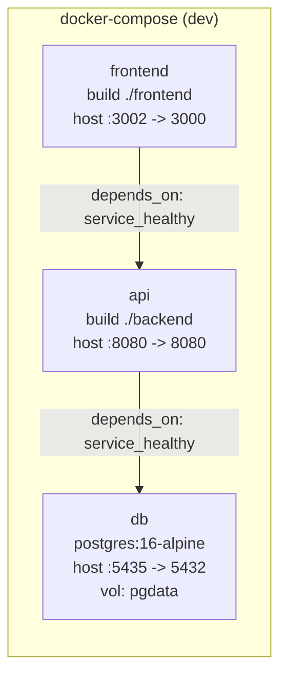
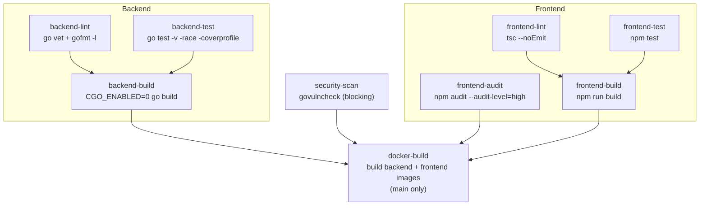
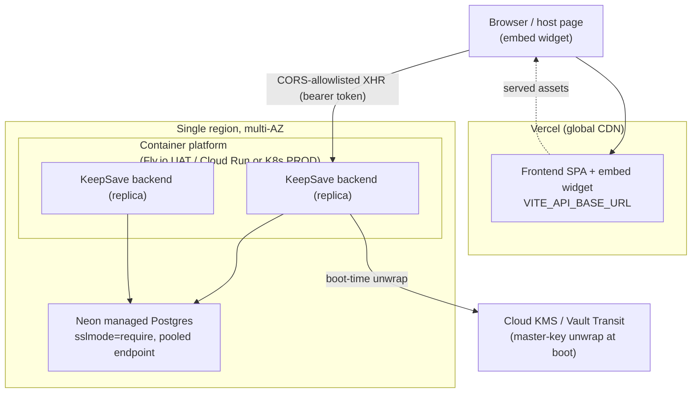

# Infrastructure

> Part of the **[KeepSave System Documentation](./README.md)**.

This chapter documents how KeepSave is packaged, built, and deployed: the two container images, the local Docker Compose stack, the Helm chart, the CI/CD pipeline, the production deployment topology, and the environment-variable surface that configures the backend. Everything here is grounded in the actual files in the repository (`docker-compose.yml`, `backend/Dockerfile`, `frontend/Dockerfile`, `helm/keepsave/`, `.github/workflows/ci.yml`, `backend/internal/config/config.go`). Where a capability is decided but not yet wired, that is called out explicitly.

For the runtime behaviour of the deployed process (graceful shutdown, DB pool, health endpoints) see [operations](./10-operations.md); for the encryption and auth model that the infrastructure must protect, see [security](./05-security.md).

---

## 1. Container images

KeepSave ships two images, both multi-stage and both running as non-root per security audit item S-M8.

### 1.1 Backend image — `backend/Dockerfile`

| Stage | Base | Purpose |
|-------|------|---------|
| `builder` | `golang:1.24-alpine` | `go mod download`, then `CGO_ENABLED=0 GOOS=linux go build -o /server ./cmd/server` (static binary) |
| runtime | `alpine:3.19` | copies the static `/server` and `./migrations`, adds `ca-certificates` |

Key properties:

- **Non-root.** A `keepsave` group/user is created with a **fixed uid/gid `10001`** so operators can map host volumes without surprise ownership; `USER keepsave:keepsave` is the final directive.
- **Migrations baked in.** `COPY --from=builder /app/migrations ./migrations` — the binary runs migrations on boot (see [operations](./10-operations.md) §graceful start).
- **`EXPOSE 8080`** — the API listens on the port from `PORT` (default `8080`).
- Static binary (`CGO_ENABLED=0`) → no libc dependency, small attack surface.

### 1.2 Frontend image — `frontend/Dockerfile`

| Stage | Base | Purpose |
|-------|------|---------|
| `build` | `node:20-alpine` | `npm ci`, then `npm run build` (Vite production bundle to `/app/dist`) |
| runtime | `nginxinc/nginx-unprivileged:alpine` | serves `dist/` via nginx; `COPY nginx.conf` to `/etc/nginx/conf.d/default.conf` |

Key properties:

- **Non-root nginx.** `nginx-unprivileged` runs master + workers as uid `101` with no root anywhere in the stack (audit S-M8) and listens on a **non-privileged port** out of the box, matching the `3000` configured in `nginx.conf`. `EXPOSE 3000`.
- This image is only relevant to the **self-hosted (Option-C) path**. The default production frontend is deployed to Vercel (see §6), which ignores this image entirely. The Dockerfile + `nginx.conf` are retained as the escape hatch per [ADR-0016](../adr/0016-deployment-topology.md).

---

## 2. Local dev stack — `docker-compose.yml`

`docker-compose.yml` is the one-command local environment. It is **dev-only** by construction (committed master key, `sslmode=disable`, `CORS_ORIGINS=*`).



| Service | Image / build | Ports (host:container) | Health check |
|---------|---------------|------------------------|--------------|
| `db` | `postgres:16-alpine` | `5435:5432` | `pg_isready -U keepsave -d keepsave` (5s interval) |
| `api` | `build: ./backend` | `8080:8080` | `wget -qO- http://localhost:8080/readyz` (10s interval) |
| `frontend` | `build: ./frontend` | `3002:3000` | (none; gated on `api` healthy) |

Notable configuration:

- **Startup ordering is enforced** via `depends_on.condition: service_healthy` — `api` waits for `db`, `frontend` waits for `api`. (The SPOF audit `docs/audits/BACKEND_SPOF.md` calls this dependency wiring out as already-correct.)
- **Volume `pgdata`** persists Postgres data across restarts.
- The `api` service env block carries the **dev** `MASTER_KEY` (`43uH/WMSJGjGgaJseq39Mt0h5eAoGgElK3k53ddRZMM=`), `JWT_SECRET=dev-jwt-secret-change-me`, `CORS_ORIGINS=*`, and `sslmode=disable`. **This master key is treated as permanently leaked** — the production startup check refuses it by SHA-256 hash (see §5 and [security](./05-security.md)).

`scripts/verify-docker.sh` validates the compose file, builds with `--no-cache`, waits up to 120 s for all three services to become healthy, and runs smoke tests (`/health/ready` and the frontend root). It is the canonical "does the stack come up" check.

---

## 3. Helm chart — `helm/keepsave/`

The Helm chart (`helm/keepsave/Chart.yaml`, version/appVersion `1.1.0`) is the **production-shaped** deployment path: it is what you run on Kubernetes when the backend moves off Cloud Run/Fly (the Option-C scale-out target in [ADR-0016](../adr/0016-deployment-topology.md)).

### 3.1 What it deploys

| Template | Object(s) | Notes |
|----------|-----------|-------|
| `deployment-backend.yaml` | backend `Deployment` | `replicaCount` (default 2); liveness `GET /healthz`, readiness `GET /readyz`; env wired from values + `*-secrets` Secret; conditional KMS/Vault/TLS blocks |
| `deployment-frontend.yaml` | frontend `Deployment` | liveness/readiness `GET /` on `frontend.port` |
| `service.yaml` | two `ClusterIP` Services | `*-backend` and `*-frontend` |
| `ingress.yaml` | `Ingress` (optional) | `ingress.enabled`; default routes `/api` → backend, `/` → frontend |
| `hpa.yaml` | `HorizontalPodAutoscaler` (optional) | `autoscaling.enabled`; targets the **backend** deployment, CPU-based, min 2 / max 10 |
| `secrets.yaml` | `Secret` (Opaque) | `master-key`, `jwt-secret`, `database-url` (base64) |

### 3.2 Values of note (`helm/keepsave/values.yaml`)

- **`backend.env.KEEPSAVE_KEY_PROVIDER`** — `env | awskms | gcpkms | vault`; values default to `awskms`. The backend deployment template emits provider-specific env (`KEEPSAVE_KMS_KEY_ID`, `KEEPSAVE_KMS_CIPHERTEXT`, or Vault vars) based on this. **Caveat:** `awskms`/`gcpkms` are not yet wired in the binary — see [operations](./10-operations.md) and §5 below.
- **`backend.env.CORS_ORIGINS`** — must be an explicit origin list in production (defaults to `https://keepsave.example.com`).
- **`secrets.databaseUrl`** — template **requires `sslmode=require`**; `KEEPSAVE_ENV=production` refuses to start with `sslmode=disable`.
- **`backend.tls`** — optional in-app TLS (cert/key file, cipher suites, HTTP→HTTPS redirect). Leave disabled to terminate TLS at the ingress instead.
- **`postgresql.enabled: true`** — bundles a Postgres subchart for convenience; production prefers managed Postgres (Neon — see §6) over an in-cluster DB.
- **`autoscaling`** — disabled by default; when enabled the HPA scales the backend on CPU.

### 3.3 Known gap — secret storage

The chart provisions a **plain Kubernetes `Secret`** (`secrets.yaml`) for `master-key`/`jwt-secret`/`database-url`. Production-grade deployments need **ExternalSecrets / SealedSecrets / Vault-injector** so encrypted secrets are not checked into git or stored as merely base64-encoded cluster objects. This is an explicitly tracked gap (DevOps 60-day item) documented in [SECRET_SOURCES](../SECRET_SOURCES.md) §Staging — the move is a Type-1 key-source decision and requires a new ADR before implementation.

---

## 4. CI/CD pipeline — `.github/workflows/ci.yml`

CI runs on push to `main` and on pull requests to `main`. The workflow declares a **top-level least-privilege default** and lets individual jobs override only what they need:

```yaml
permissions:
  contents: read
```

### 4.1 Pipeline shape



| Job | What it runs | Gates |
|-----|--------------|-------|
| `backend-lint` | `go vet ./...`; fails if `gofmt -l .` is non-empty | — |
| `backend-test` | `go test -v -race -coverprofile=coverage.out ./...`; uploads `backend-coverage` artifact | — |
| `backend-build` | `CGO_ENABLED=0 go build -o keepsave-server ./cmd/server` | needs lint + test |
| `frontend-lint` | `npx tsc --noEmit` (strict type check) | — |
| `frontend-test` | `npm test -- --reporter=verbose` (Vitest) | — |
| `frontend-audit` | `npm audit --audit-level=high` (**high+ blocking**) | — |
| `frontend-build` | `npm run build` (Vite) | needs lint + test |
| `security-scan` | `govulncheck -show verbose ./...` (**blocking**); uploads `security-report` artifact, 90-day retention | — |
| `docker-build` | `docker build` of both images, tagged `:${{ github.sha }}` | needs `backend-build`, `frontend-build`, `security-scan`, `frontend-audit`; **`main` only**, no registry push today |

Go toolchain is pinned to `1.25.8`; Node is `20`. See [testing](./11-testing.md) for what the test jobs assert.

### 4.2 Least-privilege token model

`GITHUB_TOKEN` defaults to broad write absent a `permissions:` block — a dangerous default on a secrets product. The workflow narrows it to `contents: read` at the top level; **no job needs write access today** (artifact uploads are same-repo). Future jobs that need more (release tagging → `contents: write`, GHCR push → `packages: write`, CodeQL → `security-events: write`) must declare a **job-local** `permissions:` block, never raise the top-level default. `pull_request_target` is forbidden in this repo. Full job-by-job rationale and branch-protection requirements are in [CI_PERMISSIONS](../CI_PERMISSIONS.md).

### 4.3 Dependency hygiene

`.github/dependabot.yml` schedules **weekly** updates across seven ecosystems: gomod (`/backend`), npm (`/frontend`, `/sdks/nodejs`), pip (`/sdks/python`), docker (`/backend`, `/frontend`), and github-actions (`/`). `.github/secret_scanning.yml` configures GitHub-native secret scanning (ignoring `testdata/`, `*_test.go`, `docs/`); full push-protection must additionally be enabled in repo Settings.

---

## 5. Configuration reference (env vars)

The authoritative parser is `backend/internal/config/config.go` (`config.Load`). The backend fails fast on missing/invalid config.

| Variable | Required | Default | Notes |
|----------|----------|---------|-------|
| `DATABASE_URL` | **yes** | — | Postgres DSN; `sslmode=disable` rejected when `KEEPSAVE_ENV=production` |
| `JWT_SECRET` | **yes** | — | must be ≥ 32 bytes when `KEEPSAVE_ENV=production` |
| `MASTER_KEY` | yes when `KEEPSAVE_KEY_PROVIDER=env` | — | base64 of exactly 32 bytes; the dev key is refused in production by SHA-256 hash |
| `KEEPSAVE_KEY_PROVIDER` | no | `env` | `env \| awskms \| gcpkms \| vault` (case-insensitive) |
| `KEEPSAVE_ENV` | no | `development` | also reads `APP_ENV`; `production` enables strict guards |
| `CORS_ORIGINS` | no | `*` | `*` rejected in production; comma-separated allow-list with single-`*` glob for Vercel previews |
| `PORT` | no | `8080` | API listen port |
| `AUDIT_LOG_RETENTION_DAYS` | no | `365` | positive integer; drives the pruner goroutine |
| `KEEPSAVE_KMS_KEY_ID` / `KEEPSAVE_KMS_CIPHERTEXT` | KMS providers | — | parsed into `Config`; adapter wiring deferred (see below) |
| `VAULT_ADDR` / `VAULT_TOKEN` / `KEEPSAVE_VAULT_KEY_NAME` / `KEEPSAVE_VAULT_CIPHERTEXT` | `vault` provider | — | Vault Transit unwrap at boot |
| `TLS_CERT_FILE` / `TLS_KEY_FILE` / `TLS_REDIRECT` / `TLS_CIPHER_SUITES` | no | — | in-app TLS (TLS 1.2+); when both cert+key set, server serves HTTPS |

> **Important — KMS adapters are deferred.** `resolveMasterKey` in `backend/cmd/server/main.go` wires `env` and `vault` only; `awskms`/`gcpkms` return a clear "not wired in this build" error (deferred per [ADR-0016](../adr/0016-deployment-topology.md), tracked as `FOLLOWUPS #1`). So although `values.yaml` defaults `KEEPSAVE_KEY_PROVIDER=awskms`, the binary today supports `env` (dev) and `vault` (UAT/early-PROD). See [operations](./10-operations.md) and [ADR-0012](../adr/0012-kms-auto-unseal.md).

### 5.1 `.env.example` files

- **`backend/.env.example`** — the minimal dev set: `DATABASE_URL`, `MASTER_KEY` (base64 dev key), `JWT_SECRET`, `PORT`, `CORS_ORIGINS=*`. It does **not** enumerate the production-only vars (`KEEPSAVE_ENV`, `KEEPSAVE_KEY_PROVIDER`, KMS/Vault, TLS) — those live in `values.yaml` and are read directly by `config.Load`.
- **`frontend/.env.example`** — documents `VITE_API_BASE_URL` (the absolute backend origin including the `/api/v1` prefix). Vite inlines `VITE_`-prefixed vars at build time, so **only public config goes here, never secrets**. Left empty for local dev (the Vite dev proxy forwards `/api/v1` to `localhost:8080`); set per-scope in Vercel for Preview/Production.

Additional AI-provider env vars (`ANTHROPIC_API_KEY`, `OPENAI_API_KEY`, `GOOGLE_API_KEY`, `GROQ_API_KEY`, `MISTRAL_API_KEY`, `OLLAMA_BASE_URL`, `AI_PREFERRED_PROVIDER`) are read by `internal/service/ai_provider.go` and are optional (Phase 15 intelligence features fall back when absent).

---

## 6. Deployment topology

The accepted topology ([ADR-0016](../adr/0016-deployment-topology.md), "Option A") is: **frontend on Vercel, backend as a long-running container, database on Neon (managed Postgres), KMS via Vault dev sidecar (UAT) → cloud KMS (PROD)**. The same shape is used for UAT and PROD; only tier size differs. Kubernetes-via-Helm is reserved as the scale-out target.



Topology rationale and consequences (from [ADR-0016](../adr/0016-deployment-topology.md)):

- **Why not "everything on Vercel" (Option B)?** Rejected on Type-1 grounds — Vercel Functions are per-request handlers with execution-time caps and no graceful-shutdown semantics; that would invalidate the backend's process model (ADR-0001/0004/0011) and the audit-log pruner goroutine, and widen the crypto attack surface with more cold-start KMS calls.
- **New trust boundary.** Splitting frontend (Vercel) and backend onto different origins adds a public-internet hop. CORS policy and TLS termination become part of the surface; auth is **bearer-token only** (no cross-site cookies). This widening is recorded in [THREAT_MODEL](../THREAT_MODEL.md).
- **Neon idle-connection eviction (~5 min)** requires `ConnMaxLifetime` tuning — addressed by [ADR-0011](../adr/0011-graceful-shutdown-and-db-timeouts.md) and visible in `backend/internal/repository/db.go` (see [operations](./10-operations.md)).
- **Reversibility.** Each tier re-platforms independently: frontend → rebuild from `frontend/Dockerfile`; backend → `helm install ./helm/keepsave`; DB → standard Postgres dump/restore off Neon.

---

## 7. Where KeepSave's own secrets live

KeepSave stores other people's secrets, so its own bootstrap secrets need a clear story (the "bootstrap paradox"). Summary from [SECRET_SOURCES](../SECRET_SOURCES.md):

| Secret | Dev | Staging / Production |
|--------|-----|----------------------|
| `MASTER_KEY` | hard-coded in `docker-compose.yml` (known-leaked) | **not stored directly** — `MasterKeyProvider` fetches from KMS/Vault at boot |
| `JWT_SECRET` | `dev-jwt-secret-change-me` | KMS-encrypted K8s Secret or Vault dynamic secret; 90-day rotation |
| `DATABASE_URL` | plaintext in compose | K8s Secret / managed-DB IAM token |
| TLS private key | n/a | ingress / cert-manager only — never reaches the Go process |
| OAuth client secrets | n/a | Vault |

Read-access matrix, rotation cadences, and the break-glass procedure are in [SECRET_SOURCES](../SECRET_SOURCES.md) and [RUNBOOK](../RUNBOOK.md). Two load-bearing rules: **CI never sees a production secret** (the workflow references none of `MASTER_KEY`/`JWT_SECRET`/`DATABASE_URL`), and the **production `MasterKeyProvider` MUST NOT be `EnvProvider`** (rotation is unsupported there; wire Vault/KMS before PROD).

---

## See also

- [Operations](./10-operations.md) — runtime behaviour, incidents, rotation cadence, observability
- [Security](./05-security.md) — encryption, key hierarchy, auth model the infra protects
- [Backend](./02-backend.md) — the Go service these images package
- [CI_PERMISSIONS](../CI_PERMISSIONS.md) — least-privilege CI token model
- [SECRET_SOURCES](../SECRET_SOURCES.md) — where KeepSave's own secrets live and how they rotate
- [ADR-0016](../adr/0016-deployment-topology.md) — deployment topology decision
- [ADR-0011](../adr/0011-graceful-shutdown-and-db-timeouts.md), [ADR-0012](../adr/0012-kms-auto-unseal.md) — lifecycle and KMS decisions
