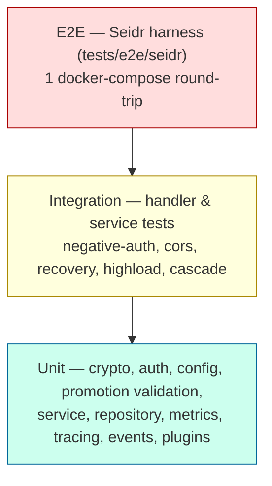

# Testing

> Part of the **[KeepSave System Documentation](./README.md)**.

This chapter documents KeepSave's test strategy: the (currently inverted) test pyramid and its coverage gates, the negative-auth matrix, the flaky-test policy, where backend and frontend tests live and what kinds exist, the end-to-end Seidr harness, and how everything runs in CI. It summarizes the canonical test docs inline and links them. A non-negotiable project rule threads through all of it: **every state-mutating handler must emit an audit event, and the test must assert the audit row was written** (`CLAUDE.md`).

For the CI jobs that execute these tests see [infrastructure](./09-infrastructure.md) §4; for the auth surface the negative tests attack see [security](./05-security.md).

---

## 1. Strategy and the inverted-pyramid reality

The conventional shape is many fast unit tests, fewer integration tests, fewest E2E. KeepSave's reality, per [PYRAMID](../../tests/PYRAMID.md), is **inverted**: heavy unit coverage in `crypto`/`auth`/promotion-validation, but the thinnest layer (handler↔service↔repo integration) is doing the most blast-radius work (the API).

The risk this shape creates: a refactor that breaks the *plumbing between layers* can land green and still break production. Closing that is the explicit Phase-A test priority — handler-level integration tests for the state-mutating endpoints (Secret / Project / API-key / Promotion), each with a happy path, an authorization-failure case, an **audit-log assertion**, and error-response sanitization. The per-package census lives in [PYRAMID](../../tests/PYRAMID.md); since that census was taken, additional integration files have landed (recovery, cascade, cors, negative-auth — see §4).

---

## 2. Coverage gates and targets

From [PYRAMID](../../tests/PYRAMID.md) §"Coverage targets" — these are gates that mean something, not vanity numbers:

| Scope | Gate |
|-------|------|
| **Critical packages** (`crypto`, `auth`, `service/promotion_service.go`) | line coverage ≥ 90%, file-level branch coverage ≥ 85% — hard CI gate |
| **API handlers** (state-mutating) | per-file presence check: each must have ≥ happy-path + 1 auth-failure + 1 audit-assertion test (no line-coverage gate — too easy to game) |
| **Repository** | every method has a round-trip test — presence-checked |
| **Other packages** | no gate |

Anti-vanity rules: don't test what the language guarantees (getters, "constructor returns non-nil"); don't test mocks (asserting only "the mock was called" tests the setup, not the code); don't add a test merely to move a coverage number. The "definition of done" for a Phase-A test: it can fail, it fails for the right reason, it runs in CI, it runs fast (< 100 ms unit / < 5 s integration), and negative paths are the explicit goal.

The CI `backend-test` job uploads the `backend-coverage` artifact (`coverage.out`); a dashboard reading from it is a QA 60-day item.

---

## 3. The negative-auth matrix

Authentication middleware rejects bad requests in code (`backend/internal/api/middleware.go`), but the gap [NEGATIVE_AUTH_PLAN](../../tests/NEGATIVE_AUTH_PLAN.md) exists to close is that **a middleware regression would otherwise land green**. The plan is a matrix of **12 endpoints × 11 attacker cases**.

- **Endpoints (E1–E12):** secret CRUD + plaintext reveal, project CRUD, API-key create/delete, and promote / approve / rollback.
- **Attacker cases (A1–A11):** no credentials, malformed JWT, expired JWT, wrong-secret JWT, no project membership, wrong-project API key, wrong-environment scope, missing required scope, revoked-mid-request key, **approver-equals-requester** on approve (the ADR-0003/0007 invariant), and rate-limit-exceeded. Each asserts the correct status **and** the sanitized error body code (per [ERROR_HANDLING_STANDARD](../ERROR_HANDLING_STANDARD.md)).

The grid is **12×11 = 132 cells**, of which the plan marks **32 N/A** (e.g. project-scope cases don't apply to project-create), leaving **100 applicable**. (`NEGATIVE_AUTH_PLAN.md`'s own census predates the Phase-1 sweep and still marks the grid `✗`; the counts below reflect tests landed since.) Coverage today, against the full 132-cell grid:

| State | Count | Where |
|-------|-------|-------|
| Covered (Phase 1 sweep — BLOCKER + HIGH surface) | ~42 cells | `internal/api/negative_auth_test.go`, `internal/service/negative_auth_test.go`, `cors_test.go`, `url_safety_test.go` |
| Deferred (the remaining surface, "S-M3") | ~90 cells | tracked in [FOLLOWUPS](../FOLLOWUPS.md) §"Deferred by design" |

The deferral was an explicit Phase-0 plan choice; the trigger to complete the matrix is any new endpoint that handles a project ID, or a customer security review asking for it. The intended end-state includes a **CI presence-check** so a new state-mutating endpoint without at least A1+A3+A5+A9 fails the build.

---

## 4. Where tests live and what kinds exist

### 4.1 Backend (`backend/internal/**/*_test.go`)

33 Go test files. Kinds present:

| Kind | Representative files |
|------|----------------------|
| **Unit** | `crypto/crypto_test.go`, `auth/auth_test.go`, `auth/password_policy_test.go`, `config/config_test.go`, `crypto/keyprovider/provider_test.go`, `events/eventbus_test.go`, `logging/*`, `tracing/tracing_test.go`, `plugins/plugin_test.go`, `metrics/metrics_test.go` |
| **Service** (state-mutating logic) | `service/promotion_service_test.go`, `service/keyrotation_service_test.go`, `service/apikey_expiry_test.go`, `service/envfile_service_test.go`, `service/dependency_service_test.go`, `service/organization_service_test.go`, `service/oauth_userinfo_test.go`, `service/url_safety_test.go`, `service/webhook_service_test.go` |
| **Audit assertion** | `service/audit_helper_test.go` (asserts audit rows are written — the §intro rule) |
| **Handler / middleware integration** | `api/negative_auth_test.go`, `api/cors_test.go`, `api/error_leak_test.go` (AST-walking regression gate for `err.Error()` leaks), `api/handlers_embed_test.go`, `api/health_test.go`, `api/recovery_test.go`, `api/ratelimit_test.go` |
| **Benchmarks** | `crypto/crypto_benchmark_test.go`, `api/highload_test.go` |
| **Repository** | `repository/audit_repo_test.go`, `repository/cascade_test.go` (cascade-delete behaviour) |

No fuzz targets exist yet; crypto fuzzing (GCM nonce-length, key-length, ciphertext truncation, AAD mismatch) is a named [PYRAMID](../../tests/PYRAMID.md) priority.

### 4.2 Frontend (`frontend/src/**/*.test.ts(x)`)

8 Vitest files. Kinds:

| Kind | Files |
|------|-------|
| **API client** | `api/client.test.ts` |
| **Component** (React Testing Library) | `components/SecretsPanel.test.tsx`, `components/PromotionWizard.test.tsx`, `pages/LoginPage.test.tsx`, `pages/ProjectsPage.test.tsx` |
| **Embed widget SDK** | `embed/api.test.ts`, `embed/auth.test.ts`, `embed/styles.test.ts` |

The embed tests cover the security-sensitive widget surface (origin-checked `postMessage` auth in `embed/auth.ts`, the embed API client, and the Shadow-DOM style isolation) — see [security](./05-security.md) and the embed origin policy.

---

## 5. End-to-end: the Seidr harness (`tests/e2e/seidr/`)

The Seidr harness exercises the exact KeepSave HTTP surface that Seidr's `KeepSaveSecretProvider` depends on. It is a `docker compose` stack (Postgres + KeepSave + a stdlib-only Go tester) run with `--abort-on-container-exit --exit-code-from tester`, so the tester's exit code becomes the CI gate.

The tester (`tests/e2e/seidr/tester/main.go`) walks the agent path end-to-end:

1. `POST /auth/register` + `POST /auth/login` → obtain a JWT.
2. `POST /projects` → create the target project.
3. `POST /projects/:id/secrets` → store a marker secret in `alpha` (server-side envelope-encrypted).
4. `POST /api-keys` → mint a scoped, environment-locked `read` key (the shape Seidr agents use).
5. `GET /projects/:id/secrets?environment=alpha` with the scoped key → confirm the plaintext round-trips.

**What it proves:** envelope encryption round-trips on a fresh DB; JWT and API-key auth both route through the same retrieval path; environment scoping returns only the intended secret; `/readyz` confirms DB + master-key resolution before the tester runs. **What it does not prove** (intentionally): it does not boot a real Seidr runtime, so Seidr's own circuit breaker, TTL cache, and key-rotation observation are out of scope — booting a real Seidr container is [FOLLOWUPS](../FOLLOWUPS.md) #8. Note the harness uses a dev master key (base64 of 32 zero bytes) and `KEEPSAVE_ENV=development`.

---

## 6. How tests run in CI

The pipeline (`.github/workflows/ci.yml`, detailed in [infrastructure](./09-infrastructure.md) §4) runs:

| Job | Command | Blocking |
|-----|---------|----------|
| `backend-test` | `go test -v -race -coverprofile=coverage.out ./...` | yes |
| `frontend-test` | `npm test -- --reporter=verbose` (Vitest) | yes |
| `security-scan` | `govulncheck -show verbose ./...` | **yes** (blocking) |
| `frontend-audit` | `npm audit --audit-level=high` | **yes** (high+ blocking) |

The backend suite runs **with the race detector** (`-race`) and produces a coverage profile. govulncheck is a blocking gate; a regression on a previously-green branch triggers the [RUNBOOK](../RUNBOOK.md) §5 procedure. The Seidr E2E harness is a separate docker-compose invocation rather than a `go test` job.

> **Doc-vs-reality note for auditors:** [FLAKY](../../tests/FLAKY.md) §"CI integration" states the suite runs with `-shuffle=on` *and* `-race`. The committed workflow runs `go test -v -race -coverprofile=...` — `-race` is present, but `-shuffle=on` is **not** currently in the command. Treat `-shuffle=on` as the intended policy, not the current invocation.

---

## 7. Flaky-test policy

[FLAKY](../../tests/FLAKY.md) treats a flaky test as a **bug, not an annoyance** — tolerating flakes erodes trust in CI. A test is flaky if it passed and failed without a code change, or its 20-run pass rate is < 99%, or it contains an unjustified `time.Sleep`, hard-coded port, wall-clock dependence, or race-conditional setup.

Process highlights:

- **Never re-run silently.** A re-run without a row added to the tracker table is a process violation.
- **Triage SLA:** 24 h to triage, 7 days to fix or quarantine (`t.Skip("flaky FL-NNN — owner; due")` with all three of row ID, owner, due date), 30 days to permanently fix or delete.
- **What is *not* a flake** (fix the code, not the test): a failure only under `-race` (a real data race), a timeout only on slow CI hardware (widen *and* profile), or a timezone-dependent failure (use UTC).

As of the doc's writing there are no documented flakes — plausibly because the suite is still small (the inverted pyramid). A planned weekly job that runs the suite 5× will surface latent flakes.

---

## 8. The audit-assertion rule (mandatory)

`CLAUDE.md` makes this a PR-blocking gate, restated here because it shapes test design: **every state-mutating handler (secret / project / api-key / promotion) MUST emit an audit event from the canonical taxonomy in [AUDIT_LOG_COVERAGE](../AUDIT_LOG_COVERAGE.md), and the test MUST assert the audit row was written.** PRs failing either are rejected. In practice the nil-safe `emitAudit` wrapper (`internal/service/audit_helper.go`) is the emission point, and `service/audit_helper_test.go` plus the per-service mutating tests assert the rows. "If an action is not in the audit log, it didn't happen — and the feature isn't done" ([ROLES](../ROLES.md) §1).

---

## See also

- [PYRAMID](../../tests/PYRAMID.md) — per-package census and coverage targets
- [NEGATIVE_AUTH_PLAN](../../tests/NEGATIVE_AUTH_PLAN.md) — the 12×11 matrix
- [FLAKY](../../tests/FLAKY.md) — flaky-test policy and tracker
- [AUDIT_LOG_COVERAGE](../AUDIT_LOG_COVERAGE.md) — audit taxonomy the tests assert
- [ERROR_HANDLING_STANDARD](../ERROR_HANDLING_STANDARD.md) — the sanitized error body shape negative tests check
- [Infrastructure](./09-infrastructure.md) §4 — the CI jobs
- [Security](./05-security.md) — the auth surface under test
